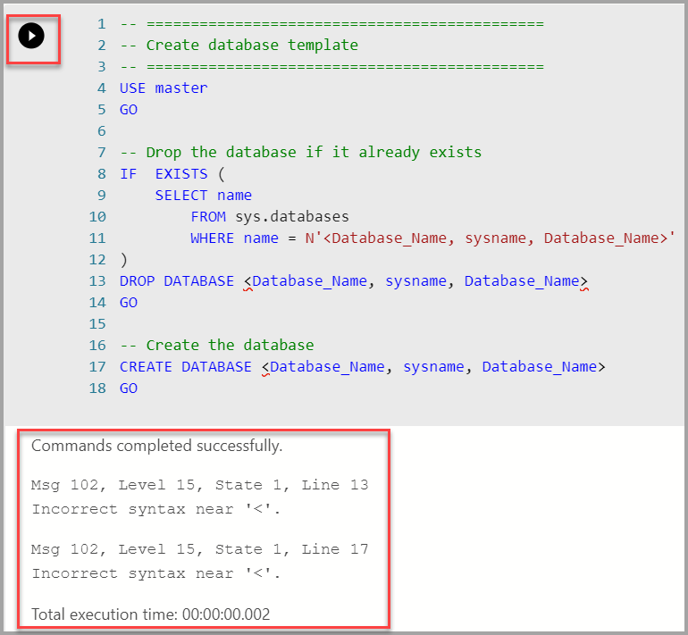

# Run a sample notebook with SQL Server

[!INCLUDE[tsql-appliesto-ssver15-xxxx-xxxx-xxx](../includes/tsql-appliesto-ssver15-xxxx-xxxx-xxx.md)]

This tutorial demonstrates how to load and run a notebook in Azure Data Studio. This allows data scientists and data engineers to run Python, R, or Scala code against the cluster.

## Prerequisites

- [Azure Data Studio installed](download-azure-data-studio.md)
- SQL Server installed
  - [Windows](../database-engine/install-windows/install-sql-server.md)
  - [Linux](../linux/sql-server-linux-setup.md)

## Open the notebook

The following steps show how to open the notebook file in Azure Data Studio:

1. In Azure Data Studio, connect to the master instance of your big data cluster.

1. Select on the connection in the **Servers** window. Then select **Open Notebook**.

   

1. Wait for the **Kernel** and the target context (**Attach to**) to be populated. Set the **Kernel** to **PySpark3**, and set **Attach to** to the IP address of your big data cluster endpoint.

   

## Run the notebook cells

You can run each notebook cell by pressing the play button to the left of the cell. The results are shown in the notebook after the cell finishes running.

Run each of the cells in the sample notebook in succession. For more information about using notebooks with [!INCLUDE[big-data-clusters-2019](../includes/ssbigdataclusters-ss-nover.md)], see the following resources:

- [How to use notebooks with SQL Server](notebooks-guidance.md)
- [How to manage notebooks in Azure Data Studio](../big-data-cluster/notebooks-how-to-manage.md)

## Next steps

Learn more about notebooks:
> [!div class="nextstepaction"]
> [Learn about notebooks](notebooks-guidance.md)
