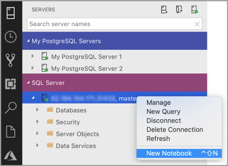
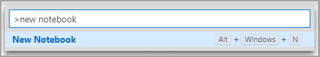
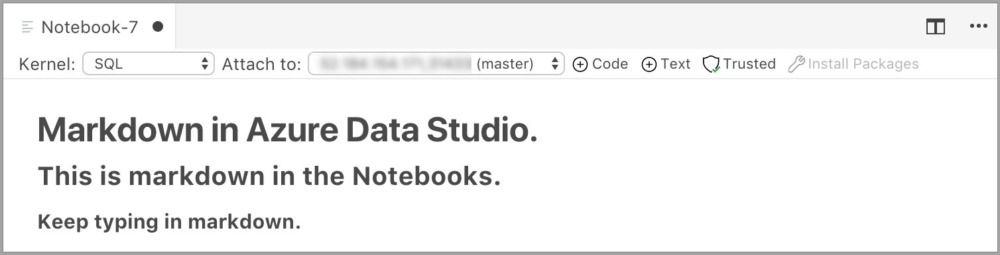
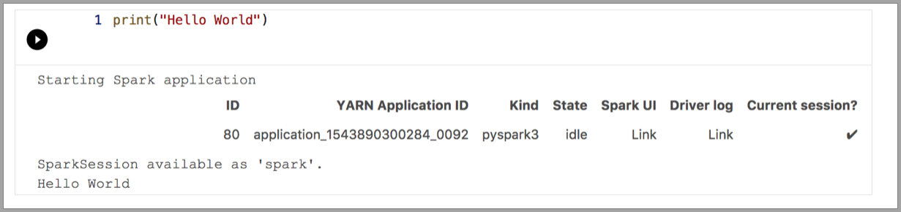
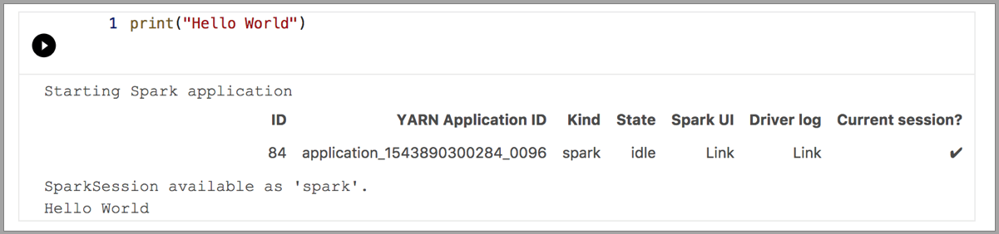
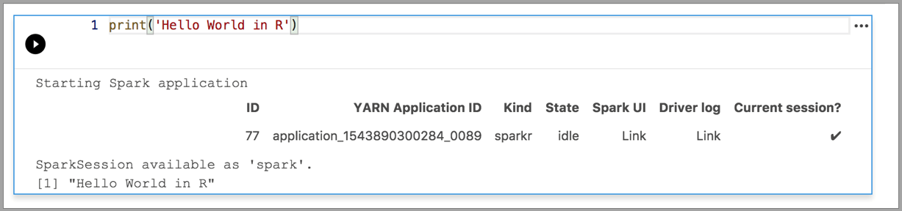
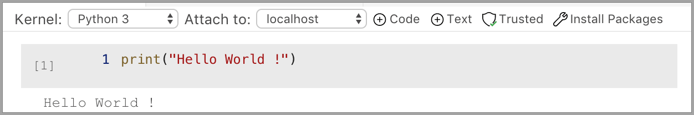

# Use Jupyter Notebooks in Azure Data Studio

[!INCLUDE[SQL Server 2019](../../includes/applies-to-version/sqlserver2019.md)]

Jupyter Notebook is an open-source web application that allows you to create and share documents containing live code, equations, visualizations, and narrative text. Usage includes data cleaning and transformation, numerical simulation, statistical modeling, data visualization, and machine learning.

This article describes how to create a new notebook in the latest release of [**Azure Data Studio**](../download-azure-data-studio.md) and how to start authoring your own notebooks using different kernels.

Watch this short 5-minute video for an introduction to notebooks in Azure Data Studio:

> [!VIDEO https://channel9.msdn.com/Shows/Data-Exposed/Introduction-to-Azure-Data-Studio-Notebooks/player?WT.mc_id=dataexposed-c9-niner]

## Create a notebook

There are multiple ways to create a new notebook. In each case, a new file named `Notebook-1.ipynb` opens.

- Go to the **File Menu** in Azure Data Studio and select **New Notebook**.

  

- Right-click a **SQL Server** connection and select **New Notebook**.

  

- Open the command palette (**Ctrl+Shift+P**), type "new notebook", and select the **New Notebook** command.

  

## Connect to a kernel

Azure Data Studio notebooks support a number of different kernels, including SQL Server, Python, PySpark, and others. Each kernel supports a different language in the code cells of your notebook. For example, when connected to the SQL Server kernel, you can enter and run T-SQL statements in a notebook code cell.

**Attach to** provides the context for the kernel. For example, if you're using SQL Kernel, then you can attach to any of your SQL Server instances.
If you're using Python3 Kernel you attach to **localhost** and you can use this kernel for your local Python development.

SQL Kernel can also be used to connect to PostgreSQL server instances. If you're a PostgreSQL developer and want to connect the notebooks to your PostgreSQL Server, then download the [**PostgreSQL extension**](../extensions/postgres-extension.md) in the Azure Data Studio extension Marketplace and connect to the PostgreSQL server.

If you're connected to SQL Server 2019 big data cluster, the default **Attach to** is the end point of the cluster. You can submit Python, Scala, and R code using the Spark compute of the cluster.

| Kernel                      | Description                                                  |
|:----------------------------|:-------------------------------------------------------------|
| SQL Kernel                  | Write SQL Code targeted at your relational database.         |
| PySpark3 and PySpark Kernel | Write Python code using Spark compute from the cluster.      |
| Spark Kernel                | Write Scala and R code using Spark compute from the cluster. |
| Python Kernel               | Write Python code for local development.                     |

For more information on specific kernels, see:

- [Create and run a SQL Server notebook](./notebooks-sql-kernel.md)
- [Create and run a Python notebook](./notebooks-python-kernel.md)
- [Kqlmagic extension in Azure Data Studio](./notebooks-kqlmagic.md) - this extends the capabilities of the Python kernel

## Add a code cell

Code cells allow you to run code interactively within the notebook.

Add a new code cell by clicking the **+Cell** command in the toolbar and selecting **Code cell**. A new code cell is added after the currently selected cell.

Enter code in the cell for the selected kernel. For example, if you're using the SQL kernel, you can enter T-SQL commands in the code cell.

Entering code with the SQL kernel is similar to a SQL query editor. The code cell supports a modern SQL coding experience with built-in features such as a rich SQL editor, IntelliSense, and built-in code snippets. Code snippets allow you to generate the proper SQL syntax to create databases, tables, views, stored procedures, and to update existing database objects. Use code snippets to quickly create copies of your database for development or testing purposes and to generate and execute scripts.

## Add a text cell

Text cells allow you to document your code by adding Markdown text blocks in between code cells.

Add a new text cell by clicking the **+Cell** command in the toolbar and selecting **Text cell**.

The cell starts in edit mode in which you can type Markdown text. As you type, a preview is shown below.

Selecting outside the text cell shows the Markdown text.

If you click in the text cell again, it changes to edit mode.

## Run a cell

To run a single cell, click **Run cell** (the round black arrow) to the left of the cell or select the cell and press F5. You can run all cells in the notebook by clicking **Run all** in the toolbar - the cells are run one at a time and execution stops if an error is encountered in a cell.

Results from the cell are shown below the cell. You can clear the results of all the executed cells in the notebook by selecting the **Clear Results** button in the toolbar.

## Save a notebook

To save a notebook, do one of the following.

- Type Ctrl+S
- Select **Save** from the **File** menu
- Select **Save As...** from the **File** menu
- Select **Save All** from the **File** menu - this saves all open notebooks
- In the command palette, enter **File: Save**

Notebooks are saved as `.ipynb` files.

## Trusted and Non Trusted

The notebooks open in Azure Data Studio are defaulted to **Trusted**.

If you open a notebook from some other source, it opens in **Non-Trusted** mode and then you can make it **Trusted**.

## Examples

The following examples demonstrate using different kernels to run a simple "Hello World" command. Select the kernel, enter the example code in a cell, and click **Run cell**.

### Pyspark

### Spark | Scala language

### Spark | R language

### Python 3

## Next steps

- [Create and run a SQL Server notebook](./notebooks-sql-kernel.md).
- [Create and run a Python notebook](./notebooks-python-kernel.md)
- [Run Python and R scripts in Azure Data Studio notebooks with SQL Server Machine Learning Services](../../machine-learning/install/sql-machine-learning-azure-data-studio.md).
- [Deploy SQL Server big data cluster with Azure Data Studio notebook](../../big-data-cluster/notebooks-deploy.md).
- [Manage SQL Server Big Data Clusters with Azure Data Studio notebooks](../../big-data-cluster/notebooks-manage-bdc.md).
- [Run a sample notebook using Spark](../../big-data-cluster/notebooks-tutorial-spark.md).