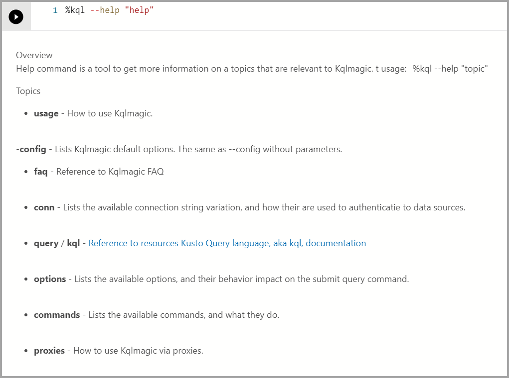
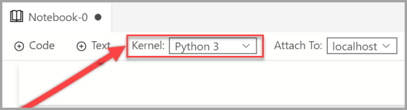
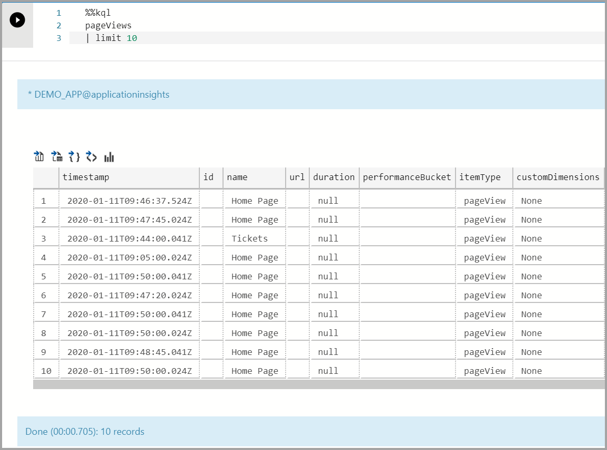

# Create and run a notebook with Kqlmagic

**Kqlmagic** is a command that extends the capabilities of the Python kernel in **[Azure Data Studio notebooks](./notebooks-guidance.md)**. You can combine Python and **[Kusto query language (KQL)](/azure/data-explorer/kusto/query)** to query and visualize data using rich Plot.ly library integrated with `render` commands. Kqlmagic brings you the benefit of notebooks, data analysis, and rich Python capabilities all in the same location. Supported data sources with Kqlmagic include **[Azure Data Explorer](/azure/data-explorer/data-explorer-overview)**, **[Application Insights](/azure/azure-monitor/app/app-insights-overview)**, and **[Azure Monitor logs](/azure/azure-monitor/platform/data-platform-logs)**.

This article shows you how to create and run a notebook in Azure Data Studio using the Kqlmagic extension for an Azure Data Explorer cluster, an Application Insights log, and Azure Monitor logs.

## Prerequisites

- [Azure Data Studio](../download-azure-data-studio.md)
- [Python](https://www.python.org/downloads/)

## Install and set up Kqlmagic in a notebook

The steps in this section all run within an Azure Data Studio notebook.

1. Create a new notebook and change the **Kernel** to *Python 3*.

   

2. You may be prompted to upgrade your Python packages when your packages need updating.

   

3. Install Kqlmagic:

   ```python
   import sys
   !{sys.executable} -m pip install Kqlmagic --no-cache-dir --upgrade
   ```

   Verify it's installed:

   ```python
   import sys
   !{sys.executable} -m pip list
   ```

   

4. Load Kqlmagic:

   ```python
   %reload_ext Kqlmagic
   ```

   > [!Note]
   > If this step fails, then close the file and reopen it.

   

5. You can test if Kqlmagic is loaded properly by browsing the help documentation or by checking for the version.

   ```python
   %kql --help "help"
   ```

   > [!Note]
   > If `Samples@help` is asking for a password, then you can leave it blank and press **Enter**.

   

   To see which version of Kqlmagic is installed, run the command below.

   ```python
   %kql --version
   ```

## Kqlmagic with an Azure Data Explorer cluster

This section explains how to run data analysis using Kqlmagic with an Azure Data Explorer cluster.

### <a name="ade-load-auth"></a> Load and authenticate Kqlmagic for Azure Data Explorer

   > [!Note]
   > Every time you create a new notebook in Azure Data Studio you must load the Kqlmagic extension.

1. Verify the **Kernel** is set to *Python3*.

   

2. Load Kqlmagic:

   ```python
   %reload_ext Kqlmagic
   ```

   

3. Connect to the cluster and authenticate:

   ```python
   %kql azureDataExplorer://code;cluster='help';database='Samples'
   ```

    > [!Note]
    > If you are using your own ADX cluster, you must include the region in the connection string as follows:   
    ```%kql azuredataexplorer://code;cluster='mycluster.westus';database='mykustodb'```

   You use Device Login to authenticate. Copy the code from the output and select **authenticate** which opens a browser where you need to paste the code. Once you authenticate successfully, you can come back to Azure Data Studio to continue with the rest of the script.

   

### Query and visualize for Azure Data Explorer

Query data using the [render operator](/azure/data-explorer/kusto/query/renderoperator) and visualize data using the ploy.ly library. This query and visualization supplies an integrated experience that uses native KQL.

1. Analyze top 10 storm events by state and frequency:

   ```python
   %kql StormEvents | summarize count() by State | sort by count_ | limit 10
   ```

   If you're familiar with the Kusto Query Language (KQL), you can type the query after `%kql`.

   

2. Visualize a timeline chart:

   ```python
   %kql StormEvents \
   | summarize event_count=count() by bin(StartTime, 1d) \
   | render timechart title= 'Daily Storm Events'
   ```

   

3. Multiline Query sample using `%%kql`.

   ```python
   %%kql
   StormEvents
   | summarize count() by State
   | sort by count_
   | limit 10
   | render columnchart title='Top 10 States by Storm Event count'
   ```

   

## Kqlmagic with Application Insights

### <a name="appin-load-auth"></a> Load and authenticate Kqlmagic for Application Insights

1. Verify the **Kernel** is set to *Python3*.

   

2. Load Kqlmagic:

   ```python
   %reload_ext Kqlmagic
   ```

   

   > [!Note]
   > Every time you create a new notebook in Azure Data Studio you must load the Kqlmagic extension.

3. Connect and authenticate.

   First, you must generate an API key for your Application Insights resource. Then, use the Application ID and API key to connect to Application Insights from the notebook:

   ```python
   %kql appinsights://appid='DEMO_APP';appkey='DEMO_KEY'
   ```

### Query and visualize for Application Insights

Query data using the [render operator](/azure/data-explorer/kusto/query/renderoperator) and visualize data using the ploy.ly library. This query and visualization supplies an integrated experience that uses native KQL.

1. Show Page Views:

   ```python
   %%kql
   pageViews
   | limit 10
   ```

   

   > [!Note]
   > Use your mouse to drag on an area of the chart to zoom in to the specific date(s).

2. Show Page views in a timeline chart:

   ```python
   %%kql
   pageViews
   | summarize event_count=count() by name, bin(timestamp, 1d)
   | render timechart title= 'Daily Page Views'
   ```

   

## Kqlmagic with Azure Monitor logs

### <a name="aml-load-auth"></a> Load and authenticate Kqlmagic for Azure Monitor logs

1. Verify the **Kernel** is set to *Python3*.

   

2. Load Kqlmagic:

   ```python
   %reload_ext Kqlmagic
   ```

   

   > [!Note]
   > Every time you create a new notebook in Azure Data Studio you must load the Kqlmagic extension.

3. Connect and authenticate:

   ```python
   %kql loganalytics://workspace='DEMO_WORKSPACE';appkey='DEMO_KEY';alias='myworkspace'
   ```

   

### Query and visualize for Azure Monitor Logs

Query data using the [render operator](/azure/data-explorer/kusto/query/renderoperator) and visualize data using the ploy.ly library. This query and visualization supplies an integrated experience that uses native KQL.

1. View a timeline chart:

   ```python
   %%kql
   KubeNodeInventory
   | summarize event_count=count() by Status, bin(TimeGenerated, 1d)
   | render timechart title= 'Daily Kubernetes Nodes'
   ```

   

## Next steps

Learn more about notebooks and Kqlmagic:

- [Kusto (KQL) extension for Azure Data Studio (Preview)](../extensions/kusto-extension.md)
- [Create and run a Kusto (KQL) notebook (Preview)](./notebooks-kusto-kernel.md)
- [Use a Jupyter Notebook and Kqlmagic extension to analyze data in Azure Data Explorer](/azure/data-explorer/Kqlmagic)
- [Extension (Magic) to Jupyter Notebook and Jupyter lab](https://github.com/Microsoft/jupyter-Kqlmagic), that enable notebook experience working with Kusto, Application Insights, and LogAnalytics data.
- [Kqlmagic](https://pypi.org/project/Kqlmagic/)
- [How to use notebooks in Azure Data Studio](./notebooks-guidance.md)