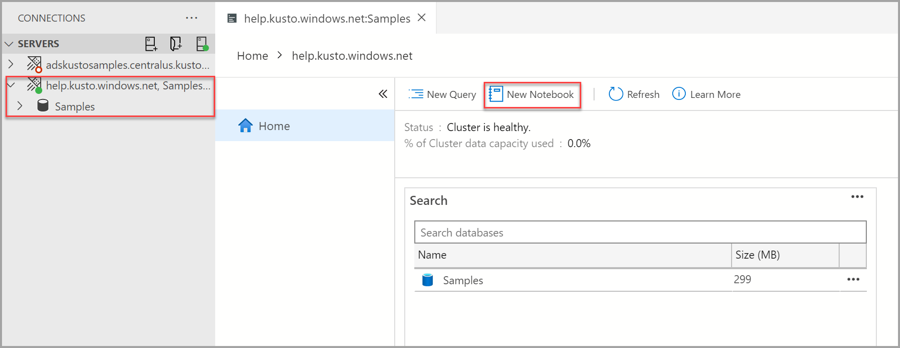
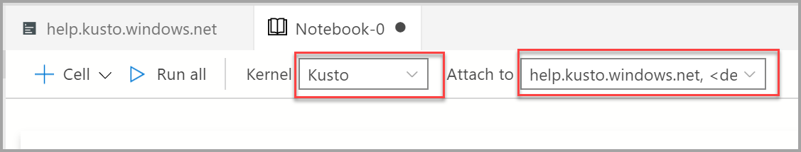
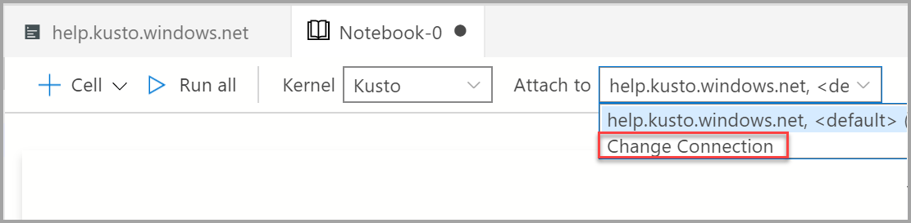
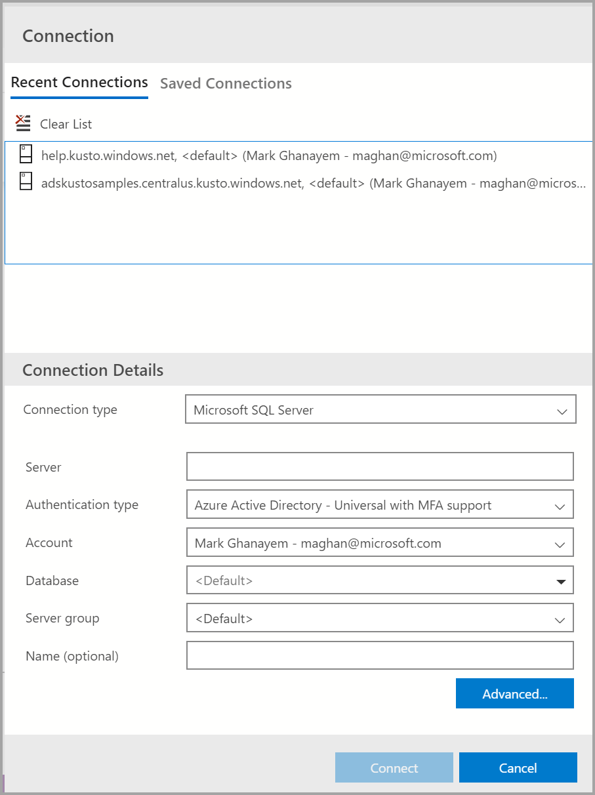

# Create and run a Kusto notebook (Preview)

This article shows you how to create and run an **[Azure Data Studio notebook](../notebooks-guidance.md)** using the Kusto extension for an Azure Data Explorer cluster.

The Kusto extension allows you to use the Kusto kernel.

The Kusto extension is in preview.

## Prerequisites

If you don't have an Azure subscription, create a [free Azure account](https://azure.microsoft.com/free/) before you begin.

- [An Azure Data Explorer cluster and database](https://docs.microsoft.com/azure/data-explorer/create-cluster-database-portal).
- [Azure Data Studio](../download-azure-data-studio.md).
- [Kusto extension for Azure Data Studio](notebooks-kusto-kernel.md).

## Create a Kusto notebook

The following steps show how to create a notebook file in Azure Data Studio:

1. In Azure Data Studio, connect to your Azure Data Explorer cluster.

2. Navigate to the **Connections** pane and under the **Servers** window select **New Notebook**.

   

3. Wait for the **Kernel** and the target context (**Attach to**) to be populated. Confirm that the **Kernel** is set to *Kusto*, and set the **Attach to** option to your Azure Data Explorer cluster (in this example its *help.kusto.windows.net*).

   

You can save the notebook using the **Save** or **Save as...** command from the **File** menu.

To open a notebook, you can use the **Open file...** command in the **File** menu, select **Open file** on the **Welcome** page, or use the **File: Open** command from the command palette.

## Change the connection

To change the Kusto connection for a notebook:

1. Select the **Attach to** menu from the notebook toolbar and then select **Change Connection**.

   

2. Now you can either select a recent connection server or enter new connection details to connect.

   

## Run a code cell

You can create cells containing SQL code that you can run in place by selecting the **Run cell** button (the round black arrow) to the left of the cell. The results are shown in the notebook after the cell finishes running.

For example:

1. Add a new code cell by selecting the **+Code** command in the toolbar.

   

2. Copy and paste the following example into the cell and select **Run cell**. This example creates a new database.

   ```kusto
    StormEvents
    | where EventType == "Waterspout"
   ```

   

## Save the result

If you run a script that returns a result, you can save that result in different formats using the toolbar displayed above the result.

- Save As CSV
- Save As Excel
- Save As JSON
- Save As XML

```kusto
    StormEvents
    | limit 10
```


## Next steps

Learn more about notebooks:

- [Kusto extension for Azure Data Studio](notebooks-kusto-kernel.md)
- [How to use notebooks in Azure Data Studio](../notebooks-guidance.md)
- [Create and run a Python notebook](../notebooks-tutorial-python-kernel.md)
- [Create and run a SQL Server notebook](../notebooks-tutorial-sql-kernel.md)