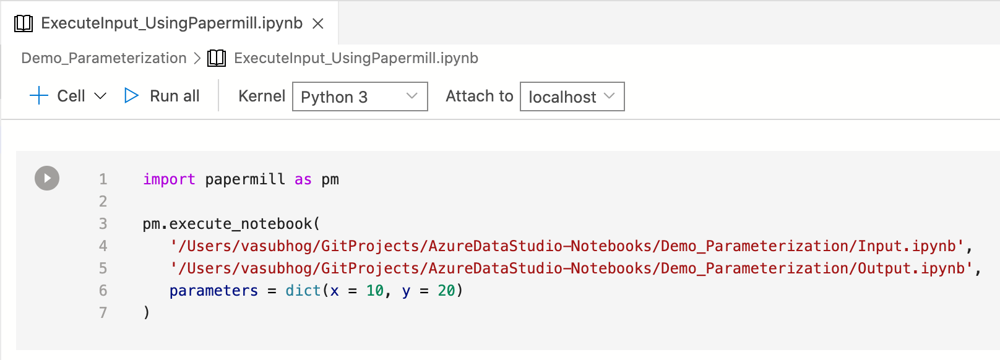

# Create a Parameterized Notebook

**Parameterization** is the ability to execute the same notebook with different parameters.

This article shows you how to create and run a parameterized notebook in Azure Data Studio using the python kernel.

> [!Note]
   > Currently Parameterization can done on Python, PySpark, PowerShell, and .Net Interactive Kernels

## Prerequisites

- [Azure Data Studio](../download-azure-data-studio.md)
- [Python](https://www.python.org/downloads/)

## Run with Parameters Action

New action that enables users to quickly set new parameters for their notebook through user input all through the UI.

> [!Note]
   > The parameter cell has to be formatted with each new parameter on a new line.

## Set up a notebook for parameterization in Azure Data Studio

The steps in this section all run within an Azure Data Studio notebook.

1. Create a new notebook and change the **Kernel** to *Python 3*.

   

2. You may be prompted to upgrade your Python packages when your packages need updating.

   

3. Create a New Code Cell and Tag as **Parameters Cell**.

   ```python
   x = 2.0
   y = 5.0
   ```

   :::image type="content" source="media/notebooks-parameterization/make-parameter-cell.png" alt-text="Parameter Cell Notebook":::

3. Add other cells to test different parameters.

   ```python
   addition = x + y
   multiply = x * y
   ```

   ```python
   print("Addition: " + str(addition))
   print("Multiplication: " + str(multiply))
   ```

   Cells in Example Input Notebook:
   :::image type="content" source="media/notebooks-parameterization/test-cells.png" alt-text="Additional Input Notebook Cells":::

4. Save notebook as **Input.ipynb**.
   :::image type="content" source="media/notebooks-parameterization/save-notebook.png" alt-text="Save Notebook":::

## How to Run the Notebook with Parameters

On the notebook toolbar there is a new action - run with parameters. 

:::image type="content" source="media/notebooks-parameterization/run-with-parameters.png" alt-text="Parameter Cell Notebook":::


2. After Execution view new Output Parameterized Notebook.
   You can note that there's a new cell labeled **# Injected-Parameters** containing the new parameter values passed in via CLI.

   :::image type="content" source="media/notebooks-parameterization/output-notebook.png" alt-text="Output Notebook":::

### Parameterized Python API execution

> [!Note]
   > Papermill Python API Documentation can be found [here](https://papermill.readthedocs.io/en/latest/usage-execute.html#execute-via-the-python-api).

1. Create a new notebook and change the **Kernel** to *Python 3*.
   

2. Add a new code cell and use papermill to use the execute method.

   ```python
   import papermill as pm

   pm.execute_notebook(
   '/Users/vasubhog/GitProjects/AzureDataStudio-Notebooks/Demo_Parameterization/Input.ipynb',
   '/Users/vasubhog/GitProjects/AzureDataStudio-Notebooks/Demo_Parameterization/Output.ipynb',
   parameters = dict(x = 10, y = 20)
   )
   ```

   

3. After Execution view new Output Parameterization Notebook.

   You can note that there's a new cell labeled **# Injected-Parameters** containing the new parameter values passed in via CLI.

   :::image type="content" source="media/notebooks-parameterization/output-notebook.png" alt-text="Output Notebook":::

## Next steps

Learn more about notebooks and Parameterization:

- [How to use notebooks in Azure Data Studio](./notebooks-guidance.md)
- [Papermill Parameterization Docs](https://papermill.readthedocs.io/en/latest/index.html)