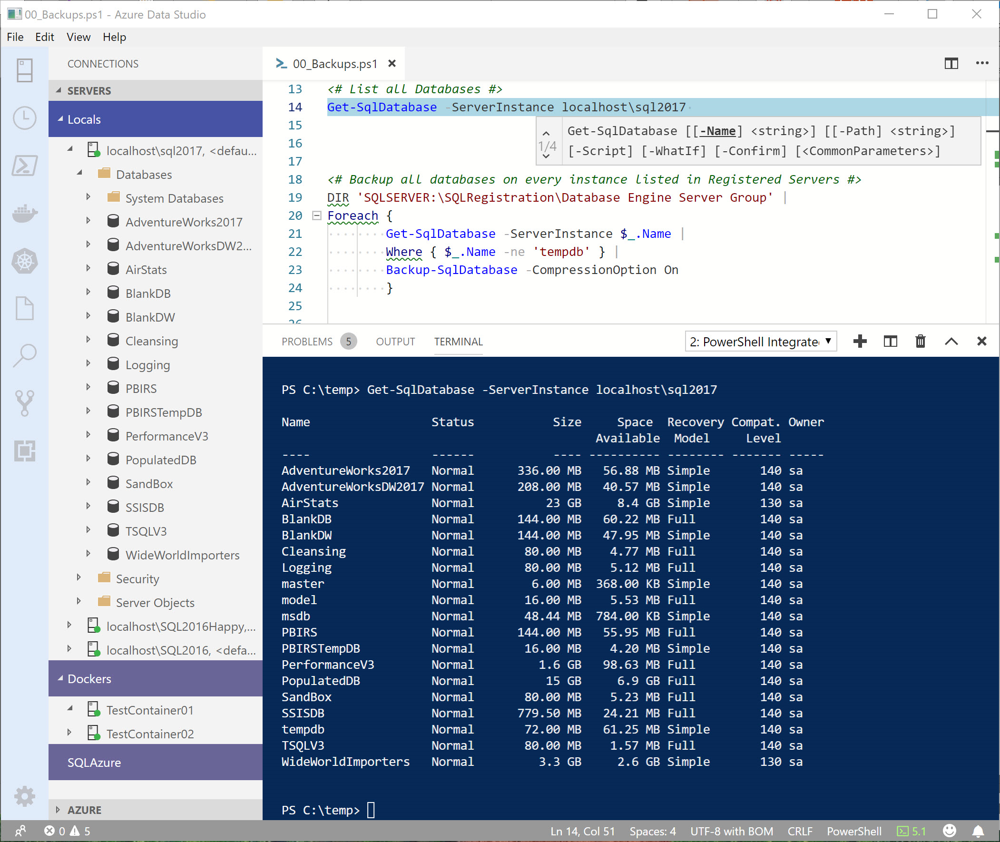

# PowerShell Editor Support for Azure Data Studio

This extension provides rich PowerShell editor support in [Azure Data Studio](https://github.com/Microsoft/azuredatastudio).
Now you can write and debug PowerShell scripts using the excellent IDE-like interface that Azure Data Studio provides.




## Features

- Syntax highlighting
- Code snippets
- IntelliSense for cmdlets and more
- Rule-based analysis provided by [PowerShell Script Analyzer](http://github.com/PowerShell/PSScriptAnalyzer)
- Go to Definition of cmdlets and variables
- Find References of cmdlets and variables
- Document and workspace symbol discovery
- Run selected selection of PowerShell code using <kbd>F8</kbd>
- Launch online help for the symbol under the cursor using <kbd>Ctrl</kbd>+<kbd>F1</kbd>
- Basic interactive console support!


## Installing the Extension

You can install the official release of the PowerShell extension by following the steps
in the [Azure Data Studio documentation](https://docs.microsoft.com/sql/azure-data-studio/extensions).
In the Extensions pane, search for "PowerShell" extension and install it there.  You will
get notified automatically about any future extension updates!

You can also install a VSIX package from our [Releases page](https://github.com/PowerShell/vscode-powershell/releases) and install it through the command line:

```powershell
azuredatastudio --install-extension PowerShell-<version>.vsix
```

## Platform support

- **Windows 7 through 10** with Windows PowerShell v3 and higher, and PowerShell Core
- **Linux** with PowerShell Core (all PowerShell-supported distributions)
- **macOS** with PowerShell Core

Read the [FAQ](https://github.com/PowerShell/vscode-powershell/wiki/FAQ) for answers to common questions.

## Installing PowerShell Core

If you are running Azure Data Studio on MacOS or Linux, you may also need to install PowerShell Core.

PowerShell Core is an Open Source project on [GitHub](https://github.com/powershell/powershell).
For more information on installing PowerShell Core on MacOS or Linux platforms, see the following articles:

- [Installing PowerShell Core on Linux](https://docs.microsoft.com/powershell/scripting/install/installing-powershell-core-on-linux?view=powershell-6)
- [Installing PowerShell Core on macOS](https://docs.microsoft.com/powershell/scripting/install/installing-powershell-core-on-macos?view=powershell-6)

## Example Scripts

There are some example scripts in the extension's `examples` folder that you can
use to discover PowerShell editing and debugging functionality.  Check out the included [README.md](https://github.com/PowerShell/vscode-powershell/blob/master/examples/README.md) file to learn more about
how to use them.

This folder can be found at the following path:

```powershell
$HOME/.azuredatastudio/extensions/ms-vscode.PowerShell-<version>/examples
```

or if you're using the preview version of the extension

 ```powershell
$HOME/.azuredatastudio/extensions/ms-vscode.powershell-preview-<version>/examples
```

To open/view the extension's examples in Azure Data Studio, run the following from your PowerShell command prompt:

```powershell
azuredatastudio (Get-ChildItem $Home\.azuredatastudio\extensions\ms-vscode.PowerShell-*\examples)[-1]
```

### Creating and opening files

To create and open a new file inside the editor, use the New-EditorFile from within the PowerShell Integrated Terminal.

```powershell
PS C:\temp> New-EditorFile ExportData.ps1
```

This command works for any file type, not just PowerShell files.

```powershell
PS C:\temp> New-EditorFile ImportData.py
```

To open one or more files in Azure Data Studio, use the `Open-EditorFile` command.

```powershell
Open-EditorFile ExportData.ps1, ImportData.py
```

### No focus on console when executing

For those who are used to working with SSMS, you're used to being able to run a query, and then being able to re-run it again without having to switch back to the query pane.  In this case, the default behavior of the code editor may feel strange to you.  To keep the focus in the editor when you execute with <kbd>F8</kbd> change the following setting:

```json
"powershell.integratedConsole.focusConsoleOnExecute": false
```

The default is `true` for accessibility purposes.

Please be aware this will prevent the focus from changeing to the console, even when you use a command that explicitly calls for input, like `Get-Credential`.

## SQL PowerShell Examples
In order to use these examples (below), you need to install the SqlServer module from the [PowerShell Gallery](https://www.powershellgallery.com/packages/SqlServer).

```powershell
Install-Module -Name SqlServer
```

> [!NOTE]
> With version `21.1.18102` and up, the `SqlServer` module supports [PowerShell Core](https://github.com/PowerShell/PowerShell) 6.2 and up, in addition to Windows PowerShell.

In this example, we use the `Get-SqlInstance` cmdlet to Get the Server SMO objects for ServerA & ServerB.  The default output for this command will include the Instance name, version, Service Pack, & CU Update Level of the instances.

```powershell
Get-SqlInstance -ServerInstance ServerA, ServerB
```

Here is a sample of what that output will look like:

```
Instance Name             Version    ProductLevel UpdateLevel  HostPlatform HostDistribution
-------------             -------    ------------ -----------  ------------ ----------------
ServerA                   13.0.5233  SP2          CU4          Windows      Windows Server 2016 Datacenter
ServerB                   14.0.3045  RTM          CU12         Linux        Ubuntu
```
The `SqlServer` module contains a Provider called `SQLRegistration` which allows you to programatically access the follwing types of saved SQL Server connections:

+ Database Engine Server (Registered Servers)
+ Central Management Server (CMS)
+ Analysis Services
+ Integration Services
+ Reporting Services

 In the following example, we will do a `dir` (alias for `Get-ChildItem`) to get the list of all SQL Server instances listed in your Registered Servers file.

```powershell
dir 'SQLSERVER:\SQLRegistration\Database Engine Server Group' -Recurse 
```

Here is a sample of what that output could look like:

```powershell
Mode Name
---- ----
-    ServerA
-    ServerB
-    localhost\SQL2017
-    localhost\SQL2016Happy
-    localhost\SQL2017
```

For many operations that involve a database, or objects within a database, the `Get-SqlDatabase` cmdlet can be used.  If you supply values for the both the `-ServerInstance` and `-Database` parameters, only that one database object will be retrieved.  However, if you specify only the `-ServerInstance` parameter, a full list of all databases on that instance will be returned.

Here is a sample of what that output will look like:

```
Name                 Status           Size     Space  Recovery Compat. Owner
                                            Available  Model     Level
----                 ------           ---- ---------- -------- ------- -----
AdventureWorks2017   Normal      336.00 MB   57.01 MB Simple       140 sa
master               Normal        6.00 MB  368.00 KB Simple       140 sa
model                Normal       16.00 MB    5.53 MB Full         140 sa
msdb                 Normal       48.44 MB    1.70 MB Simple       140 sa
PBIRS                Normal      144.00 MB   55.95 MB Full         140 sa
PBIRSTempDB          Normal       16.00 MB    4.20 MB Simple       140 sa
SSISDB               Normal      325.06 MB   26.21 MB Full         140 sa
tempdb               Normal       72.00 MB   61.25 MB Simple       140 sa
WideWorldImporters   Normal         3.2 GB     2.6 GB Simple       130 sa
```

This next example uses the `Get-SqlDatabase` cmdlet to retrieve a list of all databases on the ServerB instance, then presents a grid/table (using the `Out-GridView` cmdlet) to select which databases should be backed up.  Once the user clicks on the "OK" button, only the highlighted databases will be backed up.

```powershell
Get-SqlDatabase -ServerInstance ServerB |
Out-GridView -PassThru |
Backup-SqlDatabase -CompressionOption On
```

This example, again, gets list of all SQL Server instances listed in your Registered Servers file, then calls the `Get-SqlAgentJobHistory` which reports every failed SQL Agent Job since Midnight, for each SQL Server instance listed.

```powershell
dir 'SQLSERVER:\SQLRegistration\Database Engine Server Group' -Recurse |
WHERE {$_.Mode -ne 'd' } |
FOREACH {
    Get-SqlAgentJobHistory -ServerInstance  $_.Name -Since Midnight -OutcomesType Failed
}
```

In this example, we will do a `dir` (alias for `Get-ChildItem`) to get the list of all SQL Server instances listed in your Registered Servers file, and then use the `Get-SqlDatabase` cmdlet to get a list of Databases for each of those instances.

```powershell
dir 'SQLSERVER:\SQLRegistration\Database Engine Server Group' -Recurse |
WHERE { $_.Mode -ne 'd' } |
FOREACH {
    Get-SqlDatabase -ServerInstance $_.Name
}
```

Here is a sample of what that output will look like:

```
Name                 Status           Size     Space  Recovery Compat. Owner
                                            Available  Model     Level      
----                 ------           ---- ---------- -------- ------- -----
AdventureWorks2017   Normal      336.00 MB   57.01 MB Simple       140 sa   
master               Normal        6.00 MB  368.00 KB Simple       140 sa   
model                Normal       16.00 MB    5.53 MB Full         140 sa   
msdb                 Normal       48.44 MB    1.70 MB Simple       140 sa   
PBIRS                Normal      144.00 MB   55.95 MB Full         140 sa   
PBIRSTempDB          Normal       16.00 MB    4.20 MB Simple       140 sa   
SSISDB               Normal      325.06 MB   26.21 MB Full         140 sa   
tempdb               Normal       72.00 MB   61.25 MB Simple       140 sa   
WideWorldImporters   Normal         3.2 GB     2.6 GB Simple       130 sa   
```

## Reporting Problems

If you experience any problems with the PowerShell Extension, see
[the troubleshooting docs](https://github.com/PowerShell/vscode-powershell/blob/master/docs/troubleshooting.md) for information
on diagnosing and reporting issues.

#### Security Note

For any security issues, see [here](https://github.com/PowerShell/vscode-powershell/blob/master/docs/troubleshooting.md#note-on-security).

## Contributing to the Code

Check out the [development documentation](https://github.com/PowerShell/vscode-powershell/blob/master/docs/development.md) for more details
on how to contribute to this extension!

## Maintainers

- [Keith Hill](https://github.com/rkeithhill) - [@r_keith_hill](http://twitter.com/r_keith_hill)
- [Tyler Leonhardt](https://github.com/tylerl0706) - [@TylerLeonhardt](http://twitter.com/tylerleonhardt)
- [Rob Holt](https://github.com/rjmholt)

## License

This extension is [licensed under the MIT License](https://github.com/PowerShell/vscode-powershell/blob/master/LICENSE.txt). For details on the third-party
binaries that we include with releases of this project, see the [third-party notices](https://github.com/PowerShell/vscode-powershell/blob/master/Third%20Party%20Notices.txt) file.

## [Code of Conduct][conduct-md]

This project has adopted the [Microsoft Open Source Code of Conduct][conduct-code].
For more information, see the [Code of Conduct FAQ][conduct-FAQ] or contact [opencode@microsoft.com][conduct-email] with any additional questions or comments.

[conduct-code]: http://opensource.microsoft.com/codeofconduct/
[conduct-FAQ]: http://opensource.microsoft.com/codeofconduct/faq/
[conduct-email]: mailto:opencode@microsoft.com
[conduct-md]: https://github.com/PowerShell/vscode-powershell/blob/master/CODE_OF_CONDUCT.md
