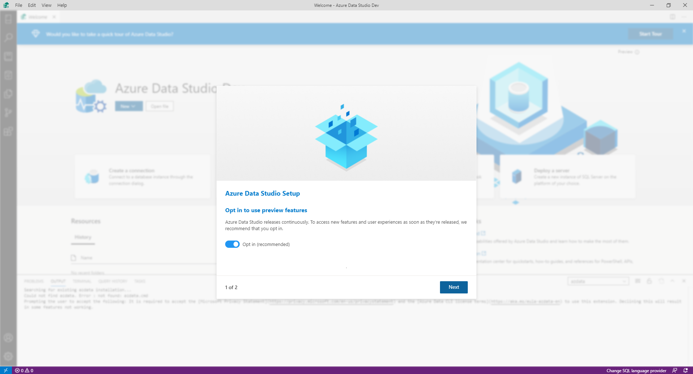

# Preview features in Azure Data Studio

Azure Data Studio releases continuously. Before new features and improvements are made broadly available, they're first released as **Preview features**. While all Preview features are stable to use, the amount of time a feature remains in Preview can vary from feature to feature. By enabling Preview features, you will get full access to Azure Data Studio features and the chance to provide early feedback.

## How do I enable Preview features?
### On first launch
The first time you launch Azure Data Studio, you'll be greeted with an **Initial Setup Wizard** that guides you through some simple onboarding tasks. You can configure your Preview settings in the first step of the Wizard.

To enable preview features in the **Initial Setup Wizard**, make sure you have selected **opt in (recommended)**. It should be selected by default. When you are finished with the Initial Setup Wizard, Preview features will be enabled.

### In Settings
You can enable or disable Preview features anytime in your Settings.

1. Select the **Gear** icon in the bottom-left corner and then select **Settings** from the context menu. The Settings tab will open.

2. Type "enable preview features" in the search bar.
3. To enable Preview features, check the checkbox for **Enable unreleased preview features** under **Workbench: Enable Preview Features**. To disable Preview features, clear the checkbox.

## Current list of Preview features in Azure Data Studio

### General features in Preview
* Azure portal integration
* Backup / Restore
* Deployments
    * SQL Edge
    * SQL Server Big Data Cluster
    * SQL Server container image
    * SQL Server on Windows
* Feature tour
* SQLCMD mode
* New Welcome page

### Notebook features in Preview
* Dotnet interactive support
* Markdown toolbar
* New Notebook toolbar
* Notebook kernels
    * Kusto
    * PowerShell
    * PySpark
    * Python
    * Spark | Scala
    * Spark | R
    * SQL
* Open Notebook from browser
* Pinned Notebooks
* Python dependencies wizard

### First-party extensions in Preview
* Admin Pack for SQL Server
* Azure SQL Data Warehouse Insights
* Central Management Servers
* Database Administration Tool Extensions for Windows
* Kusto
* Language packs
* PostgreSQL
* PowerShell
* Query History
* SandDance for Azure Data Studio
* Server Reports
* SQL Assessment
* SQL Server Agent
* SQL Server Profiler
* Machine Learning
* Managed Instance Dashboard
* Visual Studio IntelliCode
* whoisactive