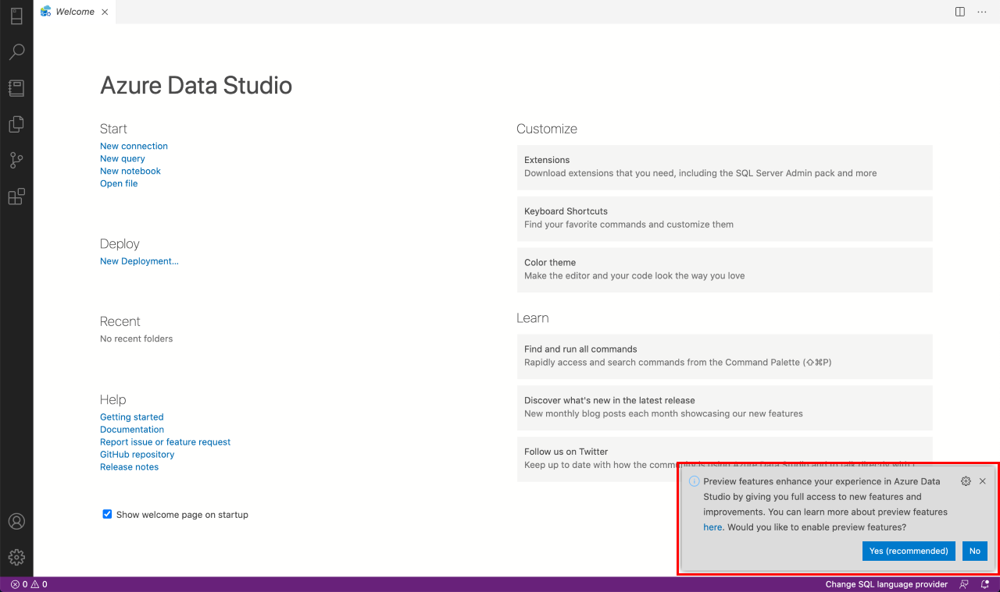
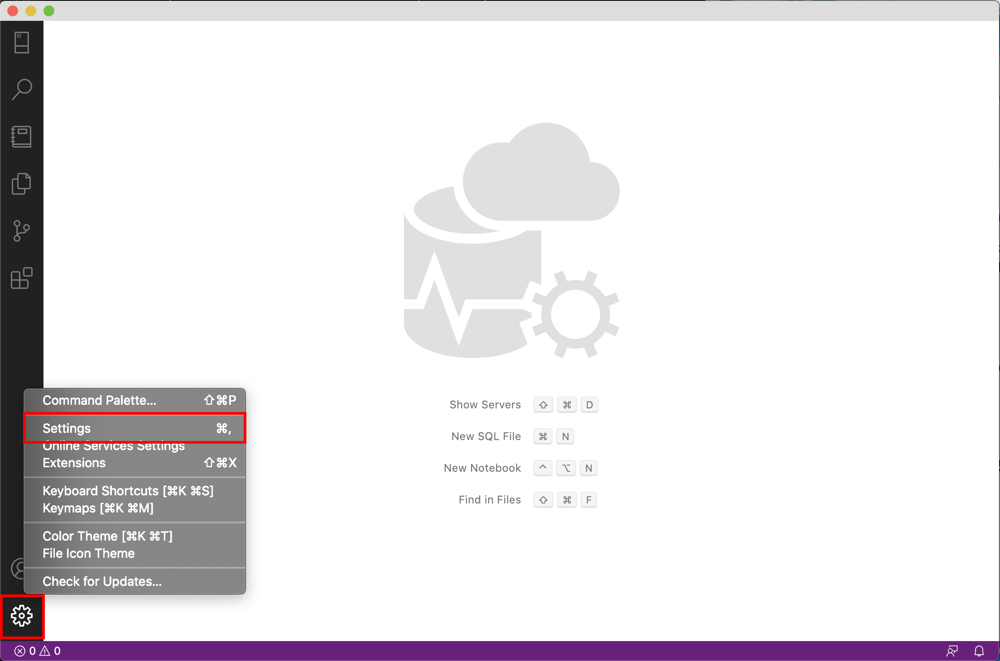
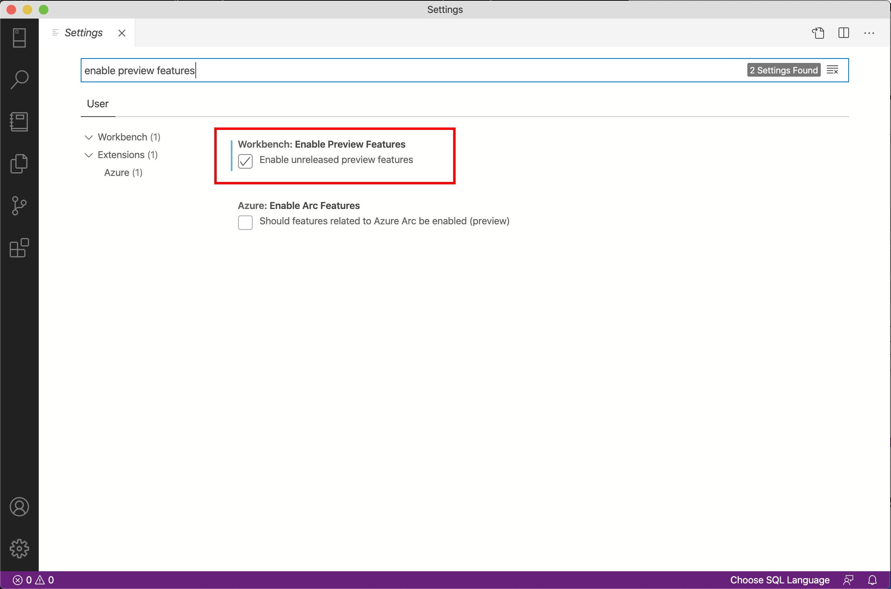

# Preview features in Azure Data Studio

In Azure Data Studio, new features and improvements are often first released as preview features before they're made generally available (GA). The amount of time a feature remains in preview can vary based on user feedback, quality checks, and long-term road maps. By enabling preview features, you get full access to Azure Data Studio features and the chance to provide early feedback.

## How do I enable preview features?

### On first launch

If you're a new user, you can opt into preview features when you launch Azure Data Studio for the first time. On startup, a toast notification will appear in the bottom-right corner of the screen that gives you the option to enable or disable preview features. Select **Yes (recommended)** to enable preview features.

### In Settings

You can enable or disable preview features anytime in your Settings.

1. Select the **Gear** icon in the bottom-left corner and then select **Settings** from the context menu. The Settings tab will open.

   

2. Type "enable preview features" in the search bar.

3. To enable preview features, check the checkbox for **Enable unreleased preview features** under **Workbench: Enable Preview Features**. To disable preview features, clear the checkbox.

   

## List of preview features in Azure Data Studio

### General features in preview

* Azure portal integration
* Backup / Restore
* Deployments
    * SQL Edge
* Feature tour

### Notebook features in preview

* Dotnet interactive support

### First-party extensions in preview

* Azure Monitor Logs
* Azure SQL Edge Deployment
* Central Management Servers
* Cosmos
* Database Administration Tool Extensions for Windows
* Database Migration Assessment for Oracle
* Kusto
* Managed Instance Dashboard
* Oracle
* MySQL
* PostgreSQL
* SandDance for Azure Data Studio
* Server Reports
* SQL Assessment
* SQL Database Projects
* SQL Server Agent
* SQL Server Profiler
* whoisactive

## Next steps

* [Azure Data Studio](what-is-azure-data-studio.md)
