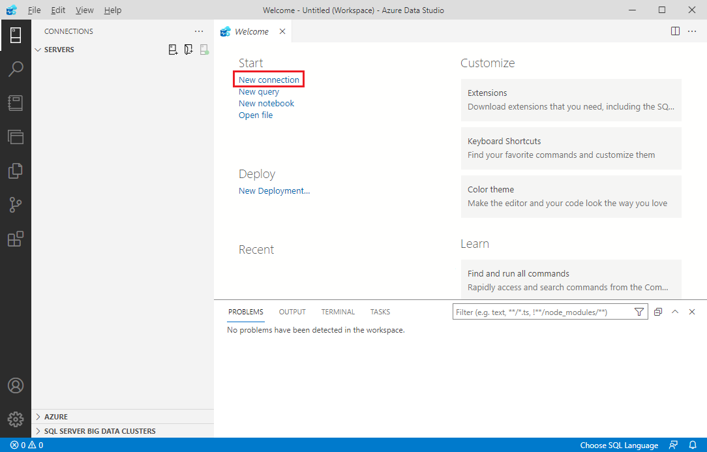
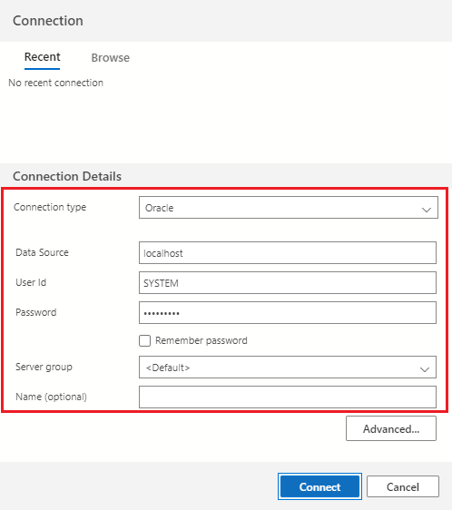
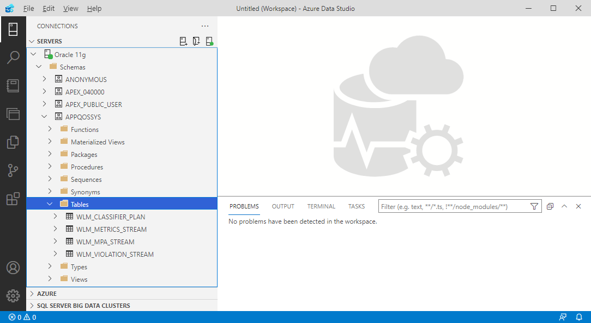

# Quickstart: Use Azure Data Studio to connect and explore Oracle databases

This quickstart shows how to use Azure Data Studio to connect to Oracle database and explore existing database objects.

> [!NOTE]
> Currently extension provides a read-only view of the database objects. Running queries is not supported.

## Prerequisites

To complete this quickstart, you need Azure Data Studio and access to Oracle database.

- [Install Azure Data Studio](./download-azure-data-studio.md).
- [Install the Extension for Oracle](./extensions/extension-for-oracle.md).

## Connect to an Oracle database

1. Start **Azure Data Studio**.

2. The first time you run Azure Data Studio the **Welcome** page should open. If you don't see the **Welcome** page, select **Help** > **Welcome**. Select **New Connection** to open the **Connection** pane:

   

3. In the connection dialog, select **Oracle** as **Connection type** and fill in the following fields:

   - **Data source:** Enter server name, for example, `localhost:1521`. **Data source** can be defined in three different ways: _Easy Connect_/_Easy Connect Plus_, _TNS Alias_ or _Connect Descriptor_. For more information on the format of each method, please refer to the Oracle documentation on **Data Source** attribute of the ODP.NET connection string.

     > [!NOTE]
     > In order to use _TNS Alias_ as a data source, make sure that `ORACLE_HOME` environment variable is set and _TNSNAMES.ORA_ file is located in the `<ORACLE_HOME>/network/admin` folder.

   - **User Id:** User name for the Oracle database
   - **Password:** Password for the Oracle database
   - **Server Group:** \<Default\>

   

   > [!NOTE]
   > Make sure that the Oracle database user used to connect has permissions to enumerate and access objects you are planning to explore. At least `CONNECT` and `SELECT ANY DICTIONARY` permissions should be granted to the connecting user.

4. Click **Connect** to establish the connection.

## Explore database objects

After connection to the Oracle database is established, you will be able to navigate and explore existing database objects using **Connections** view:

