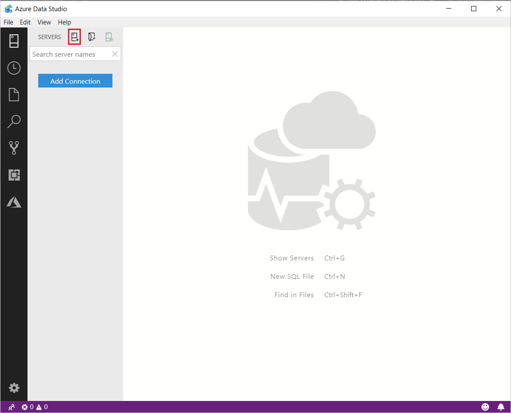
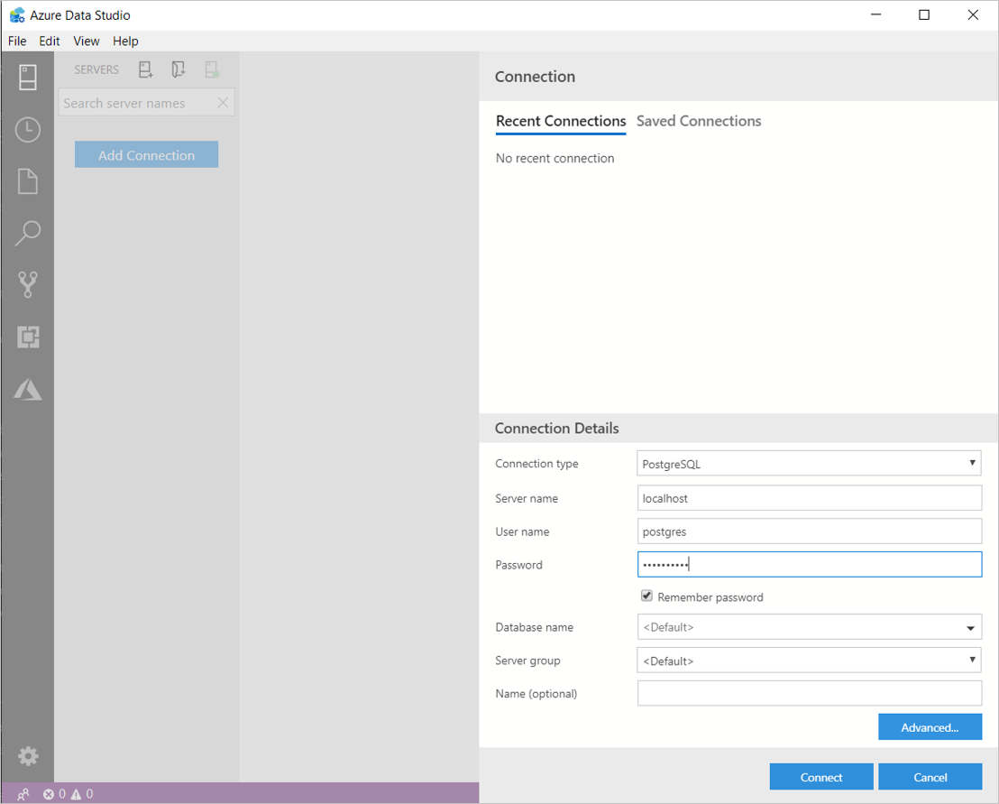
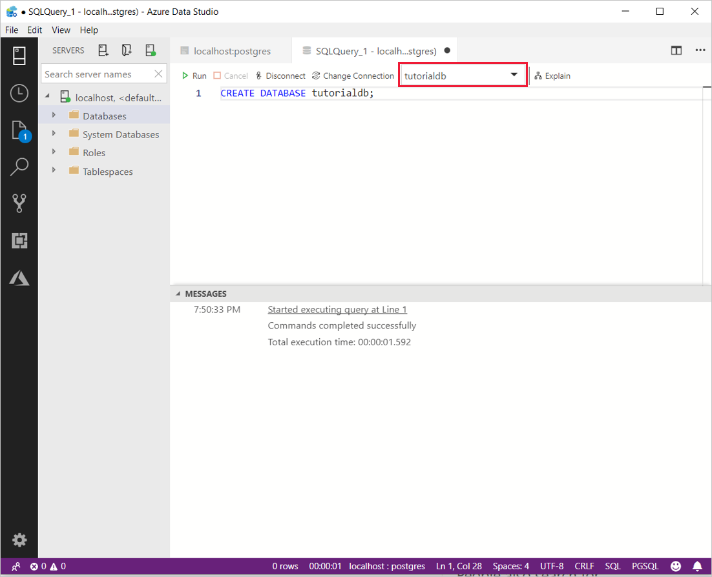
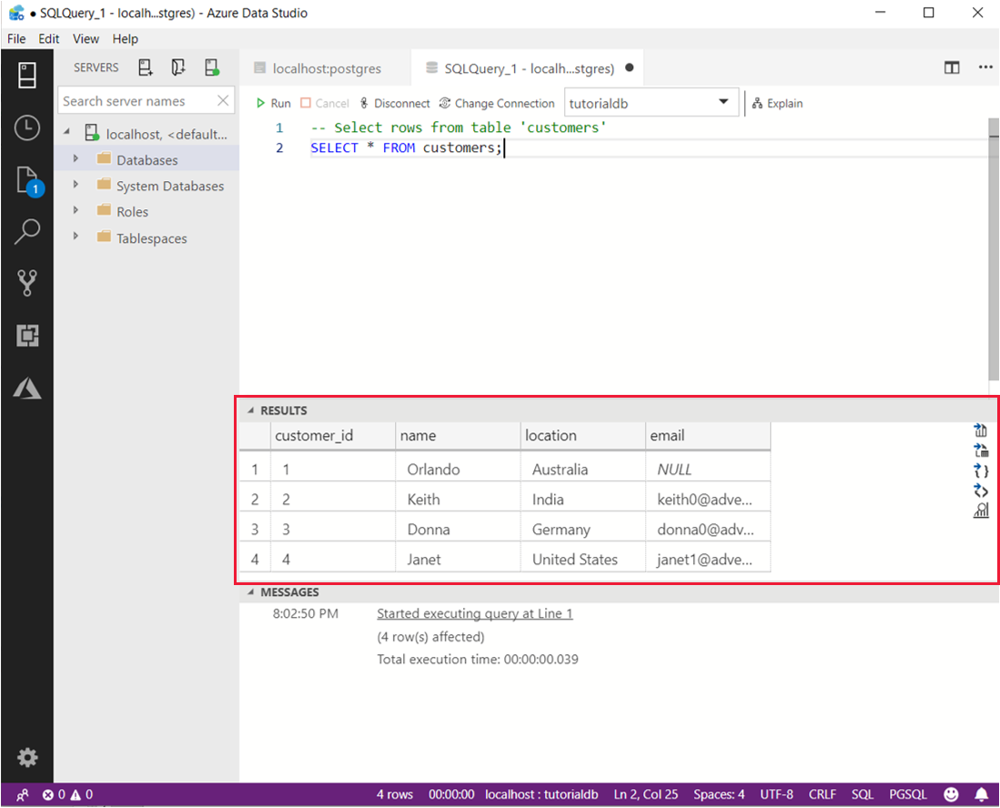

# Quickstart: Connect and query PostgreSQL using [!INCLUDE[name-sos](../includes/name-sos-short.md)]
This quickstart shows how to use [!INCLUDE[name-sos](../includes/name-sos-short.md)] to connect to Postgres, and then use SQL statements to create the database *tutorialdb* and query it.

## Prerequisites

To complete this quickstart, you need [!INCLUDE[name-sos](../includes/name-sos-short.md)], the PostgreSQL extension for [!INCLUDE[name-sos](../includes/name-sos-short.md), and access to a PostgreSQL server.

- [Install [!INCLUDE[name-sos](../includes/name-sos-short.md)]](download.md).
- [Install the PostgreSQL extension for (../includes/name-sos-short.md)].
- [Install PostgreSQL](https://www.postgresql.org/download/). Alternatively, you can use [Azure's PostgreSQL managed service](https://docs.microsoft.com/azure/postgresql/quickstart-create-server-database-portal). 

## Connect to PostgreSQL

1. Start **[!INCLUDE[name-sos](../includes/name-sos-short.md)]**.

2. The first time you start *[!INCLUDE[name-sos](../includes/name-sos-short.md)]* the **Connection** dialog opens. If the **Connection** dialog doesn't open, click the **New Connection** icon in the **SERVERS** page:

   

3. In the form that pops up, go to **Connection type** and select **PostgreSQL** from the drop-down.


4. Fill in the remaining fields using the server name, user name, and password for your PostgreSQL server. 

     

   | Setting       | Example value | Description |
   | ------------ | ------------------ | ------------------------------------------------- | 
   | **Server name** | localhost | The fully qualified server name |
   | **User name** | postgres | The user name you want to log in with. |
   | **Password (SQL Login)** | *password* | The password for the account you are logging in with. |
   | **Password** | *Check* | Check this box if you don't want to enter the password each time you connect. |
   | **Database name** | \<Default\> | Fill this if you want the connection to specify a database. |
   | **Server group** | \<Default\> | This option lets you assign this connection to a specific server group you create. | 
   | **Name (optional)** | *leave blank* | This option lets you specify a friendly name for your server. | 

5. Select **Connect**. 

After successfully connecting, your server opens in the **SERVERS** sidebar.


## Create a database

The following steps create a database named **tutorialdb**:

1. Right-click on your PostgreSQL server in the **SERVERS** sidebar and select **New Query**.

2. Paste this SQL statement in the query editor that opens up.

   ```sql
   CREATE DATABASE tutorialdb;
   ```

3. From the toolbar select **Run** to execute the query. Notifications appear in the **MESSAGES** pane to show query progress.

>![TIP]
> You can click **F5** on your keyboard to execute the statement instead of using **Run**.

After the query completes, right-click **Databases** and select **Refresh** to see **tutorialdb** in the list under the **Databases** node.


## Create a table

 The following steps create a table in the **tutorialdb**:

1. Change the connection context to **tutorialdb** using the drop-down in the query editor. 

   

2. Paste the following SQL statement into the query editor and click **Run**. 

   > [!NOTE]
   > You can either append this or overwrite the existing query in the editor. Clicking **Run** executes only the query that is highlighted. If nothing is highlighted, clicking **Run** executes all queries in the editor.

   ```sql
   -- Drop the table if it already exists
   DROP TABLE IF EXISTS customers;
   -- Create a new table called 'customers'
   CREATE TABLE customers(
       customer_id SERIAL PRIMARY KEY,
       name VARCHAR (50) NOT NULL,
       location VARCHAR (50) NOT NULL,
       email VARCHAR (50) NOT NULL
   );
   ```

## Insert rows

Paste the following snippet into the query window and click **Run**:

   ```sql
   -- Insert rows into table 'customers'
   INSERT INTO customers
       (customer_id, name, location, email)
    VALUES
      ( 1, 'Orlando', 'Australia', ''),
      ( 2, 'Keith', 'India', 'keith0@adventure-works.com'),
      ( 3, 'Donna', 'Germany', 'donna0@adventure-works.com'),
      ( 4, 'Janet', 'United States','janet1@adventure-works.com');
   ```

## Query the data

1. Paste the following snippet into the query editor and click **Run**:
   
   ```sql
   -- Select rows from table 'customers'
   SELECT * FROM customers; 
   ```

2. The results of the query are displayed:

   

