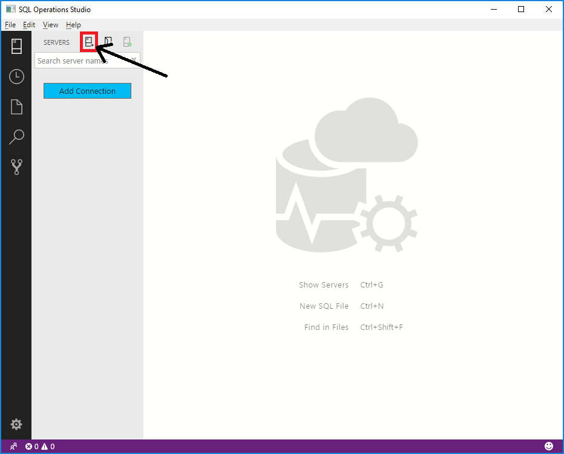
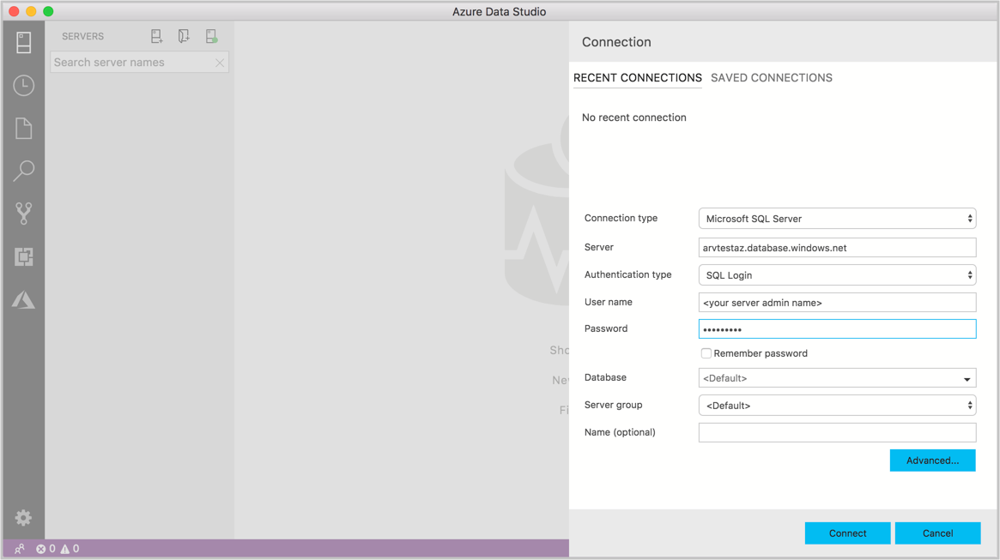
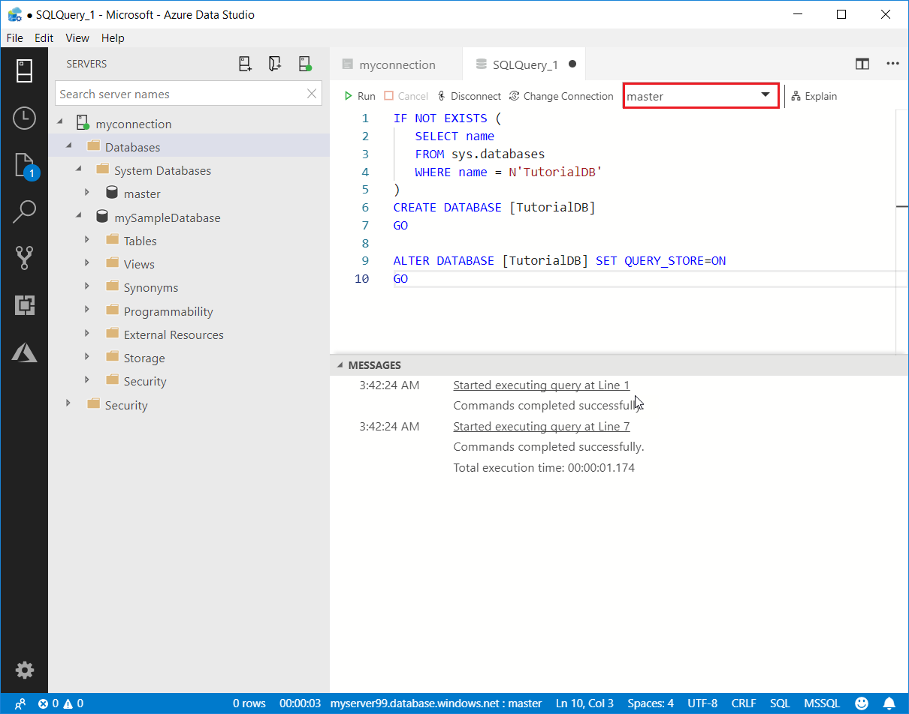
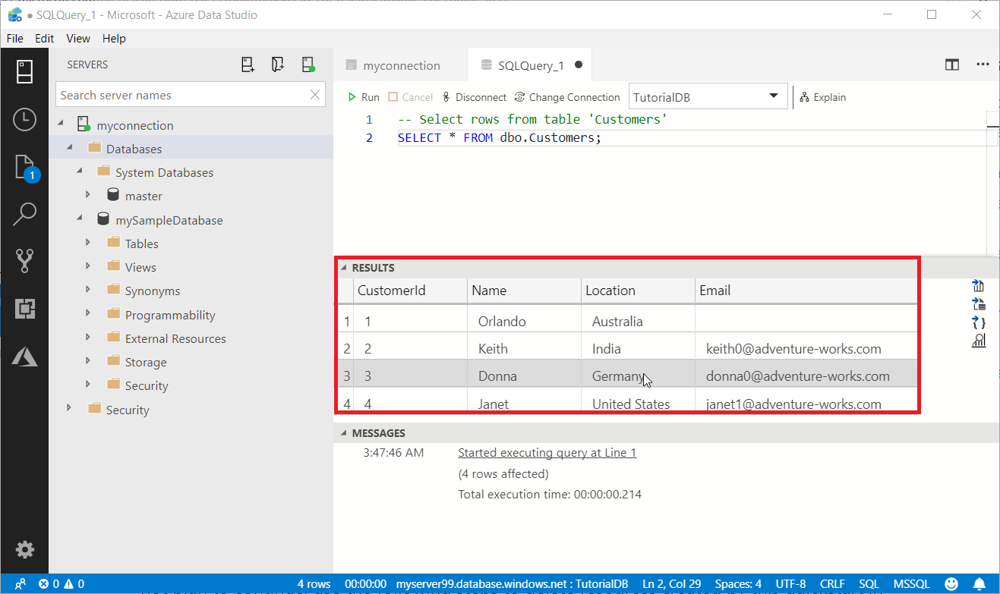

# Quickstart: Use Azure Data Studio to connect and query Azure SQL Database

In this quickstart, you'll  use Azure Data Studio to connect to an Azure SQL Database server. You'll then run Transact-SQL (T-SQL) statements to create and query the TutorialDB database, which is used in other Azure Data Studio tutorials.

## Prerequisites

To complete this quickstart, you need Azure Data Studio, and an Azure SQL Database server.

- [Install Azure Data Studio](./download-azure-data-studio.md)

If you don't have an Azure SQL server, complete one of the following Azure SQL Database quickstarts. Remember the fully qualified server name and sign in credentials for later steps:

- [Create DB - Portal](/azure/sql-database/sql-database-get-started-portal)
- [Create DB - CLI](/azure/sql-database/sql-database-get-started-cli)
- [Create DB - PowerShell](/azure/sql-database/sql-database-get-started-powershell)


## Connect to your Azure SQL Database server

Use Azure Data Studio to establish a connection to your Azure SQL Database server.

1. The first time you run Azure Data Studio the **Welcome** page should open. If you don't see the **Welcome** page, select **Help** > **Welcome**. Select **New Connection** to open the **Connection** pane:
   
   

2. This article uses SQL sign-in, but also supports Windows authentication. Fill in the following fields using the server name, user name, and password for your Azure SQL server:

   | Setting       | Suggested value | Description |
   | ------------ | ------------------ | ------------------------------------------------- | 
   | **Server name** | The fully qualified server name | Something like: **servername.database.windows.net**. |
   | **Authentication** | SQL Login| This tutorial uses SQL Authentication. |
   | **User name** | The server admin account user name | The user name from the account used to create the server. |
   | **Password (SQL Login)** | The server admin account password | The password from the account used to create the server. |
   | **Save Password?** | Yes or No | Select **Yes** if you don't want to enter the password each time. |
   | **Database name** | *leave blank* | You're only connecting to the server here. |
   | **Server Group** | Select \<Default\> | You can set this field to a specific server group you created. | 

     

3. Select **Connect**.

4. If your server doesn't have a firewall rule allowing Azure Data Studio to connect, the **Create new firewall rule** form opens. Complete the form to create a new firewall rule. For details, see [Firewall rules](/azure/sql-database/sql-database-firewall-configure).

     

After successfully connecting, your server opens in the **SERVERS** sidebar.

## Create the tutorial database

The next sections create the TutorialDB database that's used in other Azure Data Studio tutorials.

1. Right-click on your Azure SQL server in the **SERVERS** sidebar and select **New Query**.

1. Paste this SQL into the query editor.

   ```sql
   IF NOT EXISTS (
      SELECT name
      FROM sys.databases
      WHERE name = N'TutorialDB'
   )
   CREATE DATABASE [TutorialDB]
   GO

   ALTER DATABASE [TutorialDB] SET QUERY_STORE=ON
   GO
   ```

1. From the toolbar, select **Run**. Notifications appear in the **MESSAGES** pane showing query progress.

## Create a table

The query editor is connected to the **master** database, but we want to create a table in the **TutorialDB** database. 

1. Connect to the **TutorialDB** database.

   


1. Create a `Customers` table. 

   Replace the previous query in the query editor with this one and select **Run**.

   ```sql
   -- Create a new table called 'Customers' in schema 'dbo'
   -- Drop the table if it already exists
   IF OBJECT_ID('dbo.Customers', 'U') IS NOT NULL
   DROP TABLE dbo.Customers
   GO
   -- Create the table in the specified schema
   CREATE TABLE dbo.Customers
   (
      CustomerId        INT    NOT NULL   PRIMARY KEY, -- primary key column
      Name      [NVARCHAR](50)  NOT NULL,
      Location  [NVARCHAR](50)  NOT NULL,
      Email     [NVARCHAR](50)  NOT NULL
   );
   GO
   ```


## Insert rows into the table

Replace the previous query with this one and select **Run**.

   ```sql
   -- Insert rows into table 'Customers'
   INSERT INTO dbo.Customers
      ([CustomerId],[Name],[Location],[Email])
   VALUES
      ( 1, N'Orlando', N'Australia', N''),
      ( 2, N'Keith', N'India', N'keith0@adventure-works.com'),
      ( 3, N'Donna', N'Germany', N'donna0@adventure-works.com'),
      ( 4, N'Janet', N'United States', N'janet1@adventure-works.com')
   GO
   ```

## View the result

Replace the previous query with this one and select **Run**.

   ```sql
   -- Select rows from table 'Customers'
   SELECT * FROM dbo.Customers;
   ```

The query results display:

   


## Clean up resources

Later quickstart articles build upon the resources created here. If you plan to work through these articles, be sure not to delete these resources. Otherwise, in the Azure portal, delete the resources you no longer need. For details, see [Clean up resources](/azure/sql-database/sql-database-get-started-portal#clean-up-resources).

## Next steps

Now that you've successfully connected to an Azure SQL database and run a query, try the [Code editor tutorial](tutorial-sql-editor.md).
