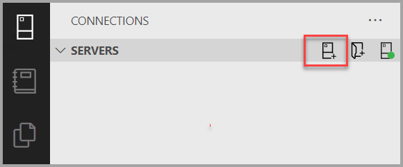
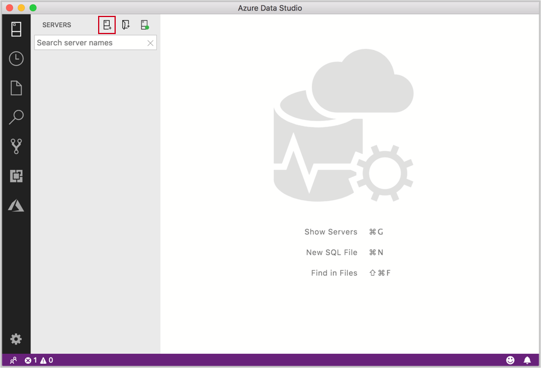
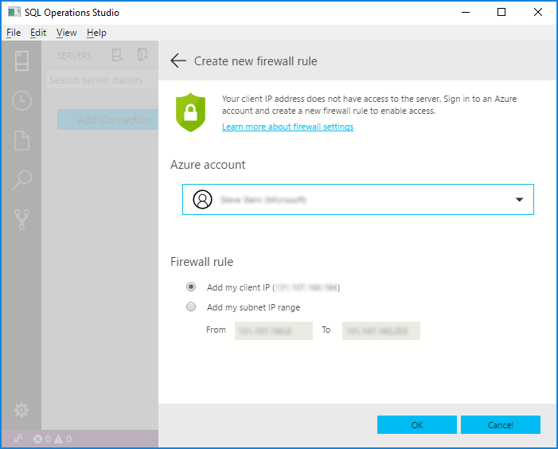
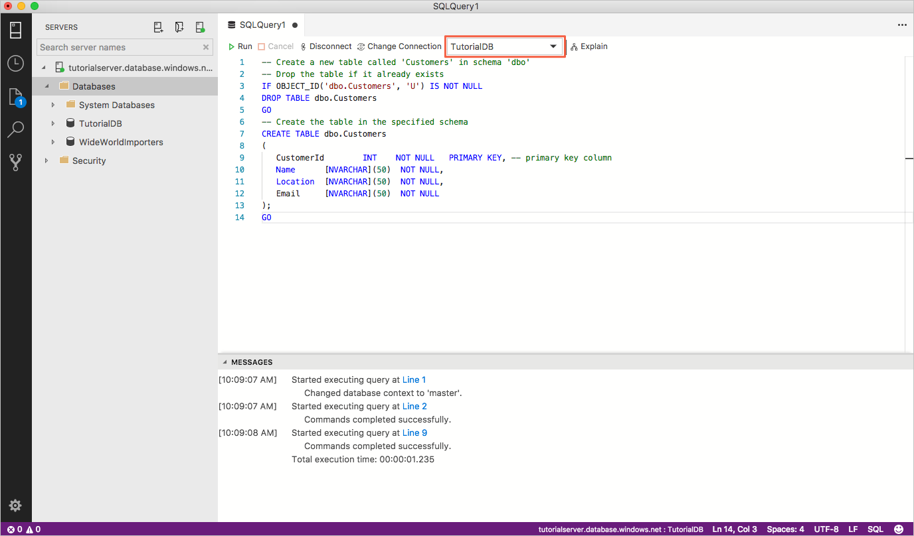
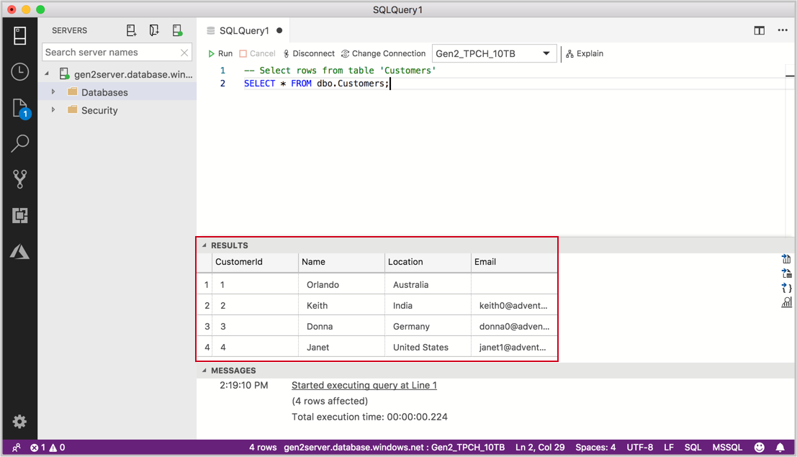

# Quickstart: Use [!INCLUDE[name-sos](../includes/name-sos-short.md)] to connect and query data in Azure SQL Data Warehouse

This quickstart demonstrates how to use [!INCLUDE[name-sos](../includes/name-sos-short.md)] to connect to Azure SQL data warehouse, and then use Transact-SQL statements to create, insert, and select data. 

## Prerequisites
To complete this quickstart, you need [!INCLUDE[name-sos](../includes/name-sos-short.md)], and an Azure SQL data warehouse.

- [Install [!INCLUDE[name-sos](../includes/name-sos-short.md)]](download.md).

If you don't already have a SQL data warehouse, see [Create a SQL Data Warehouse](https://docs.microsoft.com/azure/sql-data-warehouse/sql-data-warehouse-get-started-provision).

Remember the server name, and login credentials!


## Connect to your data warehouse

Use [!INCLUDE[name-sos](../includes/name-sos-short.md)] to establish a connection to your Azure SQL Data Warehouse server.

1. The first time you run [!INCLUDE[name-sos](../includes/name-sos-short.md)] the **Connection** page should open. If you don't see the **Connection** page, click **Add Connection**, or the **New Connection** icon in the **SERVERS** sidebar:
   
   

2. This article uses *SQL Login*, but *Windows Authentication* is also supported. Fill in the fields as follows using the server name, user name, and password for *your* Azure SQL server:

   | Setting       | Suggested value | Description |
   | ------------ | ------------------ | ------------------------------------------------- | 
   | **Server name** | The fully qualified server name | The name should be something like this: **sqldwsample.database.windows.net** |
   | **Authentication** | SQL Login| SQL Authentication is used in this tutorial. |
   | **User name** | The server admin account | This is the account that you specified when you created the server. |
   | **Password (SQL Login)** | The password for your server admin account | This is the password that you specified when you created the server. |
   | **Save Password?** | Yes or No | Select Yes if you do not want to enter the password each time. |
   | **Database name** | *leave blank* | The name of the database to which to connect. |
   | **Server Group** | Select <Default> | If you created a server group, you can set to a specific server group. | 

    

3. If your server doesn't have a firewall rule allowing Azure Data Studio to connect, the **Create new firewall rule** form opens. Complete the form to create a new firewall rule. For details, see [Firewall rules](https://docs.microsoft.com/azure/sql-database/sql-database-firewall-configure).

     

4. After successfully connecting your server opens in the *Servers* sidebar.

## Create the tutorial data warehouse
1. Right click on your server, in the object explorer and select **New Query.**

1. Paste the following snippet into the query editor and click **Run**:

   ```sql
    IF NOT EXISTS (
       SELECT name
       FROM sys.databases
       WHERE name = N'TutorialDB'
    )
    CREATE DATABASE [TutorialDB] (EDITION = 'datawarehouse', SERVICE_OBJECTIVE='DW100');
    GO  
    
    ALTER DATABASE [TutorialDB] SET QUERY_STORE=ON
    GO
   ```


## Create a table

The query editor is still connected to the *master* database, but we want to create a table in the *TutorialDB* database. 

1. Change the connection context to **TutorialDB**:

   


1. Paste the following snippet into the query editor and click **Run**:

   > [!NOTE]
   > You can append this to, or overwrite the previous query in the editor. Note that clicking **Run** executes only the query that is selected. If nothing is selected, clicking **Run** executes all queries in the editor.

   ```sql
   -- Create a new table called 'Customers' in schema 'dbo'
   -- Drop the table if it already exists
   IF OBJECT_ID('dbo.Customers', 'U') IS NOT NULL
   DROP TABLE dbo.Customers
   GO
   -- Create the table in the specified schema
   CREATE TABLE dbo.Customers
   (
      CustomerId        INT     NOT NULL,
      Name      [NVARCHAR](50)  NOT NULL,
      Location  [NVARCHAR](50)  NOT NULL,
      Email     [NVARCHAR](50)  NOT NULL
   );
   GO
   ```


## Insert rows

1. Paste the following snippet into the query editor and click **Run**:

   ```sql
   -- Insert rows into table 'Customers'
   INSERT INTO dbo.Customers
      ([CustomerId],[Name],[Location],[Email])
      SELECT 1, N'Orlando',N'Australia', N'' UNION ALL
      SELECT 2, N'Keith', N'India', N'keith0@adventure-works.com' UNION ALL
      SELECT 3, N'Donna', N'Germany', N'donna0@adventure-works.com' UNION ALL
      SELECT 4, N'Janet', N'United States', N'janet1@adventure-works.com'
   ```


## View the result
1. Paste the following snippet into the query editor and click **Run**:

   ```sql
   -- Select rows from table 'Customers'
   SELECT * FROM dbo.Customers;
   ```

1. The results of the query are displayed:

   


## Clean up resources

Other articles in this collection build upon this quickstart. If you plan to continue on to work with subsequent quickstarts, do not clean up the resources created in this quickstart. If you do not plan to continue, use the following steps to delete resources created by this quickstart in the Azure portal.
Clean up resources by deleting the resource groups you no longer need. For details, see [Clean up resources](https://docs.microsoft.com/azure/sql-database/sql-database-get-started-portal#clean-up-resources).


## Next steps

Now that you've successfully connected to an Azure SQL data warehouse and ran a query, try out the [Code editor tutorial](tutorial-sql-editor.md).
