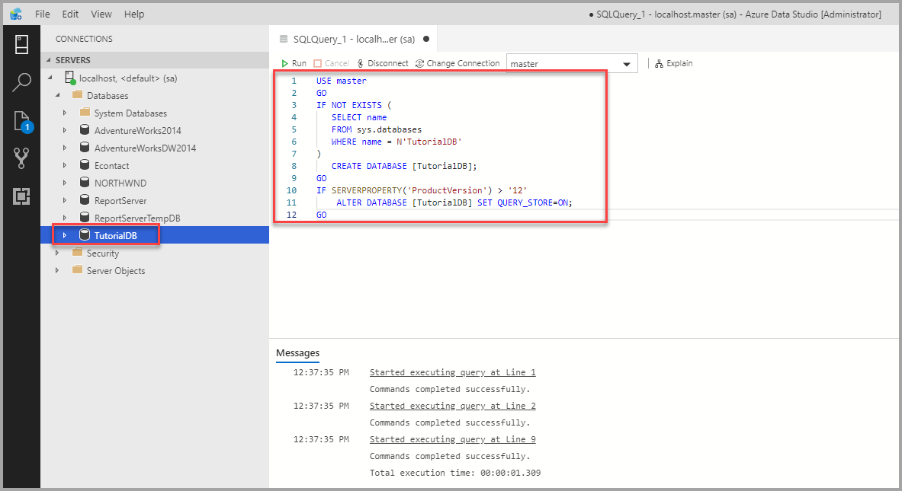

# Quickstart: Use Azure Data Studio to connect and query SQL Server

This quickstart shows how to use Azure Data Studio to connect to SQL Server, and then use Transact-SQL (T-SQL) statements to create the *TutorialDB* used in Azure Data Studio tutorials.

## Prerequisites

To complete this quickstart, you need Azure Data Studio, and access to SQL Server.

- [Install Azure Data Studio](./download-azure-data-studio.md).

If you don't have access to a SQL Server, select your platform from the following links (make sure you remember your SQL Login and Password!):

- [Windows - Download SQL Server 2019 Developer Edition](https://www.microsoft.com/sql-server/sql-server-downloads)
- [macOS - Download SQL Server 2019 on Docker](../linux/quickstart-install-connect-docker.md)
- [Linux - Download SQL Server 2019 Developer Edition](../linux/sql-server-linux-overview.md#install) - You only need to follow the steps up to *Create and Query Data*.

## Connect to a SQL Server

1. Start **Azure Data Studio**.

2. The first time you run Azure Data Studio the **Welcome** page should open. If you don't see the **Welcome** page, select **Help** > **Welcome**. Select **New Connection** to open the **Connection** pane:

   

3. This article uses *SQL Login*, but *Windows Authentication* is supported. Fill in the fields as follows:

   - **Server Name:** Enter server name here. For example, localhost.
   - **Authentication Type:** SQL Login
   - **User name:** User name for the SQL Server
   - **Password:** Password for the SQL Server
   - **Database Name:** \<Default\>
   - **Server Group:** \<Default\>

   

## Create a database

The following steps create a database named **TutorialDB**:

1. Right-click on your server, **localhost**, and select **New Query**.

2. Paste the following snippet into the query window: and then select **Run**.

    ```sql
    USE master
    GO
    IF NOT EXISTS (
     SELECT name
     FROM sys.databases
     WHERE name = N'TutorialDB'
    )
     CREATE DATABASE [TutorialDB];
    GO
    IF SERVERPROPERTY('ProductVersion') > '12'
     ALTER DATABASE [TutorialDB] SET QUERY_STORE=ON;
    GO
    ```

   After the query completes, the new **TutorialDB** appears in the list of databases. If you don't see it, right-click the **Databases** node and select **Refresh**.

   

## Create a table

The query editor is still connected to the *master* database, but we want to create a table in the *TutorialDB* database.

1. Change the connection context to **TutorialDB**:

   

2. Paste the following snippet into the query window and click **Run**:

   > [!NOTE]
   > You can append this too, or overwrite the previous query in the editor. Note that clicking **Run** executes only the query that is selected. If nothing is selected, clicking **Run** executes all queries in the editor.

    ```sql
    -- Create a new table called 'Customers' in schema 'dbo'
    -- Drop the table if it already exists
    IF OBJECT_ID('dbo.Customers', 'U') IS NOT NULL
     DROP TABLE dbo.Customers;
    GO
    -- Create the table in the specified schema
    CREATE TABLE dbo.Customers
    (
     CustomerId int NOT NULL PRIMARY KEY, -- primary key column
     Name nvarchar(50) NOT NULL,
     Location nvarchar(50) NOT NULL,
     Email nvarchar(50) NOT NULL
    );
    GO
    ```

After the query completes, the new **Customers** table appears in the list of tables. You might need to right-click the **TutorialDB > Tables** node and select **Refresh**.

## Insert rows

- Paste the following snippet into the query window and click **Run**:

    ```sql
    -- Insert rows into table 'Customers'
    INSERT INTO dbo.Customers
     ([CustomerId], [Name], [Location], [Email])
    VALUES
     ( 1, N'Orlando', N'Australia', N''),
     ( 2, N'Keith', N'India', N'keith0@adventure-works.com'),
     ( 3, N'Donna', N'Germany', N'donna0@adventure-works.com'),
     ( 4, N'Janet', N'United States', N'janet1@adventure-works.com')
    GO
    ```

## View the data returned by a query

 - Paste the following snippet into the query window and click **Run**:

   ```sql
   -- Select rows from table 'Customers'
   SELECT * FROM dbo.Customers;
   ```

   

## Next steps

Now that you've successfully connected to SQL Server and run a query try out the [Code editor tutorial](tutorial-sql-editor.md).
