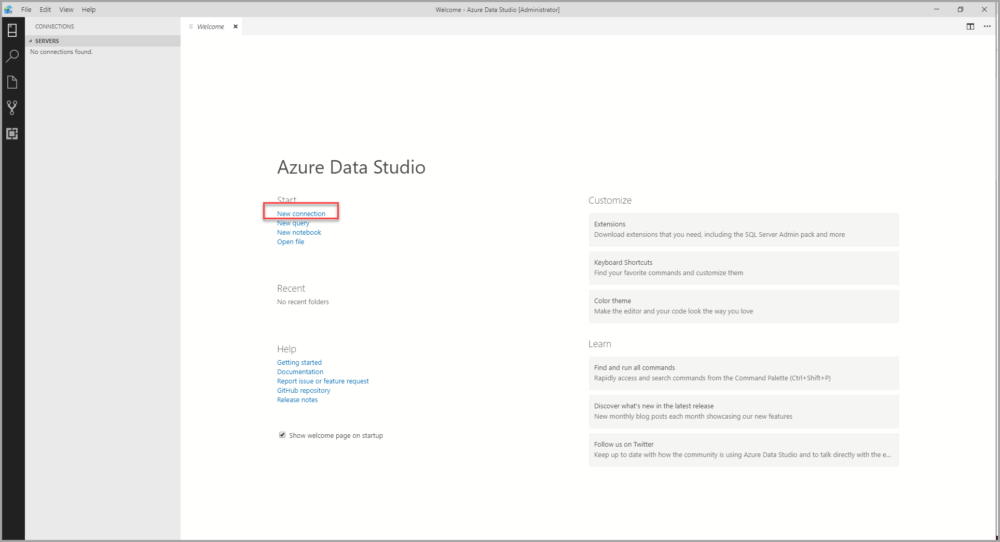
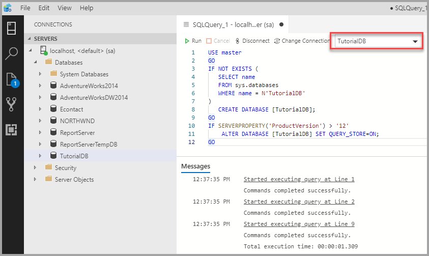
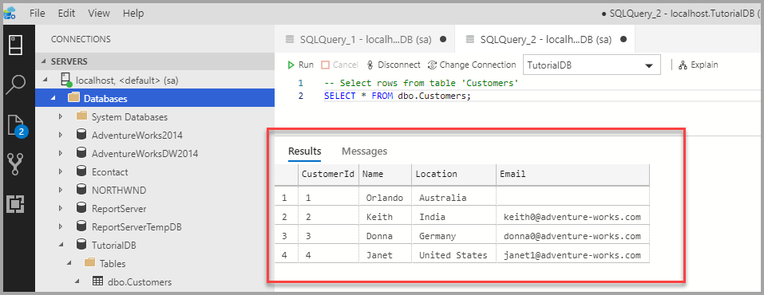

# Quickstart: Connect and query SQL Server using [!INCLUDE[name-sos](../includes/name-sos-short.md)]
This quickstart shows how to use [!INCLUDE[name-sos](../includes/name-sos-short.md)] to connect to SQL Server, and then use Transact-SQL (T-SQL) statements to create the *TutorialDB* used in [!INCLUDE[name-sos](../includes/name-sos-short.md)] tutorials.

## Prerequisites

To complete this quickstart, you need [!INCLUDE[name-sos](../includes/name-sos-short.md)], and access to a SQL Server.

- [Install [!INCLUDE[name-sos](../includes/name-sos-short.md)]](download.md).

If you don't have access to a SQL Server, select your platform from the following links (make sure you remember your SQL Login and Password!):
- [Windows - Download SQL Server 2017 Developer Edition](https://www.microsoft.com/sql-server/sql-server-downloads)
- [macOS - Download SQL Server 2017 on Docker](https://docs.microsoft.com/sql/linux/quickstart-install-connect-docker)
- [Linux - Download SQL Server 2017 Developer Edition](https://docs.microsoft.com/sql/linux/sql-server-linux-overview#install) - You only need to follow the steps up to *Create and Query Data*.


## Connect to a SQL Server

   
1. Start **[!INCLUDE[name-sos](../includes/name-sos-short.md)]**.
1. The first time you run *[!INCLUDE[name-sos](../includes/name-sos-short.md)]* the **Connection** dialog opens. If the **Connection** dialog doesn't open, click the **New Connection** icon in the **SERVERS** page:
   
   

1. This article uses *SQL Login*, but *Windows Authentication* is supported. Fill in the fields as follows:
 
    - **Server Name:** localhost
    - **Authentication Type:** SQL Login  
    - **User name:** User name for the SQL Server  
    - **Password:** Password for the SQL Server  
    - **Database Name:** leave this field blank 
    - **Server Group:** \<Default\>  

   


## Create a database

The following steps create a database named **TutorialDB**:

1. Right click on your server, **localhost**, and select **New Query.**
1. Paste the following snippet into the query window: 

   ```sql
   USE master
   GO
   IF NOT EXISTS (
      SELECT name
      FROM sys.databases
      WHERE name = N'TutorialDB'
   )
      CREATE DATABASE [TutorialDB];
   GO
   IF SERVERPROPERTY('ProductVersion') > '12'
       ALTER DATABASE [TutorialDB] SET QUERY_STORE=ON;
   GO
   ```
1. To execute the query, click **Run** .

After the query completes, the new **TutorialDB** appears in the list of databases. If you don't see it, right-click the **Databases** node and select **Refresh**.


## Create a table

The query editor is still connected to the *master* database, but we want to create a table in the *TutorialDB* database. 

1. Change the connection context to **TutorialDB**:

   


1. Paste the following snippet into the query window  and click **Run**:

   > [!NOTE]
   > You can append this to, or overwrite the previous query in the editor. Note that clicking **Run** executes only the query that is selected. If nothing is selected, clicking **Run** executes all queries in the editor.

   ```sql
   -- Create a new table called 'Customers' in schema 'dbo'
   -- Drop the table if it already exists
   IF OBJECT_ID('dbo.Customers', 'U') IS NOT NULL
      DROP TABLE dbo.Customers;
   GO
   -- Create the table in the specified schema
   CREATE TABLE dbo.Customers
   (
       CustomerId  int NOT NULL PRIMARY KEY, -- primary key column
       Name        nvarchar(50) NOT NULL,
       Location    nvarchar(50) NOT NULL,
       Email       nvarchar(50) NOT NULL
   );
   GO
   ```

After the query completes, the new **Customers** table appears in the list of tables. You might need to right-click the **TutorialDB > Tables** node and select **Refresh**.

## Insert rows

- Paste the following snippet into the query window and click **Run**:

   ```sql
   -- Insert rows into table 'Customers'
   INSERT INTO dbo.Customers
      ([CustomerId], [Name], [Location], [Email])
   VALUES
      ( 1, N'Orlando', N'Australia', N''),
      ( 2, N'Keith', N'India', N'keith0@adventure-works.com'),
      ( 3, N'Donna', N'Germany', N'donna0@adventure-works.com'),
      ( 4, N'Janet', N'United States', N'janet1@adventure-works.com')
   GO
   ```


## View the data returned by a query
1. Paste the following snippet into the query window and click **Run**:

   ```sql
   -- Select rows from table 'Customers'
   SELECT * FROM dbo.Customers;
   ```

1. The results of the query are displayed:

   


## Next steps
Now that you've successfully connected to SQL Server and run a query, try out the [Code editor tutorial](tutorial-sql-editor.md).


