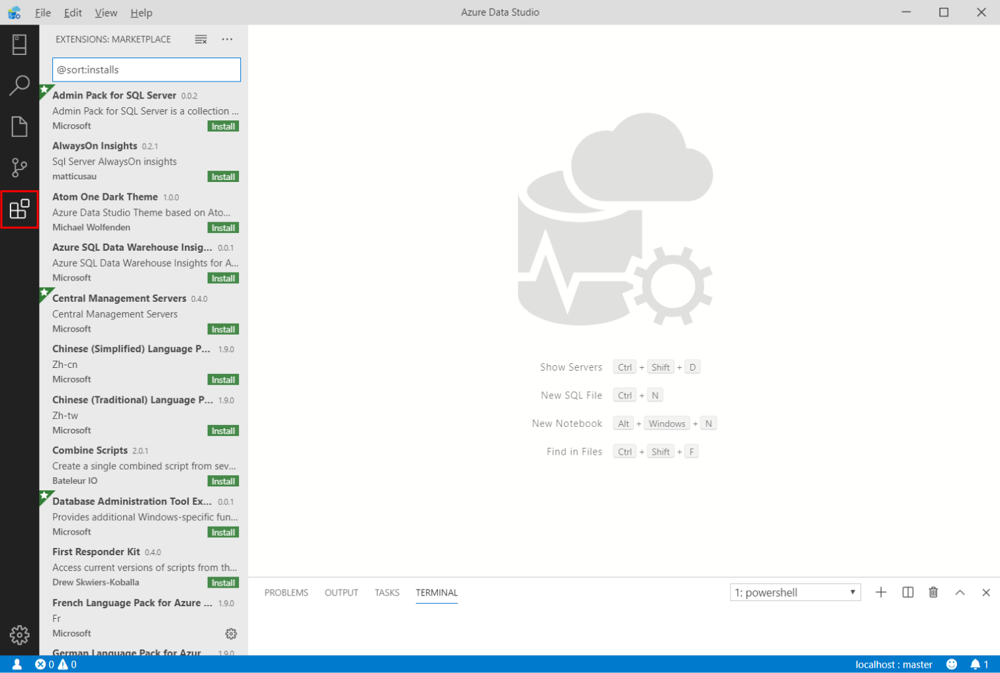
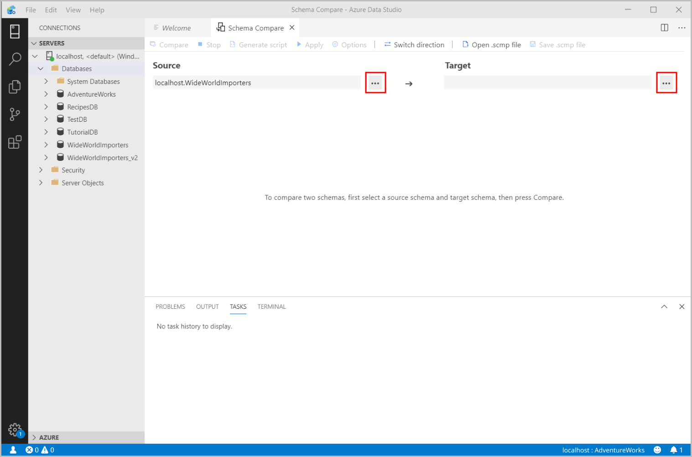

# Schema Compare extension
The Schema Compare extension provides an easy-to-use experience to compare two database definitions and apply the differences from the source to the target.

## Features

* Compare schemas of two dacpac files or databases
* View results as a set of actions that must be taken against the target for it to match the source
* Selectively exclude actions listed in results
* Set options that control the scope of the comparison
* Apply changes to target or generate a script with the same effect
* Save the comparison

## Why Would I Use the Schema Compare Extension?

It can be tedious to manually manage and synchronize different database versions. The Schema Compare extension simplifies the process of comparing databases and gives you full control when synchronizing them &mdash; you can selectively filter specific differences and categories of differences before applying the changes. The Schema Compare extension is a reliable tool that will save you time and code.

## Install the Extension

1. Select the Extensions Icon to view the available extensions.

    

2. Search for the **Schema Compare** extension and select it to view its details. Click **Install** to add the extension.

3. Once installed, **Reload** to enable the extension in Azure Data Studio (only required when installing an extension for the first time).

## Launch a Schema Compare

1. To open the Schema Compare dialog, **right-click** a database in the Object Explorer and click **Schema Compare**. The database you select will be set as the Source database in the comparison.

    

2. Select one of the ellipses (...) to change the Source and Target of your Schema Compare and click OK.

    

3. To customize your comparison, click the **Options** button in the toolbar.

4. Click **Compare** to view the results of the comparison.

## Next steps

To learn more about Schema Compare, [check our documentation.](../ssdt/how-to-use-schema-compare-to-compare-different-database-definitions.md)
Report issues and feature requests [here.](https://github.com/microsoft/azuredatastudio/issues)