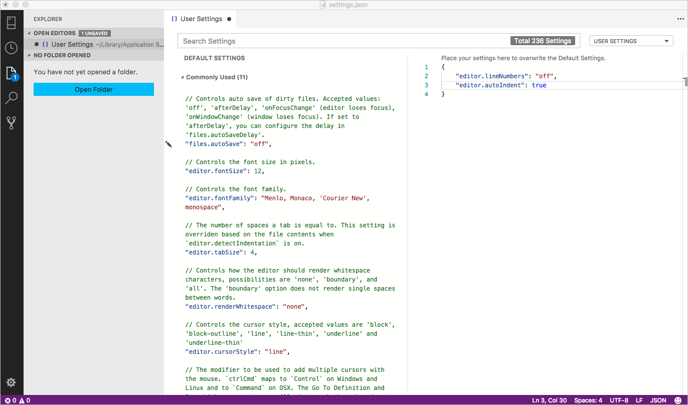

# Modify User and Workspace Settings

It is easy to configure [!INCLUDE[name-sos](../includes/name-sos-short.md)] to your liking through settings. Nearly every part of [!INCLUDE[name-sos](../includes/name-sos-short.md)]'s editor, user interface, and functional behavior has options you can modify.

[!INCLUDE[name-sos](../includes/name-sos-short.md)] provides two different scopes for settings:

* **User** These settings apply globally to any instance of [!INCLUDE[name-sos](../includes/name-sos-short.md)] you open.
* **Workspace** Workspace settings are settings specific to a folder on your computer, and are only available when the folder is open in the Explorer sidebar. Settings defined on this scope override the user scope.

## Creating User and Workspace Settings

The menu command **File** > **Preferences** > **Settings** (**Code** > **Preferences** > **Settings** on Mac) provides the entry point to configure user and workspace settings. You are provided with a list of Default Settings. Copy any setting that you want to change to the appropriate `settings.json` file. The tabs on the right let you switch quickly between the user and workspace settings files.

You can also open the user and workspace settings from the **Command Palette** (**Ctrl+Shift+P**) with **Preferences: Open User Settings** and **Preferences: Open Workspace Settings** or use the keyboard shortcut (**Ctrl+,**).

The following example disables line numbers in the editor and configures lines of code to be indented automatically.

Changes to settings are reloaded by [!INCLUDE[name-sos](../includes/name-sos-short.md)] after the modified `settings.json` file is saved.

>**Note:** Workspace settings are useful for sharing project-specific settings across a team.

## Settings File Locations

Depending on your platform, the user settings file is located here:

* **Windows** `%APPDATA%\azuredatastudio\User\settings.json`
* **Mac** `$HOME/Library/Application Support/azuredatastudio/User/settings.json`
* **Linux** `$HOME/.config/azuredatastudio/User/settings.json`

The workspace setting file is located under the `.[!INCLUDE[name-sos](../includes/name-sos-short.md)]` folder in your project.

## Hot Exit

Azure Data Studio remembers unsaved changes to files when you exit by default. This is the same as the hot exit feature in Visual Studio Code.

By default, hot exit is off. Enable hot exit by editing the `files.hotExit` setting. For details, see [Hot Exit (in the Visual Studio Code documentation)](https://code.visualstudio.com/docs/editor/codebasics#_hot-exit).

## Tab color

To simplify identifying what connections you are working with, open tabs in the editor can have their colors set to match the color of the Server Group the connection belongs to. By default, tab colors are off by default. Enable tab colors by editing the `sql.tabColorMode` setting.

## Additional resources

Because [!INCLUDE[name-sos](../includes/name-sos-short.md)] inherits its user and workspace settings functionality from Visual Studio Code, detailed information about settings is in the [Settings for Visual Studio Code](https://code.visualstudio.com/docs/getstarted/settings) article.
