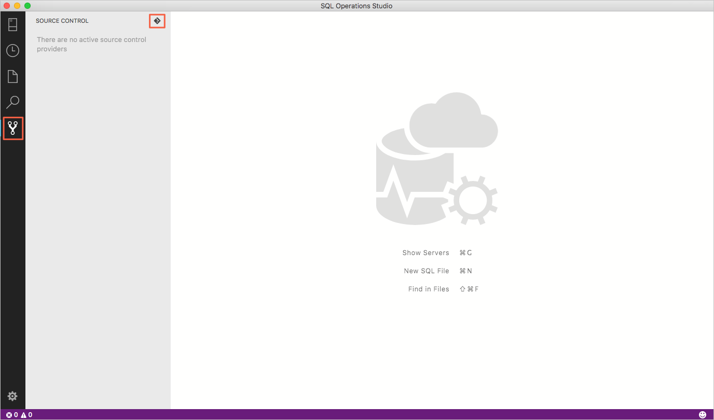
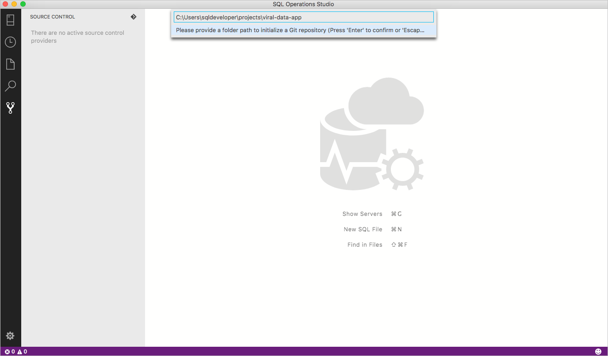

# Source control in Azure Data Studio

Azure Data Studio supports Git for version/source control.

## Git support in Azure Data Studio

Azure Data Studio ships with a Git source control manager (SCM), but you still need to [install Git (version 2.0.0 or later)](https://git-scm.com/download) before these features are available.

## Open an existing Git repository

1. Under the **File** menu, select **Open Folder...**
2. Browse to the folder that contains your files tracked by git, and select **Select Folder**. Subfolders in your local repository are okay to select here.

## Initialize a new git repository

1. Select **Source Control**, then select the git icon.

   

1. Enter the path to the folder you want to initialize as a Git repository and press **Enter**.

   

## Working with Git repositories

Azure Data Studio inherits its Git implementation from VS Code, but doesn't currently support additional SCM providers. For the details about working with Git after you open or initialize a repository, see [Git support in VS Code](https://code.visualstudio.com/docs/editor/versioncontrol#_git-support).

## Additional resources

- [Git documentation](https://git-scm.com/documentation)
