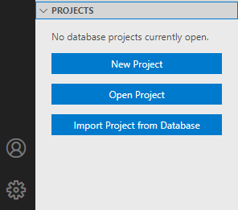

# SQL Database Projects extension (preview)

The SQL Database Projects extension (preview) is an extension for developing SQL databases in a project-based development environment. This extension is currently in preview and is available in the [Azure Data Studio Insiders Build](https://github.com/microsoft/azuredatastudio#try-out-the-latest-insiders-build-from-main).

## Install the SQL Database Projects extension

1. To open the extensions manager and access the available extensions, select the extensions icon, or select **Extensions** in the **View** menu.
2. Identify the *SQL Database Projects* extension by typing all or part of the name in the extension search box. Select an available extension to view its details.

   

3. Select the extension you want and **Install** it.
4. Select **Reload** to enable the extension (only required the first time you install an extension).
5. Select the files icon from the activity bar or select **Explorer** from the **View** menu. A new viewlet for **Projects** is now available.

   > [!NOTE]
   > It is recommended to install the [Schema Compare extension](schema-compare-extension.md) alongside the SQL Database Projects extension for full functionality.

## Getting Started with Database Projects

* Create a new database project by going to the **Projects** viewlet under Explorer, or by searching for **New Database Project** in the command palette.
* Existing database projects can be opened via **Open Database Project** in the command palette.
* Start from an existing database by using **Import New Database Project** from the command palette.

   

### Create an Empty Database Project

 In the **Projects** viewlet under **Explorer**, click the **New Project** button and enter a project name in the text input that appears.  In the "Select a Folder" dialog that appears, select a directory for the project's folder, .sqlproj file, and other contents to reside in.
 The empty project is opened and visible in the **Projects** viewlet for editing.

### Open an Existing Project

In the **Projects** viewlet, click the **Open Project** button and open an existing *.sqlproj* file from the file picker that appears. Existing projects can originate from Azure Data Studio or [Visual Studio SQL Server Data Tools](../ssdt/sql-server-data-tools.md).

The existing project is opened and its contents are visible in the **Projects** viewlet for editing.

### Create a Database Project from an Existing Database

In the **Project** viewlet, click the **Import Project from Database** button and connect to a SQL Server.  Once the connection is established, select a database from the list available databases and set the name of the project.

Finally, select a target structure of the extraction.  The new project is opened and contains SQL scripts for the contents of the selected database.

## Build and Publish

Deploying the database project is achieved in the SQL Database Projects extension for Azure Data Studio by building the project into a [data-tier application file](../relational-databases/data-tier-applications/data-tier-applications.md) (DACPAC) and publishing to a supported platform. For more on this process, please see [Build and Publish a Project](sql-database-project-extension-build.md).

## Schema Compare
The SQL Database Projects extension interacts with the [Schema Compare extension](schema-compare-extension.md), if installed, to compare the contents of a project to a dacpac or existing database.  The resulting schema comparison can be used to view and apply the differences from source to target.

## Next steps

- [Build and Publish a project with SQL Database Projects extension for Azure Data Studio](sql-database-project-extension-build.md)
- [Data Tier Applications](../relational-databases/data-tier-applications/data-tier-applications.md)