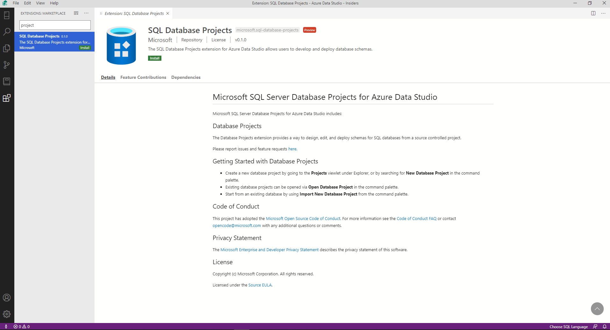

# SQL Database Projects extension (Preview)

The SQL Database Projects extension (preview) is an extension for developing SQL databases in a project-based development environment. This extension is currently in preview and is available in the [Azure Data Studio Insiders Build](https://github.com/microsoft/azuredatastudio#try-out-the-latest-insiders-build-from-main).

## Features

1. Create project from a connected database 
2. Create a new blank project
3. Open a Project previously created in [Azure Data Studio](sql-database-project-extension-getting-started.md) or in [SQL Server Data Tools](../ssdt/sql-server-data-tools.md) 
4. Edit project by adding or removing Table, View, Stored Procedure, or custom scripts in the project 
5. Organize files/scripts in folders 
6. Add references to system databases or user dacpac
7. Build single project 
8. Deploy single project
9. Load connection details (SQL Windows authentication) and SQLCMD variables from deployment profile 

## Install the SQL Database Projects extension

1. Open the extensions manager to access the available extensions.  To do so, either select the extensions icon or select **Extensions** in the **View** menu.
2. Identify the *SQL Database Projects* extension by typing all or part of the name in the extension search box. Select an available extension to view its details.

   

3. Select the extension you want and **Install** it.
4. Select **Reload** to enable the extension (only required the first time you install an extension).
5. Select the files icon from the activity bar or select **Explorer** from the **View** menu. A new viewlet for **Projects** is now available.

   > [!NOTE]
   > The .NET Core SDK is required for project build functionality and you will be prompted to install the .NET Core SDK if it cannot be detected by the extension.  The .NET Core SDK (v3.1 or higher) can be downloaded and installed from [https://dotnet.microsoft.com/download/dotnet-core/3.1](https://dotnet.microsoft.com/download/dotnet-core/3.1).

   > [!NOTE]
   > It is recommended to install the [Schema Compare extension](schema-compare-extension.md) alongside the SQL Database Projects extension for full functionality.

## Known limitations
1. Adding project references and loading existing project references in Azure Data Studio viewlet is not currently supported. 
2. Loading files as link is not supported in Azure Data Studio viewlet today, however the files will be loaded at the top level in tree and build will incorporate these files as expected. 
3. Pre-Post deploy script adding and loading in viewlet is not supported as of today, however if you manually add these files in project they will be honored at build time. 
3. SQLCLR objects in project are not supported in .NET Core version of DacFx. 
3. Tasks (build/publish) are not user-defined
3. Publish targets defined by DacFx
3. Source control integration and new project creation do not automatically create .gitignore file 
3. WSL environment support is limited 

## Next steps
- [Getting Started with the SQL Database Projects extension](sql-database-project-extension-getting-started.md)
- [Build and Publish a project with SQL Database Projects extension for Azure Data Studio](sql-database-project-extension-build.md)