# How to use notebooks in Azure Data Studio

This article describes how to launch the Notebook experience in Azure Data Studio and how to start authoring your own notebooks. It also shows how to write Notebooks using different kernels.


## Connect to SQL Server

You can connect to the Microsoft SQL Server connection type in Azure Data Studio.
In Azure Data Studio, you can also press F1, and click **New Connection** and connect to your SQL Server.

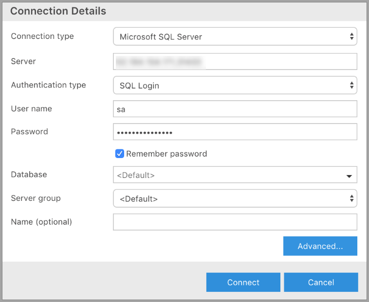

## Launch Notebooks

There are multiple ways to launch a new notebook.

1. Go to the **File Menu** in Azure Data Studio and then click on **New Notebook**.

    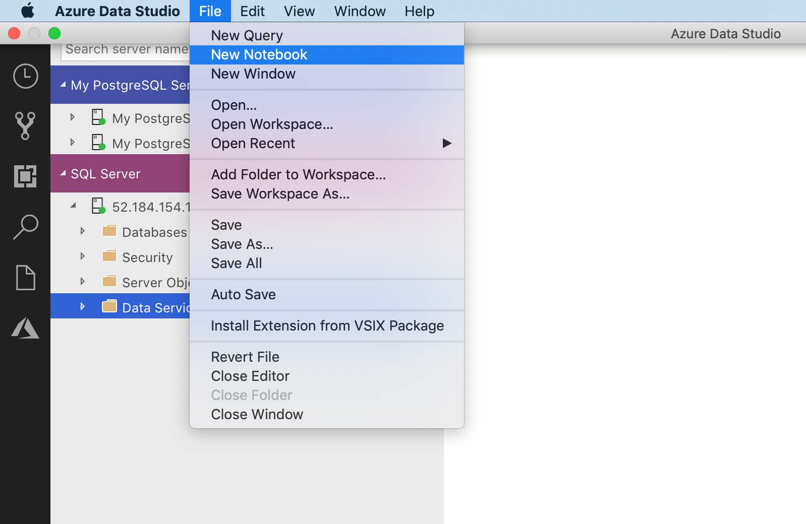

3. Right click on the **SQL Server** connection and then launch **New Notebook**. 
    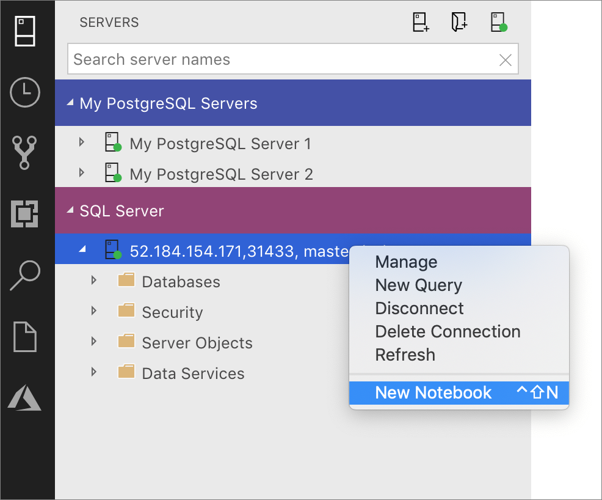

4. Open the command palette (**Ctrl+Shift+P**)) and then type in **New Notebook**. A new file named `Notebook-1.ipynb` opens.

## Supported kernels and attach to context

The Notebook Installation in Azure Data Studio natively supports SQL Kernel. If you are a SQL developer and would like to use Notebooks then this would be your chosen Kernel. 

The SQL Kernel can also be used to connect to PostgreSQL server instances. If you are a PostgreSQL developer and would like to connect to your PostgreSQL Server then download the [**PostgreSQL extension**](postgres-extension.md) in the Azure Data Studio extension marketplace.


### SQL Kernel

In the code cells within the Notebook, similar to our query editor, we support modern SQL coding experience that makes your everyday tasks easier with built-in features such as a rich SQL editor, IntelliSense, and built-in code snippets. Code snippets allow you to generate the proper SQL syntax to create databases, tables, views, stored procedures, etc., and to update existing database objects. Use code snippets to quickly create copies of your database for development or testing purposes and to generate and execute scripts.

Click **Run** to execute each cell.

SQL Kernel to connect to SQL Server instance

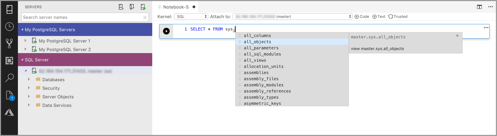

Query Results

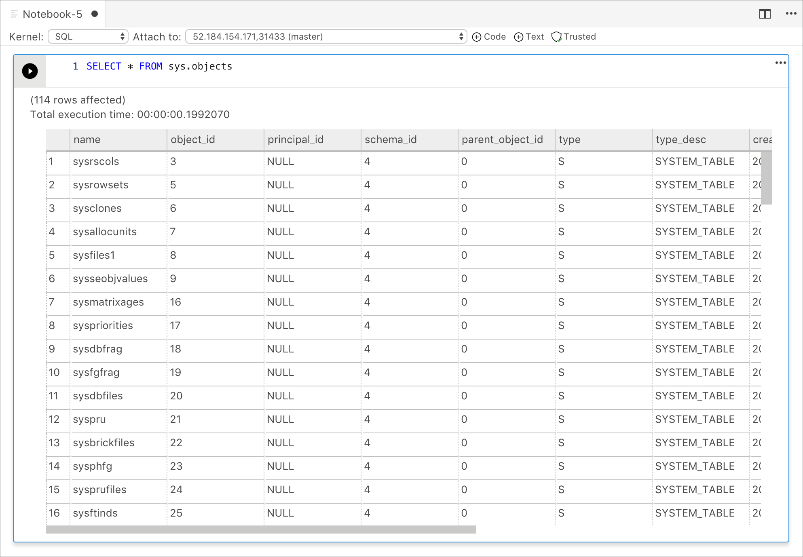

SQL Kernel to connect to PostgreSQL Server instance 

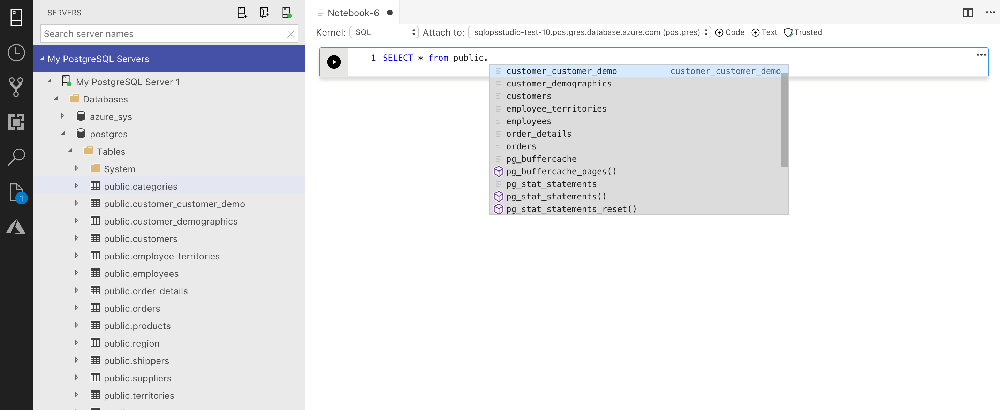

Query Results

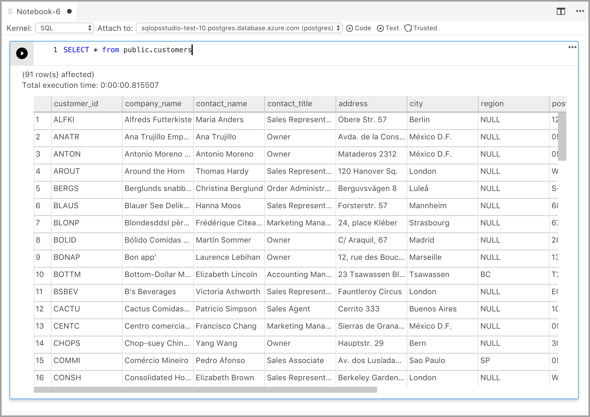

### Configure Python for Notebooks

When you select any of the other kernels apart from SQL from the kernel dropdown, this prompts you to **Configure Python for Notebooks**. The Notebook dependencies get installed in a specified location but you can decide whether to set the installation location. This installation can take some time and it is recommended to not close the application until the installation is complete. Once the installation finishes, you can start writing code in the supported language.

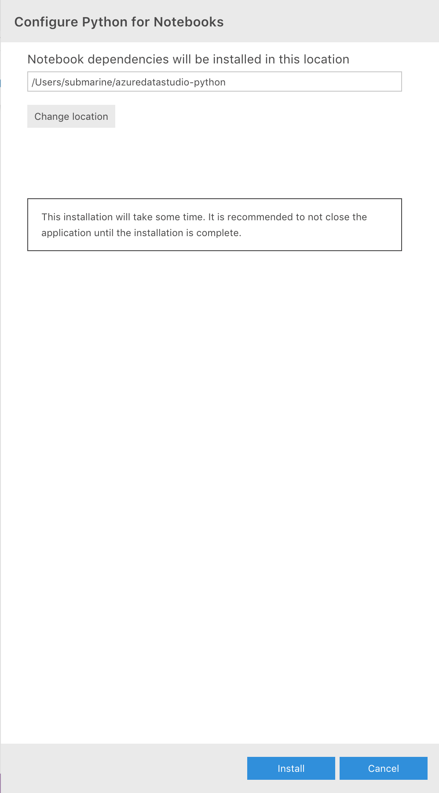

Once the installation succeeds, you will find a notification in the Task History along with the location of the Jupyter backend server running in the Output Terminal.

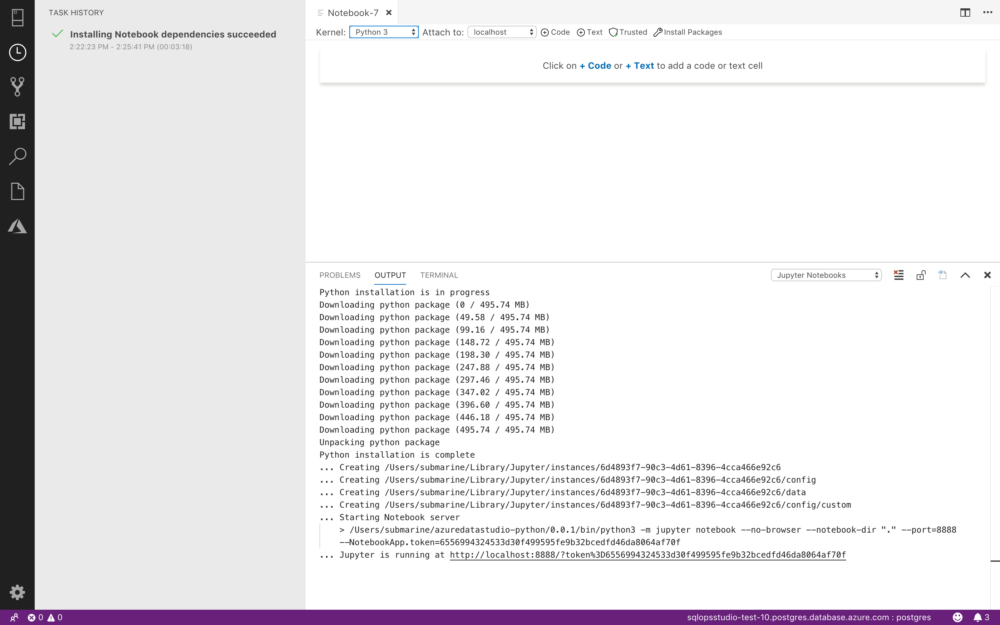

|Kernel|Description
|:-----|:-----
| SQL Kernel | Write SQL Code targeted at your relational database.
|PySpark3 and PySpark Kernel| Write Python code using Spark compute from the cluster.
|Spark Kernel|Write Scala and R code using Spark compute from the cluster.
|Python Kernel|Write Python code for local development.

`Attach to` provides the context for the Kernel to attach. If you are using SQL Kernel then you can `Attach to` any of your SQL Server instances.

If you are using Python3 Kernel the `Attach to` is `localhost`. You can use this kernel for your local Python development.

When you are connected to SQL Server 2019 big data cluster, the default `Attach to` is that end point of the cluster and will let you submit Python,Scala and R code using the Spark compute of the cluster.

### Code Cells and Markdown Cells

Add a new code cell by clicking the **+Code** command in the toolbar.

Add a new text cell by clicking the **+Text** command in the toolbar.


The cell changes to edit mode and now type markdown and you will see the preview at the same time

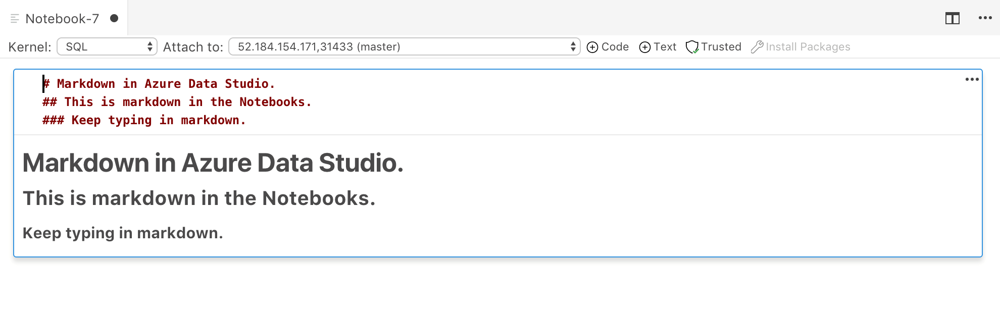

Clicking outside the text cell will show the markdown text.

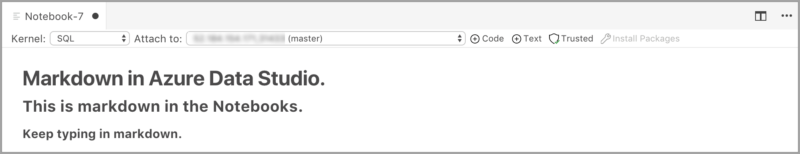

### Trusted and Non Trusted

Notebooks open in Azure Data Studio are default **Trusted**.

If you open a Notebook from some other source it will be opened in **Non Trusted** mode and then you can make it **Trusted**.

### Save 

You can save the Notebook by **Ctrl+S** or clicking the **File Save**, **File Save As...** and **File Save All** commands from the File menu and **File: Save** commands entered in the command palette.

### Pyspark3/PySpark kernel

Choose the `PySpark Kernel` and in the cell type in the following code.

Click **Run**.

The Spark Application is started and returns the following output:

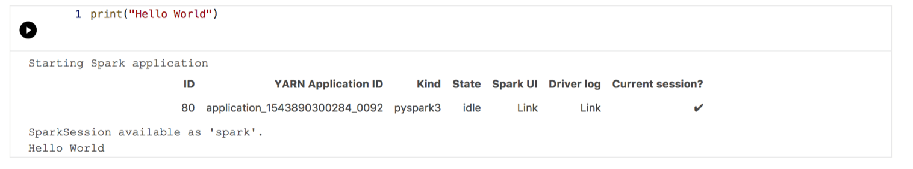

### Spark kernel | Scala language

Choose the `Spark|Scala Kernel` and in the cell type in the following code.

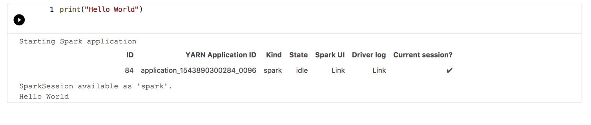

You can also view the "Cell Options" when you click on the options icon below –

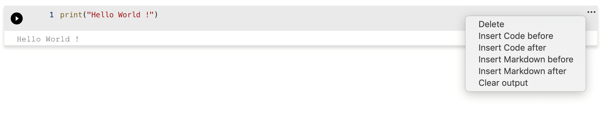

### Spark kernel | R language

Choose the Spark | R in the dropdown for the kernels. In the cell, type or paste in the code. Click **Run** to see the following output.

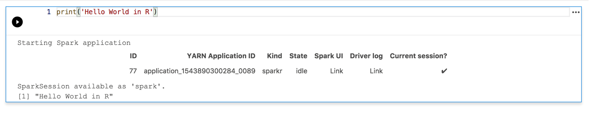

### Local Python kernel

Choose the local Python Kernel and in the cell type in -

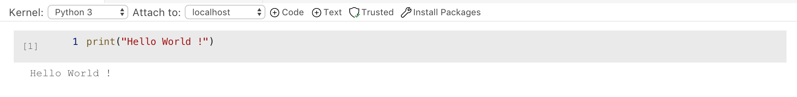

## Manage Packages
One of the things we optimized for local Python development was to include the ability to install packages which customers would need for their scenarios. By default, we include the common packages like `pandas`, `numpy` etc., but if you are expecting a package that is not included then write the following code in the notebook cell: 

```python
import <package-name>
```

When you run this command, `Module not found` is returned. If your package exists, then you will not get the error.

If it returns a `Module not Found` error, then click on **Manage Packages** to launch the terminal . You can now install packages locally. Use the following commands to install the packages:

```bash
./pip install <package-name>
```

   > [!Tip]
   > On Mac please follow the instructions in the Terminal window for installing packages. 

After the package is installed, you should be able to go in the Notebook cell and type in following command:

```python
import <package-name>
```

To uninstall a package, use the following command from your terminal:

```bash
./pip uninstall <package-name>
```

## Next steps

To learn how to work with an existing notebook, see [How to manage notebooks in Azure Data Studio](https://docs.microsoft.com/sql/big-data-cluster/notebooks-how-to-manage?view=sqlallproducts-allversions).