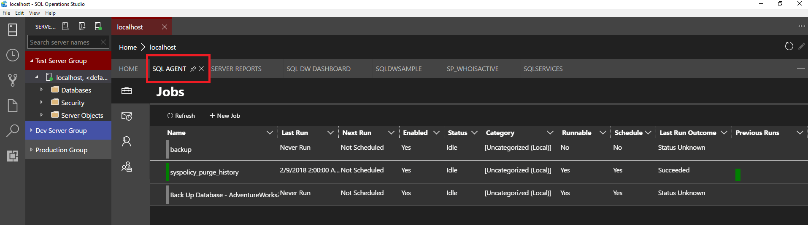
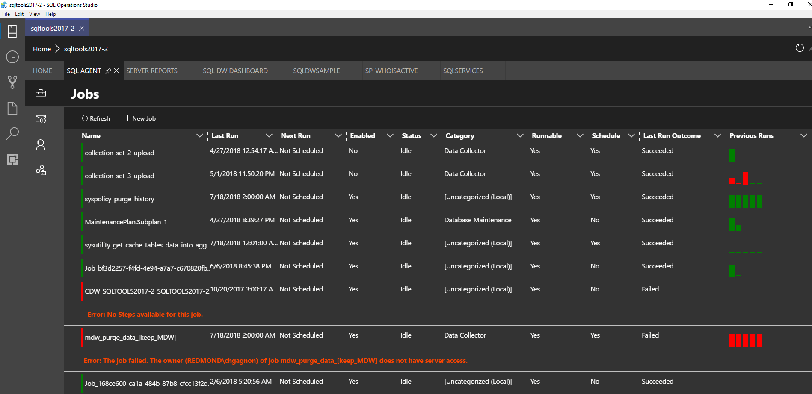

# SQL Server Agent extension (preview)

The SQL Server Agent extension (preview) is an extension for managing and troubleshooting SQL Agent jobs and configuration. This extension is currently in preview.

Key actions include:
- List SQL Server Agent Jobs Configured on a SQL Server
- View Job History with job execution results
- Basic Job Control to start and stop jobs

## Install the SQL Server Agent extension

1. To open the extensions manager and access the available extensions, select the extensions icon, or select **Extensions** in the **View** menu.
2. Select an available extension to view it's details.

   

1. Select the extension you want and **Install** it.
2. Select **Reload** to enable the extension (only required the first time you install an extension).
1. Navigate to your management dashboard by right-clicking your server or database and selecting **Manage**.
2. Installed extensions appear as tabs on your management dashboard:

   

## View jobs

When you connect to the SQL Server Agent extension, the first thing you see is a list of all your Agent jobs.

   

## Next steps

To learn more about SQL Server Agent, [check our documentation.](https://docs.microsoft.com/sql/ssms/agent/sql-server-agent?view=sql-server-2017)

