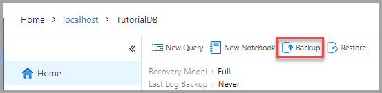
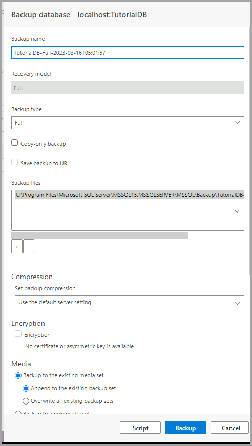
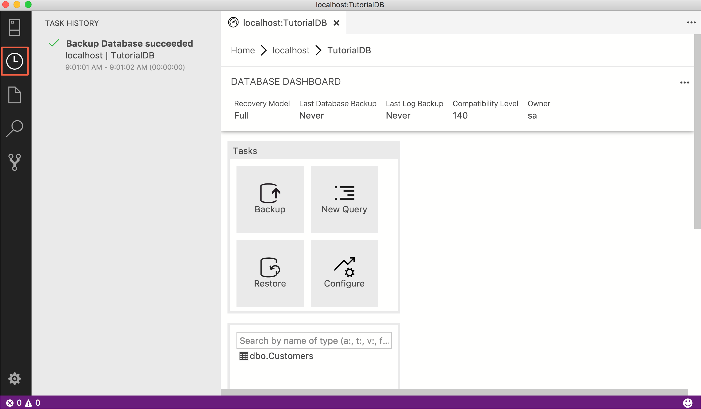
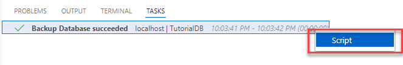
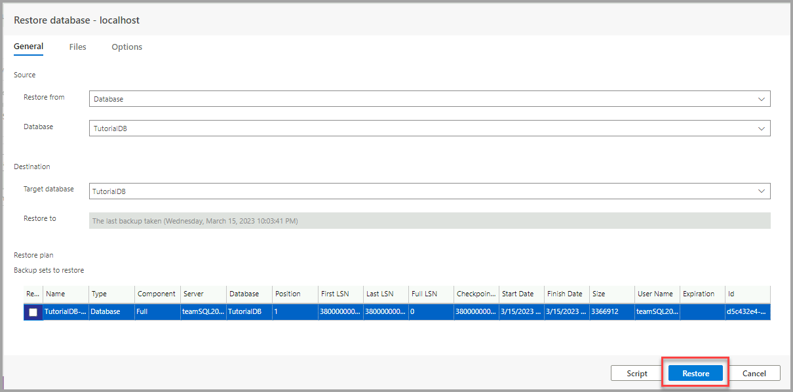
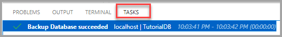

# Backup and Restore databases using [!INCLUDE[name-sos](../includes/name-sos-short.md)]

In this tutorial, you learn how to use [!INCLUDE[name-sos](../includes/name-sos-short.md)] to:
> [!div class="checklist"]
> * Backup a database 
> * View the backup status
> * Generate the script used to perform the backup
> * Restore a database
> * View the status of the restore task

## Prerequisites

This tutorial requires the SQL Server *TutorialDB*. To create the *TutorialDB* database, complete one of the following quickstarts:

- [Connect and query SQL Server using [!INCLUDE[name-sos-short](../includes/name-sos-short.md)]](quickstart-sql-server.md)

This tutorial requires connecting to a SQL Server database. Azure SQL Database has automated backups, so Azure Data Studio does not perform Azure SQL Database backup and restore. For details, see [Learn about automatic SQL Database backups](https://docs.microsoft.com/azure/sql-database/sql-database-automated-backups).

## Backup a database

1. Open the TutorialDB database dashboard (open the **SERVERS** sidebar (**CTRL+G**), expand **Databases**, right-click **TutorialDB**, and select **Manage**).

2. Open the **Backup database** dialog (click **Backup** on the **Tasks** widget).

   

3. This tutorial uses the default backup options, so click **Backup**.
   

After clicking **Backup**, the **Backup database** dialog disappears and the backup process begins.

## View the backup status and view the backup script

1. Open the **Task History** sidebar by clicking the clock icon on the *Action bar* or press **CTRL+T**.

   

2. To view the backup script in the editor, right-click **Backup Database succeeded** and select **Script**.

    

## Restore a database from a backup file

1. Open the **SERVERS** sidebar (**CTRL+G**), right-click your server, and select **Manage**. 

2. Open the **Restore database** dialog (click **Restore** on the **Tasks** widget).

2. Select **Backup file** in the **Restore from** field. 

3. Click the ellipses (...) in the **Backup file path** field, and select the latest backup file for *TutorialDB*.

3. Type **TutorialDB_Restored** in the **Target database** field in the **Destination** section to restore the backup file to a new database.

   

4. Click **Restore**

5. To view the status of the restore operation, press **CTRL+T** to open the **Task History** sidebar.

   

In this tutorial, you learned how to:
> [!div class="checklist"]
> * Backup a database 
> * View the backup status
> * Generate the script used to perform the backup
> * Restore a database
> * View the status of the restore task

