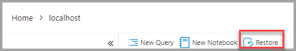

# Tutorial: Back up and restore databases using Azure Data Studio

In this tutorial, you learn how to use Azure Data Studio to:
> [!div class="checklist"]
> * Back up a database.
> * View the backup status.
> * Generate the script used to perform the backup.
> * Restore a database.
> * View the status of the restore task.

## Prerequisites

This tutorial requires SQL Server *TutorialDB*. To create the TutorialDB database, complete the following quickstart:

* [Use Azure Data Studio to connect and query SQL Server](quickstart-sql-server.md)

This tutorial requires a connection to a SQL Server database. Azure SQL Database has automated backups, so Azure Data Studio doesn't perform Azure SQL Database backup and restore. For more information, see [Learn about automatic SQL Database backups](/azure/sql-database/sql-database-automated-backups).

## Back up a database

1. Open the TutorialDB database dashboard by opening the **SERVERS** sidebar. Then select **Ctrl+G**, expand **Databases**, right-click **TutorialDB**, and select **Manage**.

1. Open the **Backup database** dialog box by selecting **Backup** on the **Tasks** widget.

   

1. This tutorial uses the default backup options, so select **Backup**.

   

After you select **Backup**, the **Backup database** dialog box disappears and the backup process begins.

## View the backup status and the backup script

1. The **Task History** pane appears, or select **Ctrl+T** to open it.

   

1. To view the backup script in the editor, right-click **Backup Database succeeded** and select **Script**.

   

## Restore a database from a backup file

1. Open the **SERVERS** sidebar by selecting **Ctrl+G**. Then right-click your server, and select **Manage**.

1. Open the **Restore database** dialog box by selecting **Restore** on the **Tasks** widget.

   

1. Select **Backup file** in the **Restore from** box.

1. Select the ellipses (...) in the **Backup file path** box, and select the latest backup file for *TutorialDB*.

1. Enter **TutorialDB_Restored** in the **Target database** box in the **Destination** section to restore the backup file to a new database. Then select **Restore**.

   

1. To view the status of the restore operation, select **Ctrl+T** to open the **Task History**.

   