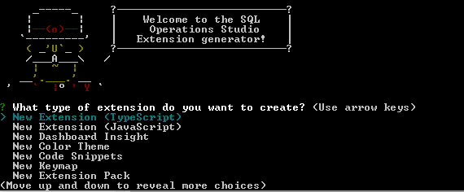
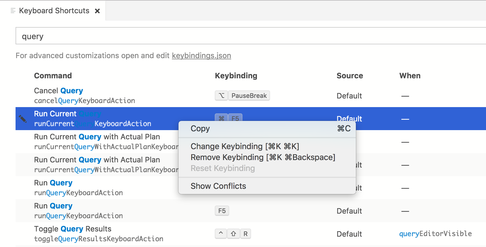
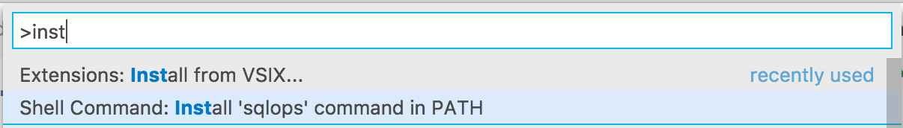
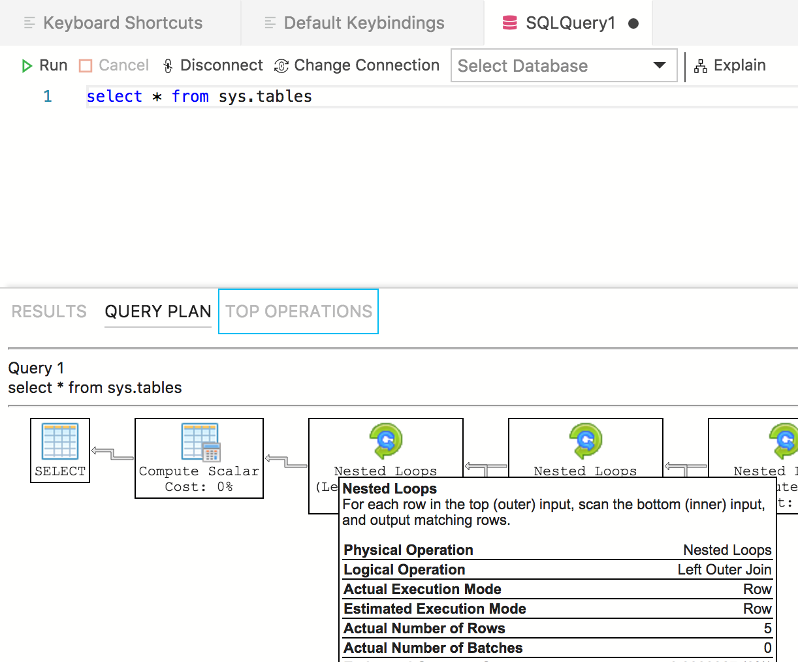
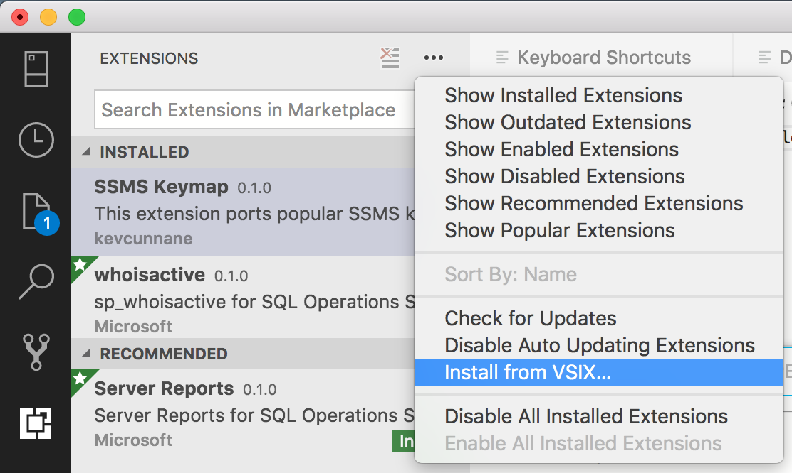

# Tutorial: Create an Azure Data Studio extension

This tutorial demonstrates how to create a new Azure Data Studio extension. The extension creates familiar SSMS key bindings in Azure Data Studio.

During this tutorial you learn how to:
> [!div class="checklist"]
> * Create an extension project
> * Install the extension generator
> * Create your extension
> * Test your extension
> * Package your extension
> * Publish your extension to the marketplace

## Prerequisites

Azure Data Studio is built on the same framework as Visual Studio Code, so extensions for Azure Data Studio are built using Visual Studio Code. To get started, you need the following components:

- [Node.js](https://nodejs.org) installed and available in your `$PATH`. Node.js includes [npm](https://www.npmjs.com/), the Node.js Package Manager, which is used to install the extension generator.
- [Visual Studio Code](https://code.visualstudio.com) to debug the extension.
- The Azure Data Studio [Debug extension](https://marketplace.visualstudio.com/items?itemName=ms-mssql.sqlops-debug).
- Ensure `sqlops` is in your path. For Windows, make sure you choose the `Add to Path` option in setup.exe. For Mac or Linux, run the *Install 'sqlops' command in PATH* option.
- SQL Operations Studio Debug extension (optional). This lets you test your extension without needing to package and install it into Azure Data Studio.


## Install the extension generator

To simplify the process of creating extensions, we've built an [extension generator](https://code.visualstudio.com/docs/extensions/yocode) using Yeoman. To install it, run the following from the command prompt:

`npm install -g yo generator-sqlops`

## Create your extension

To create an extension:

1. Launch the extension generator with the following command:

   `yo sqlops`

2. Choose **New Keymap** from the list of extension types:

   

3. Follow the steps to fill in the extension name (for this tutorial, use **ssmskeymap**), and add a description.

Completing the previous steps creates a new folder. Open the folder in Visual Studio Code and you're ready to create your own key binding extension!


### Add a keyboard shortcut

**Step 1: Find the shortcuts to replace**

Now that we have our extension ready to go, add some SSMS keyboard shortcuts (or keybindings) into Azure Data Studio. I used [Andy Mallon's Cheatsheet](https://am2.co/2018/02/updated-cheat-sheet/) and RedGate's keyboard shortcuts list for inspiration.

The top things I saw missing were:

- Run a query with the actual execution plan enabled. This is **Ctrl+M** in SSMS and doesn't have a binding in Azure Data Studio.
- Having **CTRL+SHIFT+E** as a second way of running a query. User feedback indicated that this was missing.
- Having **ALT+F1** run `sp_help`. We added this in Azure Data Studio but since that binding was already in use, we mapped it to **ALT+F2** instead.
- Toggle full screen (**SHIFT+ALT+ENTER**).
- **F8** to show **Object Explorer** / **Servers view**.

It's easy to find and replace these key bindings. Run *Open Keyboard Shortcuts* to show the **Keyboard Shortcuts** tab in Azure Data Studio, search for *query* and then choose **Change Key binding**. Once you're done changing the keybinding, you can see the updated mapping in the keybindings.json file (run *Open Keyboard Shortcuts* to see it).




**Step 2: Add shortcuts to the extension**

To add shortcuts to the extension, open the *package.json* file (in the extension) and replace the `contributes` section with the following:

```json
"contributes": {
  "keybindings": [
    {
      "key": "shift+cmd+e",
      "command": "runQueryKeyboardAction"
    },
    {
      "key": "ctrl+cmd+e",
      "command": "workbench.view.explorer"
    },
    {
      "key": "alt+f1",
      "command": "workbench.action.query.shortcut1"
    },
    {
      "key": "shift+alt+enter",
      "command": "workbench.action.toggleFullScreen"
    },
    {
      "key": "f8",
      "command": "workbench.view.connections"
    },
    {
      "key": "ctrl+m",
      "command": "runCurrentQueryWithActualPlanKeyboardAction"
    }
  ]
}
```

## Test your extension

Ensure `azuredatastudio` is in your PATH by running the Install azuredatastudio command in PATH command in Azure Data Studio.

Ensure the Azure Data Studio Debug extension is installed in Visual Studio Code.

Select **F5** to launch Azure Data Studio in debug mode with the extension running:





Key maps are one of the quickest extensions to create, so your new extension should now be successfully working and ready to share.

## Package your extension

To share with others you need to package the extension into a single file. This can be published to the Azure Data Studio extension marketplace, or shared among your team or community. To do this, you need to install another npm package from the command line:

`npm install -g vsce`

Navigate to the base directory of the extension, and run `vsce package`. I had to add in a couple of extra lines to stop the *vsce* tool from complaining:

```json
"repository": {
    "type": "git",
    "url": "https://github.com/kevcunnane/ssmskeymap.git"
},
"bugs": {
    "url": "https://github.com/kevcunnane/ssmskeymap/issues"
},
```

Once this was done, my ssmskeymap-0.1.0.vsix file was created and ready to install and share with the world!




## Publish your extension to the marketplace

The Azure Data Studio extension marketplace is not totally implemented yet, but the current process is to host the extension VSIX somewhere (for example, a GitHub Release page) then submit a PR updating [this JSON file](https://github.com/Microsoft/azuredatastudio/blob/release/extensions/extensionsGallery.json) with your extension info.


## Next steps

In this tutorial, you learned how to:
> [!div class="checklist"]
> * Create an extension project
> * Install the extension generator
> * Create your extension
> * Test your extension
> * Package your extension
> * Publish your extension to the marketplace


We hope after reading this you'll be inspired to build your own extension for Azure Data Studio. We have support for Dashboard Insights (pretty graphs that run against your SQL Server), a number of SQL-specific APIs, and a huge existing set of extension points inherited from Visual Studio Code.

If you have an idea but are not sure how to get started, please open an issue or tweet at the team: [azuredatastudio](https://twitter.com/azuredatastudio).

You can always refer to the [Visual Studio Code extension guide](https://code.visualstudio.com/docs/extensions/overview) because it covers all the existing APIs and patterns.


To learn how to work with T-SQL in Azure Data Studio, complete the T-SQL Editor tutorial:

> [!div class="nextstepaction"]
> [Use the Transact-SQL editor to create database objects](tutorial-sql-editor.md).
