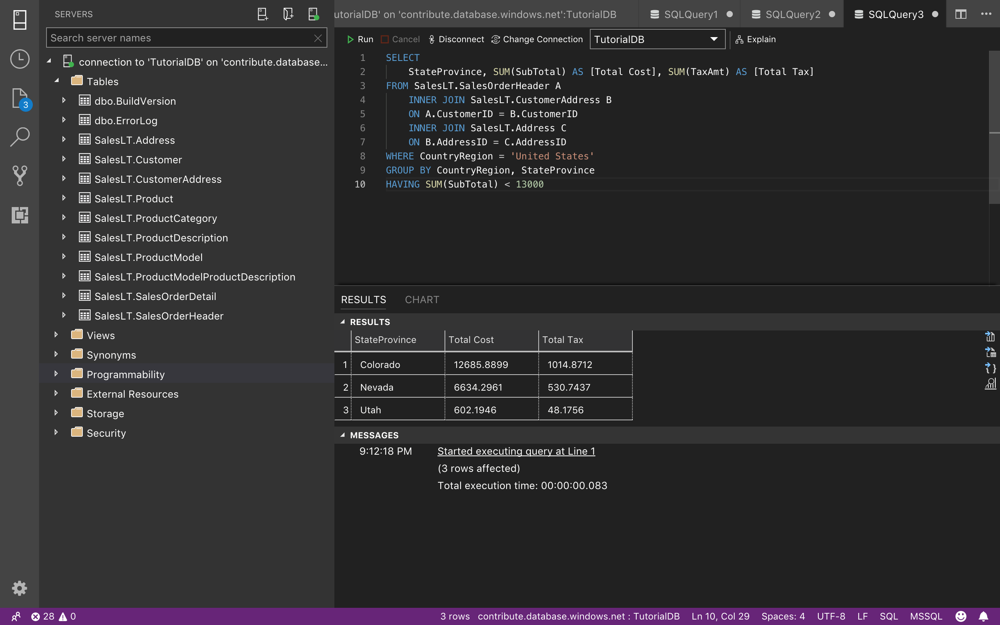
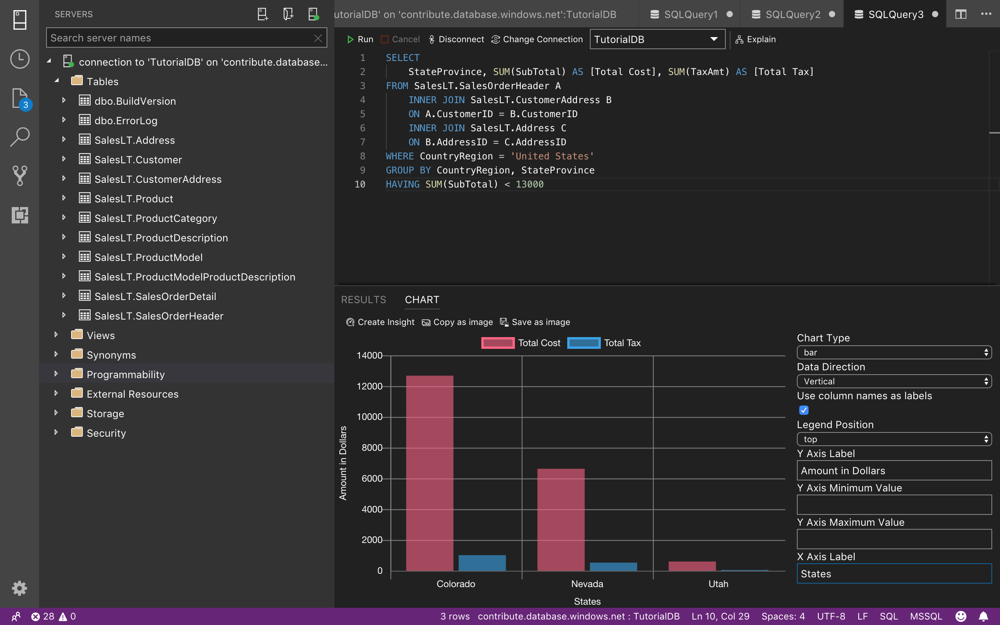
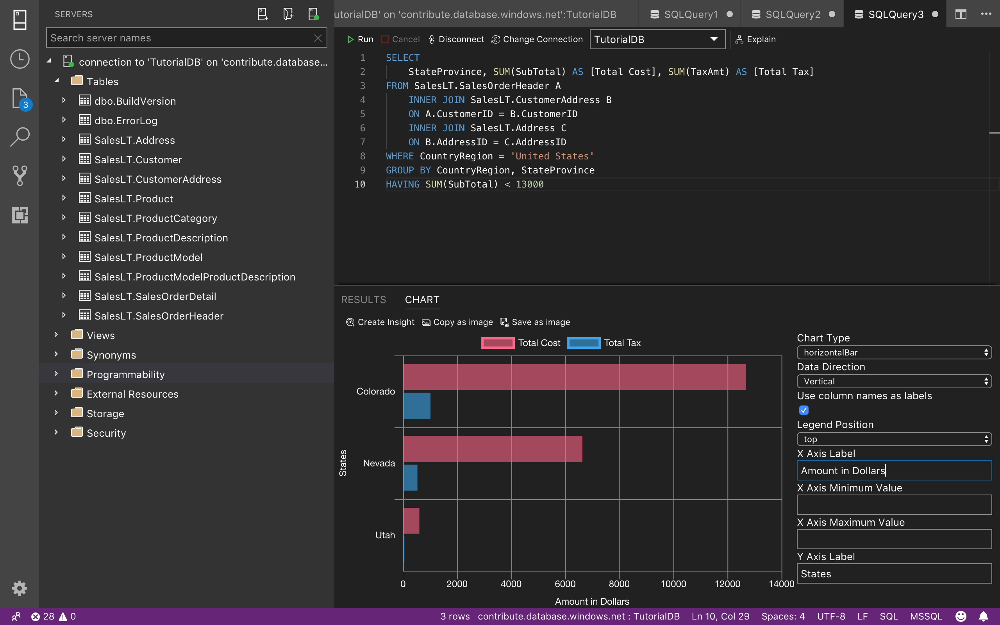
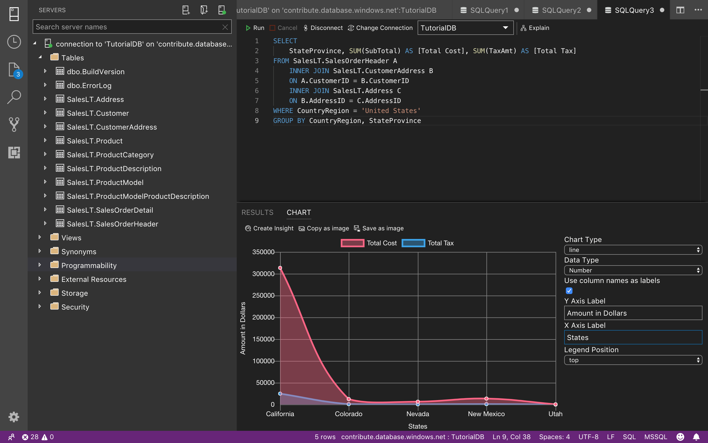
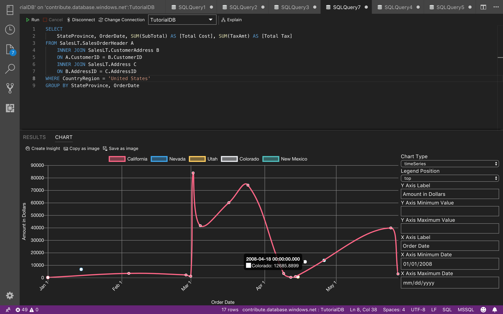

# Data Visualization using [!INCLUDE[name-sos](../includes/name-sos-short.md)]

In this tutorial, you learn how to use [!INCLUDE[name-sos](../includes/name-sos-short.md)] to:
> [!div class="checklist"]
> * Seeing data in a different way than what we are used to in SSMS

## Prerequisites

This tutorial requires the Azure SQL Database sample AdventureWorksLT.

## Charts in [!INCLUDE[name-sos](../includes/name-sos-short.md)]

[!INCLUDE[name-sos](../includes/name-sos-short.md)] different than SSMS includes a way to visualize the query result as chart. These feature help us to save time when we are debugging instead of copy our data and visualize it on a spreadsheet now we can switch the maker we see data.

Our template of AdventureWorksLT the OrderDate is the same on all orders.

    

We need to generate an OrderDate before the DueDate in this case we will generate a random date starting on 2008-01-01 until 150 days later.

    

Now we will retrieve some data from our database as a sample and display it like we do in SSMS. From United States select only the states that sells less than $13,000.

    

### Bar-Vertical

First column StateProvince as x-axis, other columns Total Cost and Total Tax as data series. 

    

### Bar-Horizontal

First column StateProvince as y-axis, other columns Total Cost and Total Tax as data series. 

    

### Line

First column StateProvince as x-axis, other columns Total Cost and Total Tax as data series. 

    

### Timeseries

First column StateProvince as data series where the OrderDate as x-axis.

    