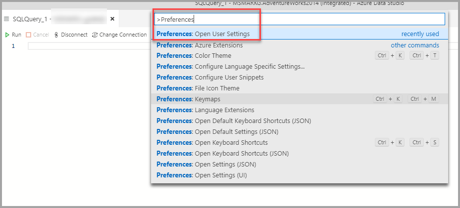
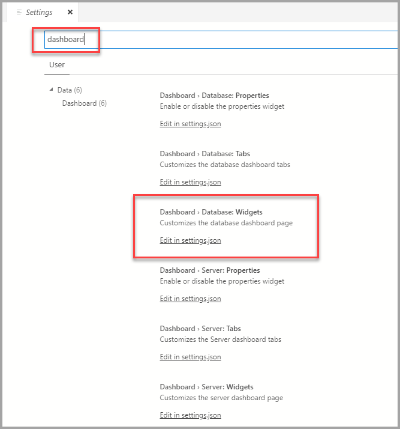
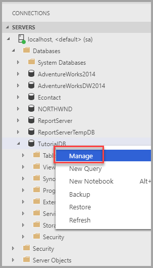
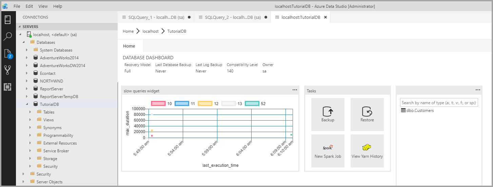
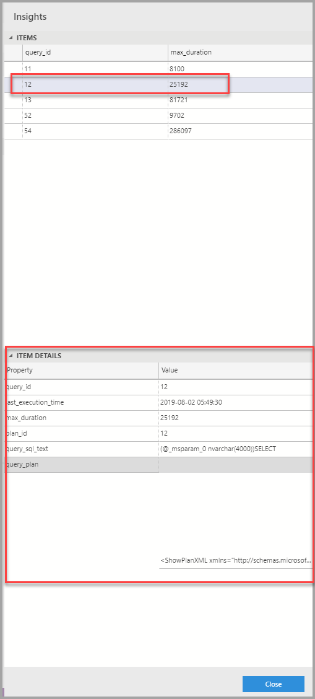
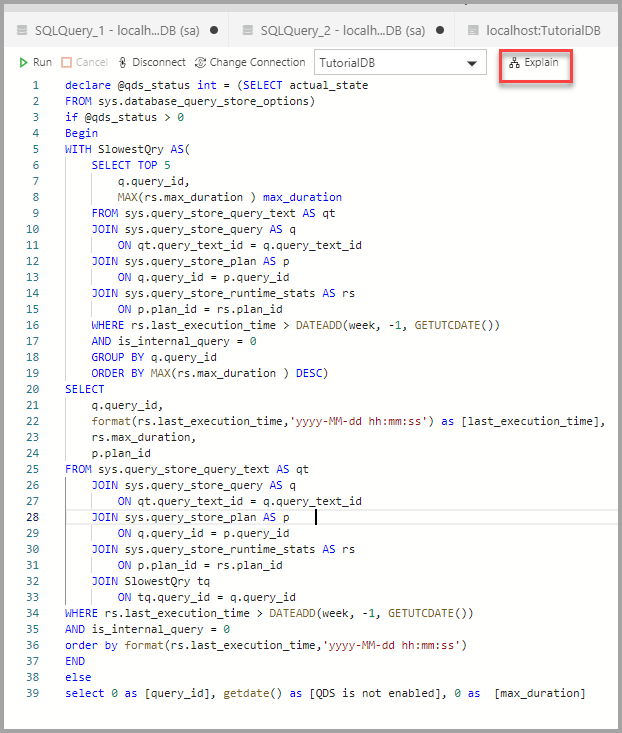
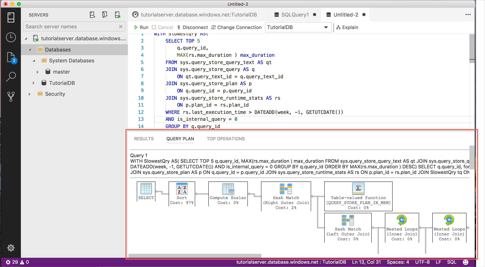
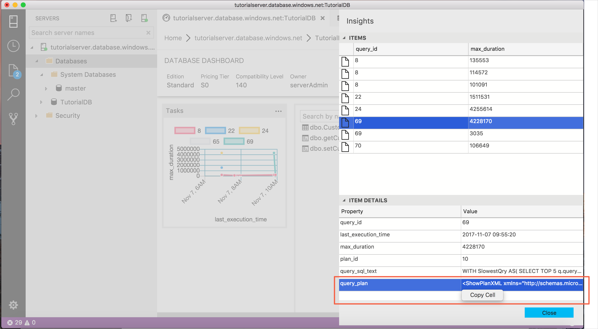
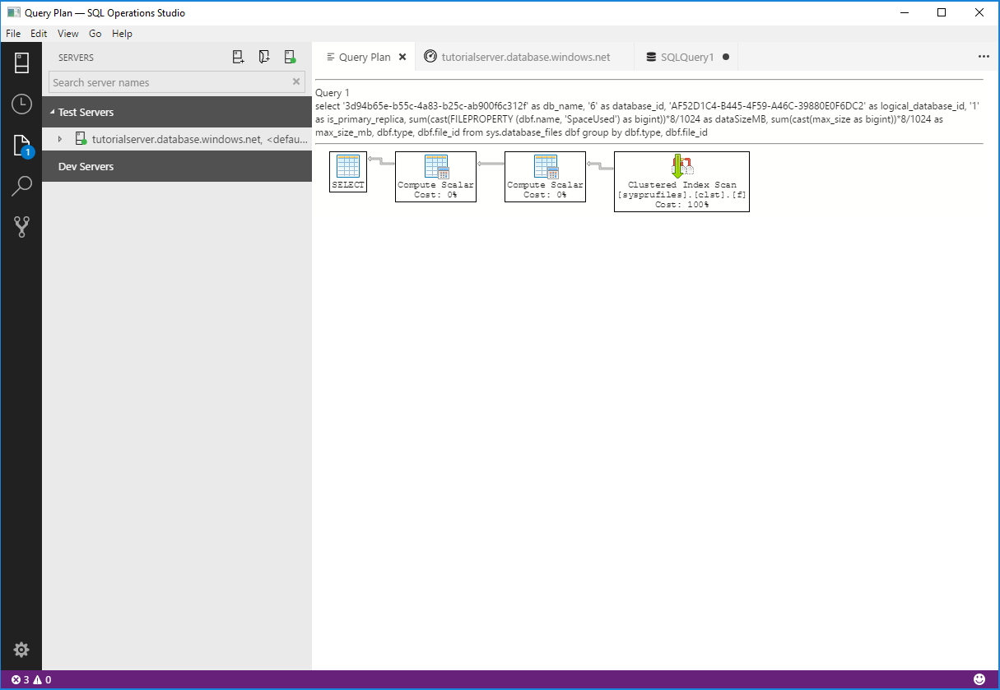

# Tutorial: Add the *five slowest queries* sample widget to the database dashboard

This tutorial demonstrates the process of adding one of [!INCLUDE[name-sos](../includes/name-sos-short.md)]'s built-in sample widgets to the *database dashboard* to quickly view a database's five slowest queries. You also learn how to view the details of the slow queries and query plans using [!INCLUDE[name-sos](../includes/name-sos-short.md)]'s features. During this tutorial, you learn how to:

> [!div class="checklist"]
> * Enable Query Store on a database
> * Add a pre-built insight widget to the database dashboard
> * View details about the database's slowest queries
> * View query execution plans for the slow queries

[!INCLUDE[name-sos](../includes/name-sos-short.md)] includes several insight widgets out-of-the-box. This tutorial shows how to add the *query-data-store-db-insight* widget, but the steps are basically the same for adding any widget.

## Prerequisites

This tutorial requires the SQL Server or Azure SQL Database *TutorialDB*. To create the *TutorialDB* database, complete one of the following quickstarts:

- [Connect and query SQL Server using [!INCLUDE[name-sos-short](../includes/name-sos-short.md)]](quickstart-sql-server.md)
- [Connect and query Azure SQL Database using [!INCLUDE[name-sos-short](../includes/name-sos-short.md)]](quickstart-sql-database.md)


## Turn on Query Store for your database

The widget in this example requires *Query Store* to be enabled.

1. Right click the **TutorialDB** database (in the **SERVERS** sidebar) and select **New Query**.
2. Paste the following Transact-SQL (T-SQL) statement in the query editor, and click **Run**:

   ```sql
    ALTER DATABASE TutorialDB SET QUERY_STORE = ON
   ```

## Add the slow queries widget to your database dashboard

To add the *slow queries widget* to your dashboard, edit the *dashboard.database.widgets* setting in your *User Settings* file.

1. Open *User Settings* by pressing **Ctrl+Shift+P** to open the *Command Palette*.
2. Type *settings* in the search box and select **Preferences: Open User Settings**.

   

2. Type *dashboard* in the settings search box and locate **dashboard.database.widgets**.

   

3. To customize the **dashboard.database.widgets** settings you need to edit the **dashboard.database.widgets** entry in the **USER SETTINGS** section (the column in the right side). If there is no **dashboard.database.widgets** in the **USER SETTINGS** section, hover over the **dashboard.database.widgets** text in the DEFAULT SETTINGS column and click the pencil icon that appears to the left of the text and click **Copy to Settings**. If the pop-up says **Replace in Settings**, don't click it! Go to the **USER SETTINGS** column to the right and locate the **dashboard.database.widgets** section and advance to the next step.

4. In the **dashboard.database.widgets** section, add the following:

   ```json
        {
            "name": "slow queries widget",
            "gridItemConfig": {
                "sizex": 2,
                "sizey": 1
            },
            "widget": {
                "query-data-store-db-insight": null
            }
        },
    ```

1. If this is the first time adding a new widget, the **dashboard.database.widgets** section should look similar to this:

   ```json
   "dashboard.database.widgets": [
       {
           "name": "slow queries widget",
           "gridItemConfig": {
               "sizex": 2,
               "sizey": 1
           },
           "widget": {
               "query-data-store-db-insight": null
           }
       },
       {
           "name": "Tasks",
           "gridItemConfig": {
               "sizex": 1,
               "sizey": 1
           },
           "widget": {
               "tasks-widget": {}
           }
       },
       {
           "gridItemConfig": {
               "sizex": 1,
               "sizey": 2
           },
           "widget": {
               "explorer-widget": {}
           }
       }
   ]
   ```

1. Press **Ctrl+S** to save the modified **User Settings**.

6. Open the *Database dashboard* by navigating to **TutorialDB** in the **SERVERS** sidebar, right-click, and select **Manage**.

   

7. The insight widget appears on the dashboard: 

   


## View insight details for more information

1. To view additional information for an insight widget, click the ellipses (**...**) in the upper right, and select **Show Details**.
2. To show more details for an item, select any item in **Chart Data** list.

   

3. Right-click the cell to the right of **query_sql_txt** in **Item Details** and click **Copy Cell**.

4. Close the **Insights** pane.

## View the query plan 

1. Open a new query editor by pressing **Ctrl+N**.

2. Paste the query text from the previous steps into the editor.

3. Click **Explain**.

   

4. View the query's execution plan:

   

## Save and open a query plan 

1. Open the insight detail dialog.
2. Select one of the query items.
2. Right-click **query_plan** value and select **Copy Cell**

   

3. Press **Ctrl+N** to open a new editor.

4. Paste the copied plan into the editor.

5. Press **Ctrl+S** to save the file, and change the file extension to *.sqlplan*. *.sqlplan* does not appear in the file extension dropdown, so just type it in. For this tutorial, name the file *slowquery.sqlplan*.

6. The query plan opens in [!INCLUDE[name-sos](../includes/name-sos-short.md)]'s query plan viewer:

   


## Next steps
In this tutorial, you learned how to:
> [!div class="checklist"]
> * Enable Query Store on a database
> * Add an insight widget to the database dashboard
> * View details about the database's slowest queries
> * View query execution plans for the slow queries


To learn how to enable the **table space usage** sample insight, complete the next tutorial:

> [!div class="nextstepaction"]
> [Enable the table space sample insight widget](tutorial-table-space-sql-server.md)
