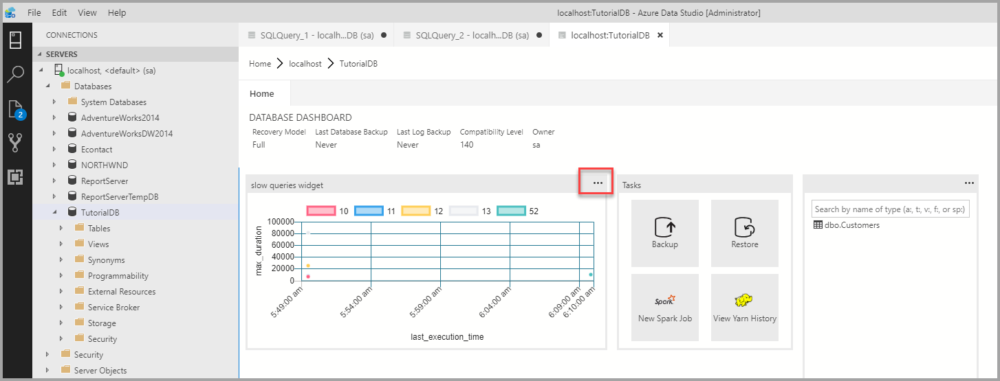
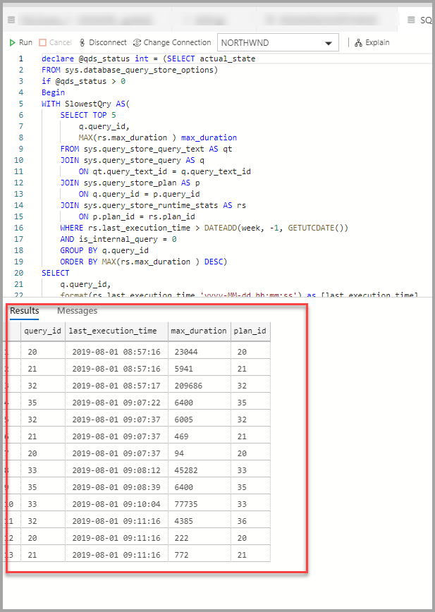

# Tutorial: Add the *five slowest queries* sample widget to the database dashboard

This tutorial demonstrates the process of adding one of the built-in Azure Data Studio sample widgets to the *database dashboard* to quickly view a database's five slowest queries. You also learn how to view the details of the slow queries and query plans using Azure Data Studio features. During this tutorial, you learn how to:

> [!div class="checklist"]
> * Enable Query Store on a database
> * Add a pre-built insight widget to the database dashboard
> * View details about the database's slowest queries
> * View query execution plans for the slow queries

Azure Data Studio includes several insight widgets out-of-the-box. This tutorial shows how to add the *query-data-store-db-insight* widget, but the steps are basically the same for adding any widget.

## Prerequisites

This tutorial requires the SQL Server or Azure SQL Database *TutorialDB*. To create the *TutorialDB* database, complete one of the following quickstarts:

* [Connect and query SQL Server using [!INCLUDE[name-sos-short](../includes/name-sos-short.md)]](quickstart-sql-server.md)

* [Connect and query Azure SQL Database using [!INCLUDE[name-sos-short](../includes/name-sos-short.md)]](quickstart-sql-database.md)

## Turn on Query Store for your database

The widget in this example requires *Query Store* to be enabled.

1. Right-click the **TutorialDB** database (in the **SERVERS** sidebar) and select **New Query**.

2. Paste the following Transact-SQL (T-SQL) statement in the query editor, and click **Run**:

   ```sql
    ALTER DATABASE TutorialDB SET QUERY_STORE = ON
   ```

## Add the slow queries widget to your database dashboard

To add the *slow queries widget* to your dashboard, edit the *dashboard.database.widgets* setting in your *User Settings* file.

1. Open *User Settings* by pressing **Ctrl+Shift+P** to open the *Command Palette*.

2. Type *settings* in the search box and select **Preferences: Open User Settings**.

   

3. Type *dashboard* in the settings search box and locate **dashboard.database.widgets**, and then click *edit in settings.json*.

   

4. In settings.json, add the following code below:

   ```json
   "dashboard.database.widgets": [
       {
           "name": "slow queries widget",
           "gridItemConfig": {
               "sizex": 2,
               "sizey": 1
           },
           "widget": {
               "query-data-store-db-insight": null
           }
       },
       {
           "name": "Tasks",
           "gridItemConfig": {
               "sizex": 1,
               "sizey": 1
           },
           "widget": {
               "tasks-widget": {}
           }
       },
       {
           "gridItemConfig": {
               "sizex": 1,
               "sizey": 2
           },
           "widget": {
               "explorer-widget": {}
           }
       }
   ]
   ```

5. Press **Ctrl+S** to save the modified **User Settings**.

6. Open the *Database dashboard* by navigating to **TutorialDB** in the **SERVERS** sidebar, right-click, and select **Manage**.

   

7. The insight widget appears on the dashboard:

   

## View insight details for more information

1. To view additional information for an insight widget, click the ellipses (**...**) in the upper right, and select **Show Details**.

2. To show more details for an item, select any item in **Chart Data** list.

   

3. Close the **Insights** pane.

## View the query plan

1. Right-click on the **TutorialDB** database and select *Manage*

2. From the *slow query widget* To view additional information for an insight widget, click the ellipses (**...**) in the upper right, and select **Run Query**.

    

3. Now you should see a new query window with the results.

    

4. Click **Explain**.

   

5. View the query's execution plan:

   

## Next steps

In this tutorial, you learned how to:
> [!div class="checklist"]
> * Enable Query Store on a database
> * Add an insight widget to the database dashboard
> * View details about the database's slowest queries
> * View query execution plans for the slow queries

To learn how to enable the **table space usage** sample insight, complete the next tutorial:

> [!div class="nextstepaction"]
> [Enable the table space sample insight widget](tutorial-table-space-sql-server.md)