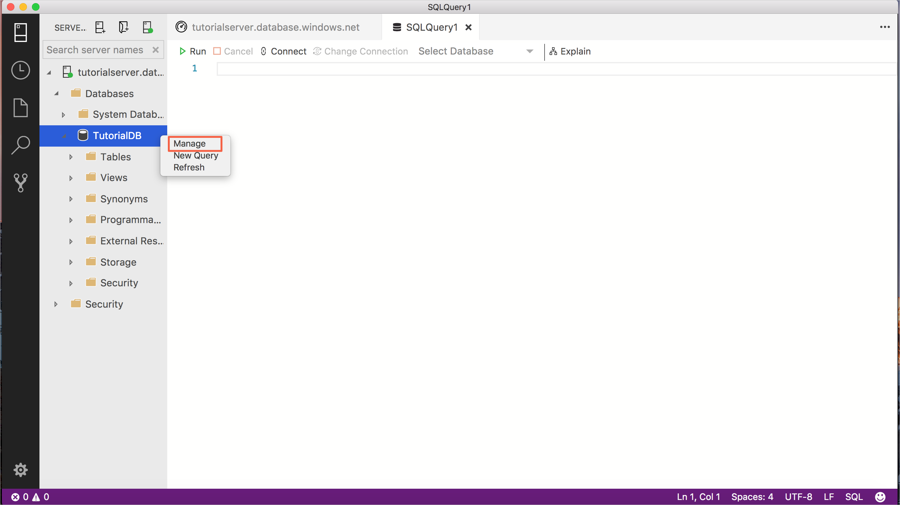
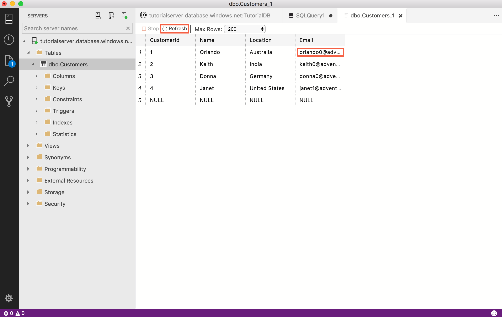
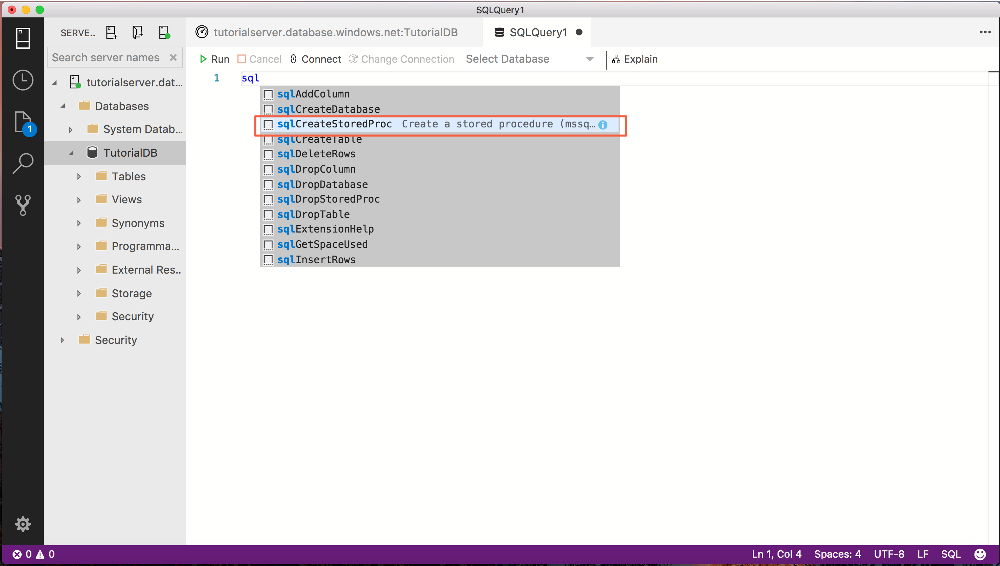
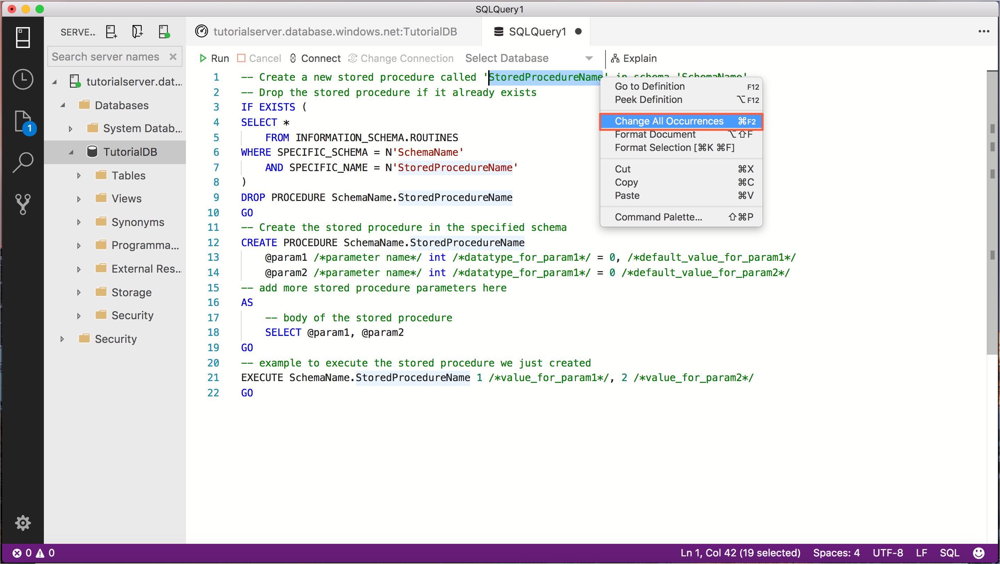
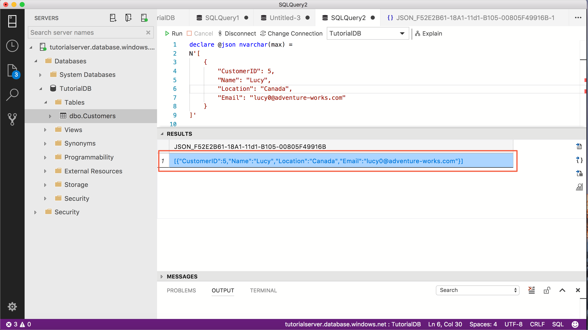

# Tutorial: Use the Transact-SQL editor to create database objects - [!INCLUDE[name-sos](../includes/name-sos-short.md)]

Creating and running queries, stored procedures, scripts, etc. are the core tasks of database professionals. This tutorial demonstrates the key features in the T-SQL editor to create database objects.

In this tutorial, you learn how to use [!INCLUDE[name-sos-short](../includes/name-sos-short.md)] to:
> [!div class="checklist"]
> * Search database objects
> * Edit table data 
> * Use snippets to quickly write T-SQL
> * View database object details using *Peek Definition* and *Go to Definition*


## Prerequisites

This tutorial requires the SQL Server or Azure SQL Database *TutorialDB*. To create the *TutorialDB* database, complete one of the following quickstarts:

- [Connect and query SQL Server using [!INCLUDE[name-sos-short](../includes/name-sos-short.md)]](quickstart-sql-server.md)
- [Connect and query Azure SQL Database using [!INCLUDE[name-sos-short](../includes/name-sos-short.md)]](quickstart-sql-database.md)


## Quickly locate a database object and perform a common task

[!INCLUDE[name-sos-short](../includes/name-sos-short.md)] provides a search widget to quickly find database objects. The results list provides a context menu for common tasks relevant to the selected object, such as *Edit Data* for a table.

1. Open the SERVERS sidebar (**Ctrl+G**), expand **Databases**, and select **TutorialDB**. 

1. Open the *TutorialDB Dashboard* by right-clicking **TutorialDB** and selecting **Manage** from the context menu:

   

1. On the dashboard, right-click **dbo.Customers** (in the search widget) and select **Edit Data**.
   
   > [!TIP]
   > For databases with many objects, use the search widget to quickly locate the table, view, etc. that you're looking for.

   

1. Edit the **Email** column in the first row, type *orlando0@adventure-works.com*, and press **Enter** to save the change.

   

## Use T-SQL snippets to create stored procedures

[!INCLUDE[name-sos](../includes/name-sos-short.md)] provides many built-in T-SQL snippets for quickly creating statements.


1. Open a new query editor by pressing **Ctrl+N**.

2. Type **sql** in the editor, arrow down to **sqlCreateStoredProcedure**, and press the *Tab* key (or *Enter*) to load the create stored procedure snippet.

   

3. The create stored procedure snippet has two fields set up for quick edit, *StoredProcedureName* and *SchemaName*. Select *StoredProcedureName*, right-click, and select **Change All Occurrences**. Now type *getCustomer* and all *StoredProcedureName* entries change to *getCustomer*.

   

5. Change all occurrences of *SchemaName* to *dbo*. 
6. The snippet contains placeholder parameters and body text that needs updating. The *EXECUTE* statement also contains placeholder text because it doesn't know how many parameters the procedure will have. For this tutorial update the snippet so it looks like the following code:

	```sql
    -- Create a new stored procedure called 'getCustomer' in schema 'dbo'
    -- Drop the stored procedure if it already exists
    IF EXISTS (
    SELECT *
    FROM INFORMATION_SCHEMA.ROUTINES
    WHERE SPECIFIC_SCHEMA = N'dbo'
    AND SPECIFIC_NAME = N'getCustomer'
    )
    DROP PROCEDURE dbo.getCustomer
    GO
    -- Create the stored procedure in the specified schema
    CREATE PROCEDURE dbo.getCustomer
    @ID int
    -- add more stored procedure parameters here
    AS
    -- body of the stored procedure
    SELECT  c.CustomerId, 
    c.Name, 
    c.Location, 
    c.Email
    FROM dbo.Customers c
    WHERE c.CustomerId = @ID
    FOR JSON PATH

    GO
    -- example to execute the stored procedure we just created
    EXECUTE dbo.getCustomer 1
    GO
	```
    
5. To create the stored procedure and give it a test run, press **F5**.

The stored procedure is now created, and the **RESULTS** pane displays the returned customer in JSON. To see formatted JSON, click the returned record. 


## Use Peek Definition 

[!INCLUDE[name-sos](../includes/name-sos-short.md)] provides the ability to view an objects definition using the peek definition feature. This section creates a second stored procedure and uses peek definition to see what columns are in a table to quickly create the body of the stored procedure.

1. Open a new editor by pressing **Ctrl+N**. 

2. Type *sql* in the editor, arrow down to *sqlCreateStoredProcedure*, and press the *Tab* key (or *Enter*) to load the create stored procedure snippet.
3. Type in *setCustomer* for *StoredProcedureName* and *dbo* for *SchemaName*

3. Replace the @param placeholders with the following parameter definition:

   ```sql
   @json_val nvarchar(max)
   ```

4. Replace the body of the stored procedure with the following code:
   ```sql
   INSERT INTO dbo.Customers
   ```

5. In the *INSERT* line you just added, right-click **dbo.Customers** and select **Peek Definition**.

   

6. The table definition appears so you can quickly see what columns are in the table. Refer to the column list to easily complete the statements for your stored procedure. Finish creating the INSERT statement you added previously to complete the body of the stored procedure, and close the peek definition window:

   ```sql
   INSERT INTO dbo.Customers (CustomerId, Name, Location, Email)
       SELECT CustomerId, Name, Location, Email
       FROM OPENJSON (@json_val)
       WITH(   CustomerId int, 
               Name nvarchar(50), 
               Location nvarchar(50), 
               Email nvarchar(50)
    )
   ```
7. Delete (or comment out) the *EXECUTE* command at the bottom of the query.
8. The entire statement should look like the following code:

   ```sql
   -- Create a new stored procedure called 'setCustomer' in schema 'dbo'
   -- Drop the stored procedure if it already exists
   IF EXISTS (
   SELECT *
       FROM INFORMATION_SCHEMA.ROUTINES
       WHERE SPECIFIC_SCHEMA = N'dbo'
       AND SPECIFIC_NAME = N'setCustomer'
   )
   DROP PROCEDURE dbo.setCustomer
   GO
   -- Create the stored procedure in the specified schema
   CREATE PROCEDURE dbo.setCustomer
       @json_val nvarchar(max) 
   AS
       -- body of the stored procedure
       INSERT INTO dbo.Customers (CustomerId, Name, Location, Email)
       SELECT CustomerId, Name, Location, Email
       FROM OPENJSON (@json_val)
       WITH(   CustomerId int, 
               Name nvarchar(50), 
               Location nvarchar(50), 
               Email nvarchar(50)
       )
   GO
   ```

8. To create the *setCustomer* stored procedure, press **F5**.

## Use save query results as JSON to test the setCustomer stored procedure

The *setCustomer* stored procedure created in the previous section requires JSON data be passed into the *@json_val* parameter. This section shows how to get a properly formatted bit of JSON to pass into the parameter so you can test the stored procedure.

1. In the **SERVERS** sidebar right-click the *dbo.Customers* table and click **SELECT TOP 1000 Rows**.

2. Select the first row in the results view, make sure the entire row is selected (click the number 1 in the left-most column), and select **Save as JSON**.  
3. Change the folder to a location you'll remember so you can delete the file later (for example desktop) and click **Save**. The JSON formatted file opens.

   

4. Select the JSON data in the editor and copy it.
5. Open a new editor by pressing **Ctrl+N**.
6. The previous steps show how you can easily get the properly formatted data to complete the call to the *setCustomer* procedure. You can see the following code uses the same JSON format with new customer details so we can test the *setCustomer* procedure. The statement includes syntax to declare the parameter and run the new get and set procedures. You can paste the copied data from the previous section and edit it so it is the same as the following example, or simply paste the following statement into the query editor.

   ```sql
   -- example to execute the stored procedure we just created
   declare @json nvarchar(max) =
   N'[
       {
           "CustomerId": 5,
           "Name": "Lucy",
           "Location": "Canada",
           "Email": "lucy0@adventure-works.com"
       }
   ]'

   EXECUTE dbo.setCustomer @json_val = @json
   GO

   EXECUTE dbo.getCustomer @ID = 5
   ```

7. Execute the script by pressing **F5**. The script inserts a new customer and returns the new customer's information in JSON format. Click the result to open a formatted view.

   

## Next steps
In this tutorial, you learned how to:
> [!div class="checklist"]
> * Quick search schema objects
> * Edit table data 
> * Writing T-SQL script using snippets
> * Learn about database object details using Peek Definition and Go to Definition


To learn how to enable the **five slowest queries** widget, complete the next tutorial:

> [!div class="nextstepaction"]
> [Enable the slow queries sample insight widget](tutorial-qds-sql-server.md)
