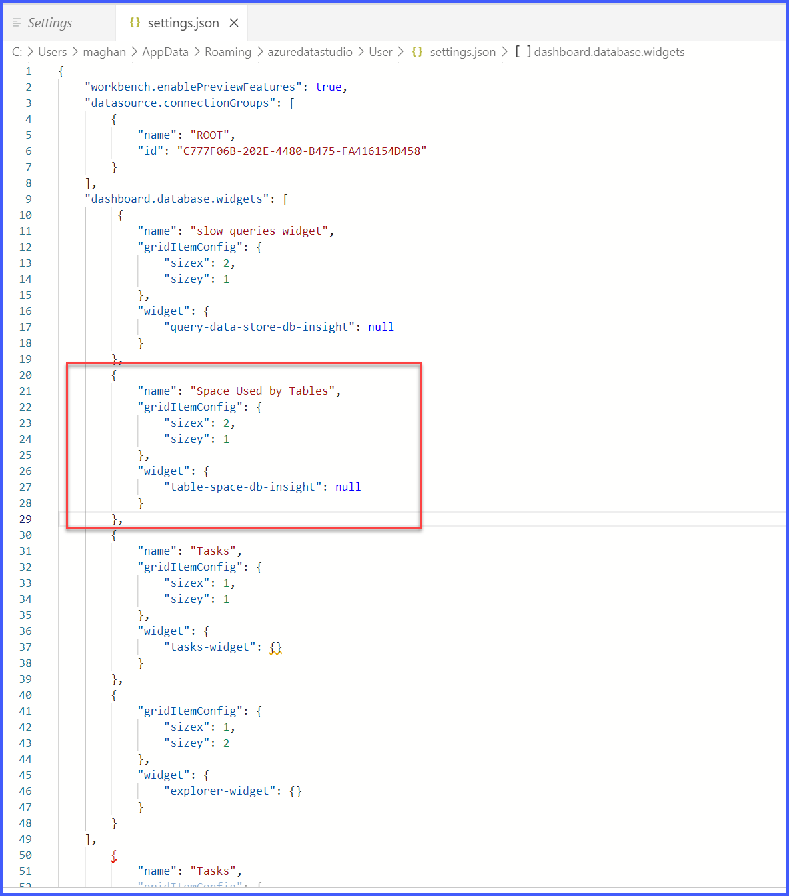
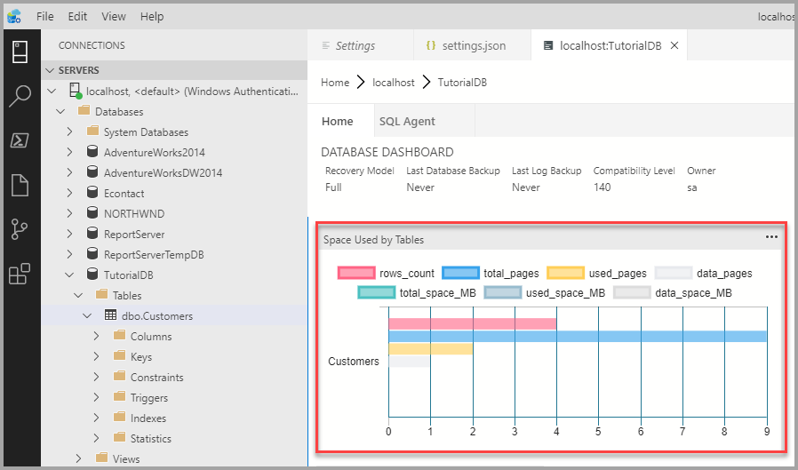
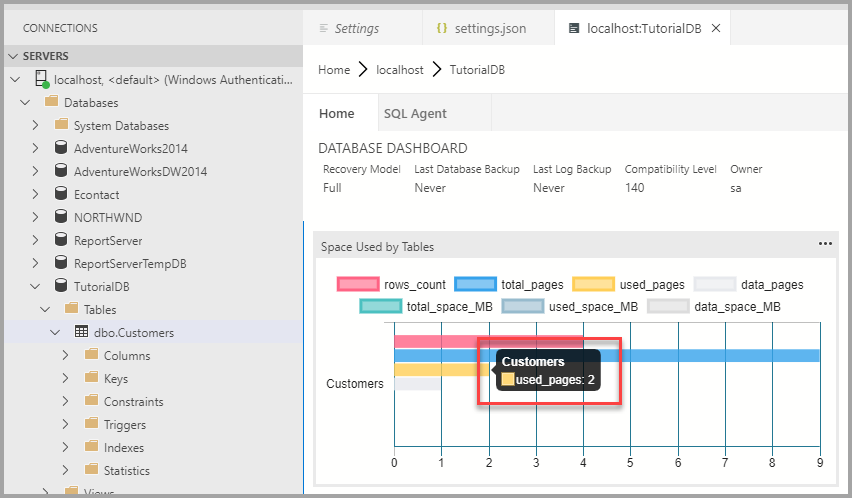

# Tutorial: Enable the table space usage sample insight widget using [!INCLUDE[name-sos](../includes/name-sos-short.md)]

This tutorial demonstrates how to enable an insight widget on the database dashboard, providing an at-a-glance view about the space usage for all tables in a database. During this tutorial, you learn how to:

> [!div class="checklist"]
> * Quickly turn on an insight widget using a built-in insight widget example
> * View the details of table space usage
> * Filter data and view label detail on an insight chart

## Prerequisites

This tutorial requires the SQL Server or Azure SQL Database *TutorialDB*. To create the *TutorialDB* database, complete one of the following quickstarts:

- [Connect and query SQL Server using [!INCLUDE[name-sos-short](../includes/name-sos-short.md)]](quickstart-sql-server.md)
- [Connect and query Azure SQL Database using [!INCLUDE[name-sos-short](../includes/name-sos-short.md)]](quickstart-sql-database.md)


## Turn on a management insight on [!INCLUDE[name-sos](../includes/name-sos-short.md)]'s database dashboard
[!INCLUDE[name-sos](../includes/name-sos-short.md)] has a built-in sample widget to monitor the space used by tables in a database.

1. Open *User Settings* by pressing **Ctrl+Shift+P** to open the *Command Palette*.
2. Type *settings* in the search box and select **Preferences: Open User Settings**.
2. Type *dashboard* in Settings Search input box and locate **dashboard.database.widgets**.

3. To customize the **dashboard.database.widgets** settings you need to edit the **dashboard.database.widgets** entry in the **USER SETTINGS** section (the column in the right side). If there is no **dashboard.database.widgets** in the **USER SETTINGS** section, hover over the **dashboard.database.widgets** text in the DEFAULT SETTINGS column and click the pencil icon that appears to the left of the text and click **Copy to Settings**. If the pop-up says **Replace in Settings**, don't click it! Go to the **USER SETTINGS** column to the right and locate the **dashboard.database.widgets** section and advance to the next step.

4. In the **dashboard.database.widgets** section, add the following:

   ```json
        {
            "name": "Space Used by Tables",
            "gridItemConfig": {
                "sizex": 2,
                "sizey": 1
            },
            "widget": {
                "table-space-db-insight": null
            }
        },
    ```
The **dashboard.database.widgets** section should look similar to the follwing image:

   

5. Press **Ctrl+S** to save the settings.

6. Open database dashboard by right-clicking **TutorialDB** and click **Manage**.

7. View the *table space* insight widget as shown in the following image: 

   


## Working with the insight chart

[!INCLUDE[name-sos](../includes/name-sos-short.md)]'s insight chart provides filtering and mouse-hover details. To try out the following steps:

1. Click and toggle the *row_count* legend on the chart. [!INCLUDE[name-sos](../includes/name-sos-short.md)] shows and hides data series as you toggle a legend on or off.
    
2. Hover the mouse pointer over the chart. [!INCLUDE[name-sos](../includes/name-sos-short.md)] shows more information about the data series label and its value as shown in the following screenshot.

   


## Next steps
In this tutorial, you learned how to:
> [!div class="checklist"]
> * Quickly turn on an insight widget using a built-in insight widget sample.
> * View the details of table space usage.
> * Filter data and view label detail on an insight chart

To learn how to build a custom insight widget, complete the next tutorial:

> [!div class="nextstepaction"]
> [Build a custom insight widget](tutorial-build-custom-insight-sql-server.md).
