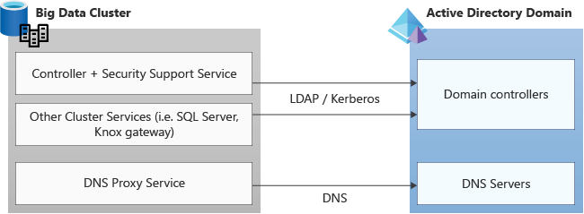

# Deploy SQL Server Big Data Cluster in Active Directory mode

This article describes how to deploy SQL Server Big Data Cluster in Active Directory mode. The steps in this article require access to an Active Directory domain. Before you proceed, you need to complete the requirements explained in [Deploy [!INCLUDE[big-data-clusters-2019](../includes/ssbigdataclusters-ss-nover.md)] in Active Directory mode](active-directory-prerequisites.md).

[!INCLUDE[big-data-clusters-banner-retirement](../includes/bdc-banner-retirement.md)]

## Prepare deployment

For deployment of a big data cluster with AD integration, there is some additional information that needs to be provided for creating the big data clusters-related objects in AD.

By using the `kubeadm-prod` profile (or `openshift-prod` starting with CU5 release), you will automatically have the placeholders for the security-related information and endpoint-related information that is required for AD integration.

Furthermore, you need to provide credentials that [!INCLUDE[big-data-clusters](../includes/ssbigdataclusters-nover.md)] will use to create the necessary objects in AD. These credentials are provided as environment variables.

### Traffic and ports

Verify that any firewalls or third-party applications allow the required ports for Active Directory communication. 



Requests are made on these protocols to and from the Kubernetes cluster services to the Active Directory domain, and so should be allowed incoming and outgoing in any firewall or third-party application listening on the required ports for both TCP and UDP. The standard port numbers that Active Directory uses:

| Service | Port |
|:---|:---|
| DNS | 53 |
| LDAP <BR> LDAPS | 389<BR> 636 |
| Kerberos | 88 |
| Kerberos/AD Password Change protocol | 464 |
| Global Catalog port <BR>via LDAP<BR>via LDAPS |<BR> 3268 <BR> 3269 |

## Set security environment variables

The following environment variables are providing the credentials for the Big Data Clusters domain service account, which will be used to set up the AD integration. This account is also used by Big Data Clusters to maintain related AD objects going forward.

```bash
export DOMAIN_SERVICE_ACCOUNT_USERNAME=<AD principal account name>
export DOMAIN_SERVICE_ACCOUNT_PASSWORD=<AD principal password>
```

## Provide security and endpoint parameters

In addition to environment variables for credentials, you also need to provide security and endpoint information for AD integration to work. The parameters needed are automatically part of the `kubeadm-prod`/`openshift-prod` [deployment profile](deployment-guidance.md#configfile).

AD integration requires the following parameters. Add these parameters to the `control.json` and `bdc.json` files using `config replace` commands shown further down in this article. All the examples below are using the example domain `contoso.local`.

- `security.activeDirectory.ouDistinguishedName`: distinguished name of an organizational unit (OU) where all AD accounts created by cluster deployment will be added. If the domain is called `contoso.local`, the OU distinguished name is: `OU=BDC,DC=contoso,DC=local`.

- `security.activeDirectory.dnsIpAddresses`: contains the list of domain's DNS servers IP addresses. 

- `security.activeDirectory.domainControllerFullyQualifiedDns`: List of FQDN of domain controller. The FQDN contains the machine/host name of the domain controller. If you have multiple domain controllers, you can provide a list here. Example: `HOSTNAME.CONTOSO.LOCAL`.

  > [!IMPORTANT]
  > When multiple domain controllers are serving a domain, use the primary domain controller (PDC) as the first entry in the `domainControllerFullyQualifiedDns` list in the security config. To get the PDC name, type `netdom query fsmo`, at the command prompt, and then press **ENTER**.

- `security.activeDirectory.realm` **Optional parameter**: In the majority of cases, the realm equals domain name. For cases where they are not the same, use this parameter to define name of realm (for example, `CONTOSO.LOCAL`). The value of provided for this parameter should be fully-qualified.

- `security.activeDirectory.netbiosDomainName` **Optional parameter**: This is the NETBIOS name of the AD domain. In most cases, this will be the first label of the AD domain name. For cases where it differs, use this parameter to define the NETBIOS domain name. This value should not contain any dots. Usually this name is used to qualify the user accounts in the domain. For example, CONTOSO\user, where CONTOSO is the NETBIOS domain name.

  > [!NOTE]
  > Support for a configuration where the Active Directory domain name is different than the Active Directory domain's **NETBIOS** name using the *security.activeDirectory.netbiosDomainName* was enabled starting with SQL Server 2019 CU9.

- `security.activeDirectory.domainDnsName`: Name of your DNS domain that will be used for the cluster (for example, `contoso.local`).

- `security.activeDirectory.clusterAdmins`: This parameter takes one AD group. The AD group scope must be universal or global. Members of this group will have the `bdcAdmin` cluster role which will give them administrator permissions in the cluster. This means that they have [`sysadmin` permissions in SQL Server](../relational-databases/security/authentication-access/server-level-roles.md#fixed-server-level-roles), [`superuser` permissions in HDFS](https://hadoop.apache.org/docs/current/hadoop-project-dist/hadoop-hdfs/HdfsPermissionsGuide.html#The_Super-User), and admin permissions when connected to the controller endpoint.

  >[!IMPORTANT]
  >Create this group in AD before deployment begins. If the scope for this AD group is domain local deployment fails.

- `security.activeDirectory.clusterUsers`: List of the AD groups that are regular users (no administrator permissions) in the big data cluster. The list can include AD groups that are scoped as either universal or global groups. They cannot be domain local groups.

AD groups in this list are mapped to the `bdcUser` big data cluster role and they need to be granted access to SQL Server (see [SQL Server permissions](../relational-databases/security/permissions-hierarchy-database-engine.md)) or HDFS (see [HDFS permissions Guide](https://hadoop.apache.org/docs/current/hadoop-project-dist/hadoop-hdfs/HdfsPermissionsGuide.html#:~:text=Permission%20Checks%20%20%20%20Operation%20%20,%20%20N%2FA%20%2029%20more%20rows%20)). When connected to the controller endpoint, these users can only list the endpoints available in the cluster using `azdata bdc endpoint list` command.

For details on how to update the AD groups for these settings see [Manage Big Data Cluster access in Active Directory mode](manage-user-access.md).

  >[!TIP]
  >To enable the HDFS browsing experience when connected to SQL Server master in Azure Data Studio, an user with bdcUser role must be granted VIEW SERVER STATE permissions since Azure Data studio is using the `sys.dm_cluster_endpoints` DMV to get the required Knox gateway endpoint to connect to HDFS.

  >[!IMPORTANT]
  >Create these groups in AD before deployment begins. If the scope for any of these AD groups is domain local deployment fails.

  >[!IMPORTANT]
  >If your domain users have a large number of group memberships, you should adjust the values for the gateway setting `httpserver.requestHeaderBuffer` (default value is `8192`) and HDFS setting `hadoop.security.group.mapping.ldap.search.group.hierarchy.levels` (default value is `10`), using the custom *bdc.json* deployment configuration file. This is a best practice to avoid connection timeouts to gateway and/or HTTP responses with a 431 (*Request Header Fields Too Large*) status code. Here is a section of the configuration file showing how to define the values of these settings and what are the recommended values for higher number of group memberships:

```json
{
    ...
    "spec": {
        "resources": {
            ...
            "gateway": {
                "spec": {
                    "replicas": 1,
                    "endpoints": [{...}],
                    "settings": {
                        "gateway-site.gateway.httpserver.requestHeaderBuffer": "65536"
                    }
                }
            },
            ...
        },
        "services": {
            ...
            "hdfs": {
                "resources": [...],
                "settings": {
                  "core-site.hadoop.security.group.mapping.ldap.search.group.hierarchy.levels": "4"
                }
            },
            ...
        }
    }
}
```

- `security.activeDirectory.enableAES Optional parameter` **Optional parameter**: Boolean value indicating whether AES 128 and AES 256 should be enabled on the automatically generated AD accounts. Default value is `false`. When this parameter is set to `true`, the following flags 'This account supports Kerberos AES 128 bit encryption' and 'This account supports Kerberos AES 256 bit encryption' will be checked on the auto-generated AD objects during big data cluster deployment. 

> [!NOTE]
> The `security.activeDirectory.enableAES` parameter is available starting with SQL Server Big Data Clusters CU13. If the big data cluster is a version prior to CU13, the following steps are required:
> 1. Run the `azdata bdc rotate -n <your-cluster-name>` command, this command will rotate the keytabs in the cluster which is necessary to ensure that the AES entries in keytabs are correct. For more information, see [azdata bdc](../azdata/reference/reference-azdata-bdc.md). Additionally, `azdata bdc rotate` will rotate the passwords of the AD objects that were auto-generated during the initial deployment in the specified OU.
> 2. Set the the following flags 'This account supports Kerberos AES 128 bit encryption' and 'This account supports Kerberos AES 256 bit encryption' on each of auto-generated AD objects in the OU that you provided during the initial big data cluster deployment. This can be achieved by executing the following PowerShell script  `Get-ADUser -Filter * -SearchBase '<OU Path>' | Set-ADUser -replace @{ 'msDS-SupportedEncryptionTypes' = '24' }` on your domain controller which sets the AES fields on each account in the OU given in `<OU Path>` parameter.

  >[!IMPORTANT]
  >Create the groups provided for the settings below in AD before deployment begins. If the scope for any of these AD groups is domain local deployment fails.

- `security.activeDirectory.appOwners` **Optional parameter**: List of AD groups who have permissions to create, delete, and run any application. The list can include AD groups that are scoped as either universal or global groups. They cannot be domain local groups.

- `security.activeDirectory.appReaders` **Optional parameter**: List of the AD groups who have permissions to run any application. The list can include AD groups that are scoped as either universal or global groups. They cannot be domain local groups.

Below table show the authorization model for application management:

|   Authorized roles   |   [!INCLUDE [azure-data-cli-azdata](../includes/azure-data-cli-azdata.md)] command   |
|----------------------|--------------------|
|   appOwner           | azdata app create  |
|   appOwner           | azdata app update  |
|   appOwner, appReader| azdata app list    |
|   appOwner, appReader| azdata app describe|
|   appOwner           | azdata app delete  |
|   appOwner, appReader| azdata app run     |

- `security.activeDirectory.subdomain`: **Optional parameter** This parameter is introduced in SQL Server 2019 CU5 release to support deploying multiple big data clusters against the same domain. Using this setting, you can specify different DNS names for each of the big data cluster deployed. If the value of this parameter is not specified in the active directory section of the `control.json` file, by default, the big data cluster name (same as Kubernetes namespace name) will be used to compute the value of subdomain setting. 

  >[!NOTE]
  >The value passed through the subdomain setting is not a new AD domain but only a DNS domain used by the big data cluster internally.

  >[!IMPORTANT]
  >You need to install or upgrade latest version of **[!INCLUDE [azure-data-cli-azdata](../includes/azure-data-cli-azdata.md)]** as of SQL Server 2019 CU5 release to leverage these new capabilities and deploy multiple big data clusters in the same domain.

  See [Concept: deploy [!INCLUDE[big-data-clusters-2019](../includes/ssbigdataclusters-ss-nover.md)] in Active Directory mode](active-directory-deployment-background.md) for more details regarding deploying multiple big data clusters in the same Active Directory domain.

- `security.activeDirectory.accountPrefix`: **Optional parameter** This parameter is introduced in SQL Server 2019 CU5 release to support deploying multiple big data clusters against the same domain. This setting guarantees uniqueness of the account names for various big data clusters services, that must differ between any two clusters. Customizing the account prefix name is optional, by default, the subdomain name is used as the account prefix. If the subdomain name is longer than the 12 characters, the first 12-characters of the subdomain name are used as the account prefix.  

  >[!NOTE]
  >Active Directory requires the account names to be limited to 20 characters. The big data cluster needs to use 8 of the characters for distinguishing pods and StatefulSets. This leaves us 12 characters as a limit for the account prefix

[Check AD group scope](/powershell/module/activedirectory/get-adgroup), to determine if it is DomainLocal.

If you have not already initialized the deployment configuration file, you can run this command to get a copy of the configuration. Examples below use the `kubeadm-prod` profile, same applies to `openshift-prod`.

```bash
azdata bdc config init --source kubeadm-prod  --target custom-prod-kubeadm
```

To set the above parameters in the `control.json` file, use the following [!INCLUDE [azure-data-cli-azdata](../includes/azure-data-cli-azdata.md)] commands. The commands replace the config and provide your own values before deployment.

> [!IMPORTANT]
> In the SQL Server 2019 CU2 release, the structure of the security configuration section in the deployment profile changed sightly and all the Active Directory related settings are in the new `activeDirectory` in the json tree under `security` in the `control.json` file.

>[!NOTE]
> In addition to providing different values for the subdomain as described in this section, you must also use different port numbers for Big Data Clusters endpoints when deploying multiple big data clusters in the same Kubernetes cluster. These port numbers are configurable at deployment time through the [deployment configuration](deployment-custom-configuration.md) profiles.

The example below is based on using SQL Server 2019 CU2. It shows how to replace the AD-related parameter values in deployment config. The domain details below are example values.

```bash
azdata bdc config replace -c custom-prod-kubeadm/control.json -j "$.security.activeDirectory.ouDistinguishedName=OU\=bdc\,DC\=contoso\,DC\=local"
azdata bdc config replace -c custom-prod-kubeadm/control.json -j "$.security.activeDirectory.dnsIpAddresses=[\"10.100.10.100\"]"
azdata bdc config replace -c custom-prod-kubeadm/control.json -j "$.security.activeDirectory.domainControllerFullyQualifiedDns=[\"HOSTNAME.CONTOSO.LOCAL\"]"
azdata bdc config replace -c custom-prod-kubeadm/control.json -j "$.security.activeDirectory.domainDnsName=contoso.local"
azdata bdc config replace -c custom-prod-kubeadm/control.json -j "$.security.activeDirectory.clusterAdmins=[\"bdcadminsgroup\"]"
azdata bdc config replace -c custom-prod-kubeadm/control.json -j "$.security.activeDirectory.clusterUsers=[\"bdcusersgroup\"]"
#Example for providing multiple clusterUser groups: [\"bdcusergroup1\",\"bdcusergroup2\"]
```

Optionally, only starting SQL Server 2019 CU5 release, you can override the default values for the `subdomain` and `accountPrefix` settings.

```bash
azdata bdc config replace -c custom-prod-kubeadm/control.json -j "$.security.activeDirectory.subdomain=[\"bdctest\"]"
azdata bdc config replace -c custom-prod-kubeadm/control.json -j "$.security.activeDirectory.accountPrefix=[\"bdctest\"]"
```

Similarly, in releases before SQL Server 2019 CU2, you can run:

```bash
azdata bdc config replace -c custom-prod-kubeadm/control.json -j "$.security.ouDistinguishedName=OU\=bdc\,DC\=contoso\,DC\=local"
azdata bdc config replace -c custom-prod-kubeadm/control.json -j "$.security.dnsIpAddresses=[\"10.100.10.100\"]"
azdata bdc config replace -c custom-prod-kubeadm/control.json -j "$.security.domainControllerFullyQualifiedDns=[\"HOSTNAME.CONTOSO.LOCAL\"]"
azdata bdc config replace -c custom-prod-kubeadm/control.json -j "$.security.domainDnsName=contoso.local"
azdata bdc config replace -c custom-prod-kubeadm/control.json -j "$.security.clusterAdmins=[\"bdcadminsgroup\"]"
azdata bdc config replace -c custom-prod-kubeadm/control.json -j "$.security.clusterUsers=[\"bdcusersgroup\"]"
#Example for providing multiple clusterUser groups: [\"bdcusergroup1\",\"bdcusergroup2\"]
```

In addition to the above information, you also need to provide DNS names for the different cluster endpoints. The DNS entries using your provided DNS names will automatically be created in your DNS Server upon deployment. You will use these names when connecting to the different cluster endpoints. For example, if the DNS name for SQL master instance is `mastersql` and considering the subdomain will use the default value of the cluster name in `control.json`, you will either use `mastersql.contoso.local,31433` or `mastersql.mssql-cluster.contoso.local,31433`  (depending on the values you provided in the deployment configuration files for the endpoint DNS names) to connect to the master instance from the tools. 

```bash
# DNS names for Big Data Clusters services
azdata bdc config replace -c custom-prod-kubeadm/control.json -j "$.spec.endpoints[0].dnsName=<controller DNS name>.contoso.local"
azdata bdc config replace -c custom-prod-kubeadm/control.json -j "$.spec.endpoints[1].dnsName=<monitoring services DNS name>.<Domain name. e.g. contoso.local>"
azdata bdc config replace -c custom-prod-kubeadm/bdc.json -j "$.spec.resources.master.spec.endpoints[0].dnsName=<SQL Master Primary DNS name>.<Domain name. e.g. contoso.local>"
azdata bdc config replace -c custom-prod-kubeadm/bdc.json -j "$.spec.resources.master.spec.endpoints[1].dnsName=<SQL Master Secondary DNS name>.<Domain name. e.g. contoso.local>"
azdata bdc config replace -c custom-prod-kubeadm/bdc.json -j "$.spec.resources.gateway.spec.endpoints[0].dnsName=<Gateway (Knox) DNS name>.<Domain name. e.g. contoso.local>"
azdata bdc config replace -c custom-prod-kubeadm/bdc.json -j "$.spec.resources.appproxy.spec.endpoints[0].dnsName=<app proxy DNS name>.<Domain name. e.g. contoso.local>"
```

> [!IMPORTANT]
> You can use endpoint DNS names of your choice as long as they are fully qualified and do not conflict between any two big data clusters deployed in the same domain. Optionally, you can use the `subdomain` parameter value to ensure DNS names are different across clusters. For example:

```bash
# DNS names for Big Data Clusters services
azdata bdc config replace -c custom-prod-kubeadm/control.json -j "$.spec.endpoints[0].dnsName=<controller DNS name>.<subdomain e.g. mssql-cluster>.contoso.local"
```

You can find an example script here for [deploying a SQL Server big data cluster on single node Kubernetes cluster (kubeadm) with AD integration](https://github.com/microsoft/sql-server-samples/tree/master/samples/features/sql-big-data-cluster/deployment/kubeadm/ubuntu-single-node-vm-ad).

> [!Note]
> There might be scenarios where you can't accommodate the newly introduced `subdomain` parameter. For example, you must deploy an a pre-CU5 release and you already upgraded **[!INCLUDE [azure-data-cli-azdata](../includes/azure-data-cli-azdata.md)]**. This is highly unlikely, but if you need to revert to the pre-CU5 behavior, you can set `useSubdomain` parameter to `false` in the active directory section of `control.json`.  Here is the command to do so:

```bash
azdata bdc config replace -c custom-prod-kubeadm/control.json -j "$.security.activeDirectory.useSubdomain=false"
```

You should now have set all the required parameters for a deployment of Big Data Clusters with Active Directory integration.

You can now deploy the big data cluster integrated with Active Directory using the [!INCLUDE [azure-data-cli-azdata](../includes/azure-data-cli-azdata.md)] command and the kubeadm-prod deployment profile. For full documentation of how to deploy [!INCLUDE[big-data-clusters](../includes/ssbigdataclusters-nover.md)], see the [How to deploy SQL Server Big Data Clusters on Kubernetes](deployment-guidance.md).

## Verify reverse DNS entry for domain controller

Make sure that there is a reverse DNS entry (PTR record) for the domain controller itself, registered in the DNS server. You can verify this by running `nslookup` of the IP address of the domain controller, to see that it can be resolved to the domain controller's FQDN.

## Known issues and limitations

**Limitations to be aware of in SQL Server 2019 CU5**

- Currently, the Log Search Dashboard and Metrics Dashboard do not support AD authentication. Basic username and password set upon deployment can be used for authentication to these dashboards. All other cluster endpoint support AD authentication.

- The secure AD mode will only work on `kubeadm` and `openshift` deployment environments and not on AKS or ARO right now. The `kubeadm-prod` and `openshift-prod` deployment profiles includes the security sections by default.

- Before SQL Server 2019 CU5 release, only one big data cluster per domain (Active Directory) is allowed. Enabling multiple big data clusters per domain is available starting with CU5 release.

- None of the AD groups specified in security configurations can be DomainLocal scoped. You can check the scope of an AD group by following [these instructions](/powershell/module/activedirectory/get-adgroup).

- AD accounts that can be used to login into the big data cluster are allowed from the same domain that was configured for SQL Server Big Data Clusters. Enabling logins from other trusted domain is not supported.

## Next steps

[Connect [!INCLUDE[big-data-clusters-2019](../includes/ssbigdataclusters-ss-nover.md)]: Active Directory mode](active-directory-connect.md)

[Troubleshoot SQL Server Big Data Cluster Active Directory integration](troubleshoot-active-directory.md)

[Concept: deploy [!INCLUDE[big-data-clusters-2019](../includes/ssbigdataclusters-ss-nover.md)] in Active Directory mode](active-directory-deployment-background.md)
