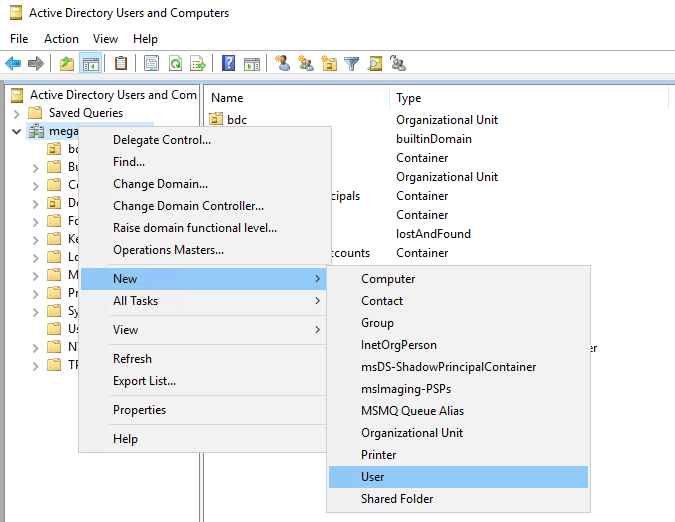
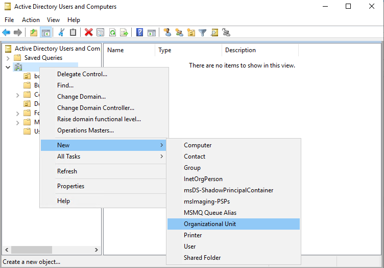
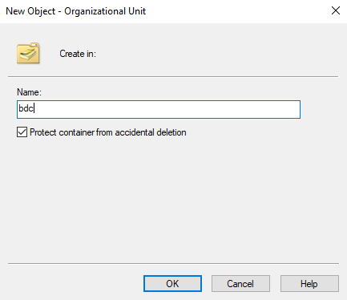
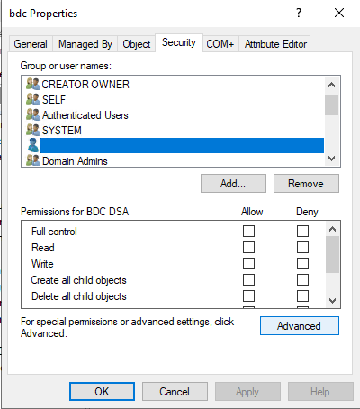
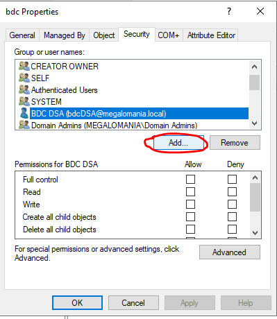
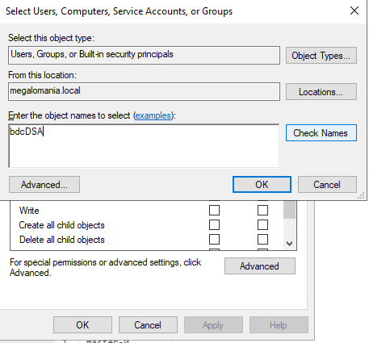
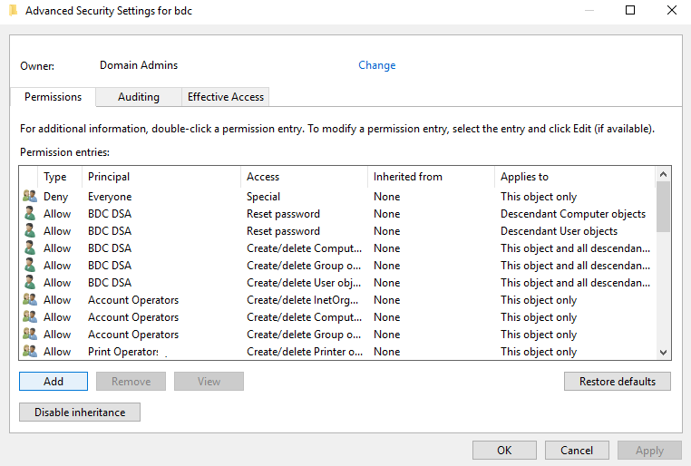
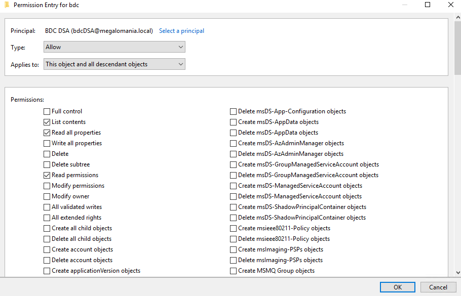

# Deploy [!INCLUDE[big-data-clusters-2019](../includes/ssbigdataclusters-ss-nover.md)] in Active Directory mode: Prerequisites

[!INCLUDE[SQL Server 2019](../includes/applies-to-version/sqlserver2019.md)]

This document explains how to prepare to deploy a SQL Server big data cluster in the Active Directory authentication mode. The cluster uses an existing AD domain for authentication.

[!INCLUDE[big-data-clusters-banner-retirement](../includes/bdc-banner-retirement.md)]

>[!Note]
>Before SQL Server 2019 CU5 release, there is a restriction in big data clusters so that only one cluster could be deployed against an Active Directory domain. This restriction is removed with the CU5 release, see [Concept: deploy [!INCLUDE[big-data-clusters-2019](../includes/ssbigdataclusters-ss-nover.md)] in Active Directory mode](active-directory-deployment-background.md) for details on the new capabilities. Examples in this article are adjusted to accommodate both deployment use cases.

## Background

To enable Active Directory (AD) authentication, the big data cluster automatically creates the users, groups, machine accounts, and service principal names (SPN) that the various services in the cluster need. To provide some containment of these accounts and allow scoping permissions, we suggest creating an organizational unit (OU) before cluster deployment. All big data cluster-related AD objects will be created during deployment. 

## Pre-requisites

### Organizational Unit (OU)
An organizational unit (OU) is a subdivision within an Active Directory into where place users, groups, and even other organizational units. Big picture Organizational units can be used to mirror an organization's functional or business structure. This article we'll create an OU called `bdc` as an example. 

>[!NOTE]
>The organizational unit (OU) represents administrative boundaries and enable customers to control the scope of authority of data administrators. 

You can follow [OU Design Principles](/windows-server/identity/ad-ds/plan/reviewing-ou-design-concepts) to decide on the best structure on working with OUs within your organization.

### AD account for big data cluster domain service account

To be able to create all the required objects in Active Directory automatically, the big data cluster needs an AD account that has specific permissions to create users, groups, and machine accounts inside the provided organizational unit (OU). This article will explain how to configure the permission of this AD account. We use an AD Account call `bdcDSA` as an example in this article.

### Auto generated Active Directory objects
Big Data Clusters deployment automatically generates account and group names. Each of the accounts represents a service and will be managed by the big data cluster throughout the lifetime where the big data cluster is in use. Those accounts own the Service Principal Names (SPNs) are required by each service.  For a full list of AD autogenerated accounts, groups, and service that they managed, see [Autogenerated Active Directory objects](active-directory-objects.md).

>[!IMPORTANT]
> Depending on the password expiration policy set in the Domain Controller, passwords for these accounts can expire. There is no mechanism to automatically rotate credentials for all accounts in the big data cluster, so the cluster will become inoperable once the expiration period is met. You can use `azdata bdc rotate` to rotate the passwords of autogenerated AD accounts for the big data cluster. For more information, see [azdata-bdc-rotate](../azdata/reference/reference-azdata-bdc-rotate.md). You can add this command to your automation scripts or pipelines as part of the security hardening process.

The steps below assume you already have an Active Directory domain controller. If you don't have a domain controller, the following [guide](https://social.technet.microsoft.com/wiki/contents/articles/37528.create-and-configure-active-directory-domain-controller-in-azure-windows-server.aspx) includes steps that can be helpful.

## Create AD objects

Do the following things before you deploy a big data cluster with AD integration:

1. Create an organizational unit (OU) where all big data cluster-related AD objects will be stored. Alternatively you can choose an existing OU upon deployment.
1. Create an AD account for the big data cluster, or use an existing account, and provide this AD account the right permissions inside the provided organizational unit (OU).

### Create a user in AD for the big data cluster domain service account

The big data cluster requires an account with specific permissions. Before you proceed, make sure that you have an existing AD account or create a new account, which the big data cluster can use to set up the necessary objects.

To create a new user in AD, you can right-click the domain or the OU and select **New** > **User**:



This user will be referred to as the *big data cluster domain service account* or *DSA* in this article.

### Create an OU

On the domain controller, open **Active Directory Users and Computers**. On the left panel, right-click the directory under which you want to create your OU and select **New** \> **Organizational Unit**, then follow the prompts from the wizard to create the OU. Alternatively, you can create an OU with PowerShell:

```powershell
New-ADOrganizationalUnit -Name "<name>" -Path "<Distinguished name of the directory you wish to create the OU in>"
```

The examples in this article use `bdc` for the OU name.





### Set permissions for an AD account

Whether you have created a new AD user or using an existing AD user, there are certain permissions the user needs to have. This account is the user account that the big data cluster controller will use when joining the cluster to AD. The DSA needs to be able to create users, groups, and computer accounts in the OU. In the following steps, we have named the big data cluster domain service account `bdcDSA`.

> [!IMPORTANT]
> You can choose any name for the DSA, but we do not recommend altering the account name once the big data cluster is deployed.

1. On the domain controller, open **Active Directory Users and Computers**

1. In the left panel, navigate to your domain, then the OU which `bdc` will use

1. Right-click the OU, and select **Properties**.

1. Go to the Security tab (Make sure that you have selected **Advanced Features** by right-clicking on the OU, and selecting **View**)

    

1. Select **Add...** and add the **bdcDSA** user

    

    

1. Select the **bdcDSA** user and clear all permissions, then select **Advanced**

1. Select **Add**

    

    - Select **Select a Principal**, insert **bdcDSA**, and select **Ok**

    - Set **Type** to **Allow**

    - Set **Applies To** to **This Object and all descendant objects**

        

    - Scroll down to the bottom, and select **Clear all**

    - Scroll back to the top, and select:
       - **Read all properties**
       - **write all properties**
       - **Create Computer objects**
       - **Delete Computer objects**
       - **Create Group objects**
       - **Delete Group objects**
       - **Create User objects**
       - **Delete User objects**

    - Select **OK**

- Select **Add**

    - Select **Select a Principal**, insert **bdcDSA**, and select **Ok**

    - Set **Type** to **Allow**

    - Set **Applies To** to **Descendant Computer objects**

    - Scroll down to the bottom, and select **Clear all**

    - Scroll back to the top, and select **Reset password**

    - Select **OK**

- Select **Add**

    - Select **Select a Principal**, insert **bdcDSA**, and select **Ok**

    - Set **Type** to **Allow**

    - Set **Applies To** to **Descendant User objects**

    - Scroll down to the bottom, and select **Clear all**

    - Scroll back to the top, and select **Reset password**

    - Select **OK**

- Select **OK** twice more to close open dialog boxes

## Next steps

[Deploy [!INCLUDE[big-data-clusters-2019](../includes/ssbigdataclusters-ss-nover.md)] in Active Directory mode](active-directory-deploy.md)

[Troubleshoot SQL Server Big Data Cluster Active Directory integration](troubleshoot-active-directory.md)

[Concept: deploy [!INCLUDE[big-data-clusters-2019](../includes/ssbigdataclusters-ss-nover.md)] in Active Directory mode](active-directory-deployment-background.md)
