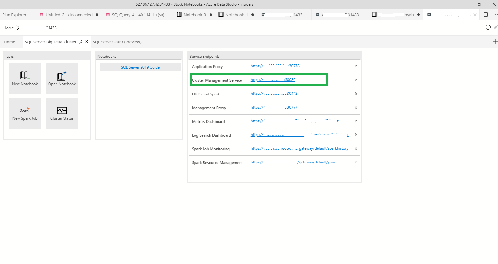
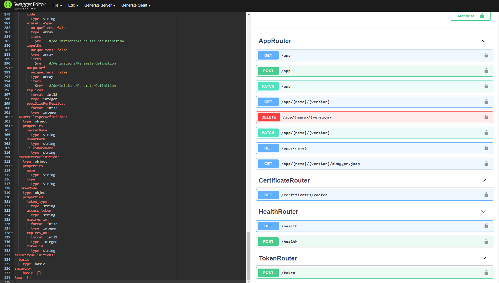
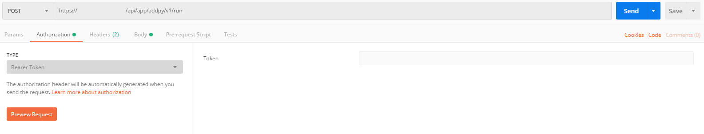
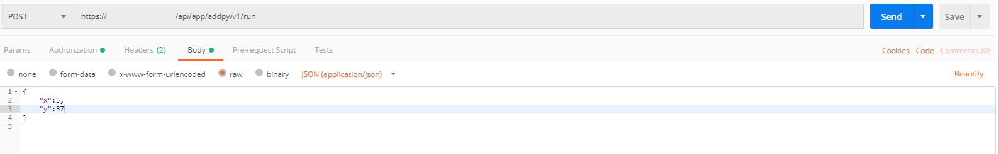
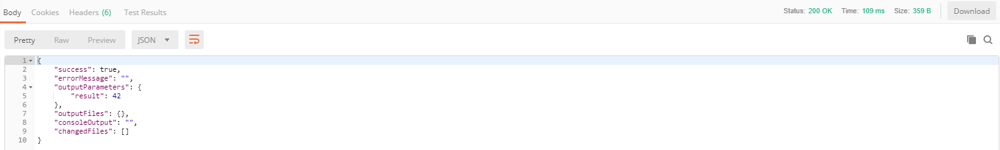

# Consume an app deployed on [!INCLUDE[big-data-clusters-2019](../includes/ssbigdataclusters-ss-nover.md)] using a RESTful web service

[!INCLUDE[SQL Server 2019](../includes/applies-to-version/sqlserver2019.md)]

This article describes how to consume an app deployed on a SQL Server big data cluster using a RESTful web service.

[!INCLUDE[big-data-clusters-banner-retirement](../includes/bdc-banner-retirement.md)]

## Prerequisites

- [SQL Server big data cluster](deployment-guidance.md)
- [[!INCLUDE [azure-data-cli-azdata](../includes/azure-data-cli-azdata.md)]](../azdata/install/deploy-install-azdata.md)
- An app deployed using either [azdata](app-create.md) or the [App Deploy extension](app-deployment-extension.md)

> [!NOTE]
> When the application's yaml specification file specifies a schedule, the application will be triggered via a cron job. If your big data cluster is deployed on OpenShift, launching the cron job requires additional capabilities. See the details regarding [security considerations on OpenShift](concept-application-deployment.md#app-deploy-security) for specific instructions.

## Capabilities

After you have deployed an application to your [!INCLUDE[big-data-clusters-2019](../includes/ssbigdataclusters-ver15.md)], you can access and consume that application using a RESTful web service. This enables integration of that app from other applications or services (for example, a mobile app or website). The following table describes the application deployment commands that you can use with **azdata** to get information about the RESTful web service for your app.

|Command |Description |
|:---|:---|
|`azdata app describe` | Describe application. |

You can get help with the `--help` parameter as in the following example:

```bash
azdata app describe --help
```

The following sections describe how to retrieve an endpoint for an application and how to work with the RESTful web service for application integration.

## Retrieve the endpoint

Big Data Clusters provides endpoints that you can access and consume that application using a RESTful web service,  the main purpose is to facilities the interaction with other web or mobile applications and being more proactive for those microservices architecture. The **azdata app describe** command provides detailed information about the app including the end point in your cluster. This is typically used by an app developer to build an app using the swagger client and using the webservice to interact with the app in a RESTful manner.

Describe your app by running a command similar to the following example:

```bash
azdata app describe --name add-app --version v1
```

```json
{
  "input_param_defs": [
    {
      "name": "x",
      "type": "int"
    },
    {
      "name": "y",
      "type": "int"
    }
  ],
  "links": {
    "app": "https://10.1.1.3:30080/app/addpy/v1",
    "swagger": "https://10.1.1.3:30080/app/addpy/v1/swagger.json"
  },
  "name": "add-app",
  "output_param_defs": [
    {
      "name": "result",
      "type": "int"
    }
  ],
  "state": "Ready",
  "version": "v1"
}
```

Note the IP address (`10.1.1.3` in this example) and the port number (`30080`) in the output.

One of the other ways to get this information is doing right-click Manage on the server in Azure Data Studio where you'll find the endpoints of the services listed.



## Generate a JWT access token

To access the RESTful web service for the app you've deployed you first have to generate a JWT Access token. The URL for the access token depends on the version of Big Data Cluster. 

|Version |URL|
|------------|------|
|GDR1|  `https://[IP]:[PORT]/docs/swagger.json`|
|CU1 and later| `https://[IP]:[PORT]/api/v1/swagger.json`|

 From the output of previous example, CU4 release and the IP address of controller (10.1.1.3 in the example) and the port number (30080), the URL would look like the following: 
 
 ```bash
    https://10.1.1.3 :30080/api/v1/swagger.json
```
 
> For version information, see [Release history](release-notes-big-data-cluster.md#release-history).

Open the appropriate URL in your browser using the IP address and port you retrieved running the [`describe`](#retrieve-the-endpoint) command above. Sign in with the same credentials you used for `azdata login`.

Paste the contents of the `swagger.json` into the [Swagger Editor](https://editor.swagger.io) to understand what methods are available:



Notice the `app` is GET method and to get the `token` would use POST method. Since the authentication for apps uses JWT tokens, you'll need to get a token my using your favorite tool to make a POST call to the `token` method. With the same example, the URL to get JWT token would look like the follows:

 ```bash
    https://10.1.1.3 :30080/api/v1/token
```


Here is an example of how to do just that in [Postman](https://www.getpostman.com/):


The output of this request will give you a JWT `access_token`, which you'll need to call the URL to run the app.

## Execute the app using the RESTful web service

There are multiple ways to consume an app on SQL Server Big Data Clusters, you can choose to use [azdata app run command](app-create.md). This section will demonstrate how to use common developer tools such as Postman to execute the app. 

You can open the URL for the `swagger` that was returned when you ran `azdata app describe --name [appname] --version [version]` in your browser, which should be similar to `https://[IP]:[PORT]/app/[appname]/[version]/swagger.json`. 

> [!NOTE]
> You'll have to log in with the same credentials you used for `azdata login`. With the same example, the command would look like the follows :

 ```bash
    azdata app describe --name add-app --version v1
```

The contents of the `swagger.json` you can paste into [Swagger Editor](https://editor.swagger.io). You'll see that the web service exposes the `run` method, and underneath it went through application proxy, which is a web API that authenticates users and then routes the requests through to the applications. Notice that the Base URL displayed at the top. You can use tool of your choice to call the `run` method (`https://[IP]:30778/api/app/[appname]/[version]/run`), passing in the parameters in the body of your POST request as json. 


In this example, we'll use [Postman](https://www.getpostman.com/). Before making the call, you'll need to set the `Authorization` to `Bearer Token` and paste in the token you retrieved earlier. This will set a header on your request. See the screenshot below.



Next, in the requests body, pass in the parameters to the app you're calling and set the `content-type` to `application/json`:



When you send the request, you'll get the same output as you did when you ran the app through `azdata app run`:



You've now successfully called the app through the web service. You can follow similar steps to integrate this web service in your application.


## Next steps

Explore how to [Monitor applications on big data clusters](app-monitor.md) for more information. You can also check out additional samples at [App Deploy Samples](https://aka.ms/sql-app-deploy).

For more information about [!INCLUDE[big-data-clusters-2019](../includes/ssbigdataclusters-ss-nover.md)], see [What are [!INCLUDE[big-data-clusters-2019](../includes/ssbigdataclusters-ver15.md)]](big-data-cluster-overview.md).