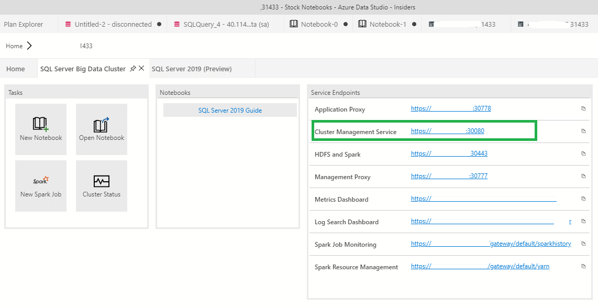

# How to use Visual Studio Code to deploy applications to [!INCLUDE[big-data-clusters-2019](../includes/ssbigdataclusters-ss-nover.md)]

[!INCLUDE[SQL Server 2019](../includes/applies-to-version/sqlserver2019.md)]

This article describes how to deploy applications to a SQL Server big data cluster. We'll use Microsoft Visual Studio Code and the App Deploy extension.

[!INCLUDE[big-data-clusters-banner-retirement](../includes/bdc-banner-retirement.md)]

## Prerequisites

- [Visual Studio Code](https://code.visualstudio.com/)
- [SQL Server big data cluster](big-data-cluster-overview.md)

## Capabilities

The App Deploy extension supports the following tasks in Visual Studio Code:

- Authenticates with SQL Server big data cluster.
- Retrieves an application template from GitHub repository for deployment of supported runtimes.
- Manages application templates currently open in the user's workspace.
- Deploys an application through a specification in YAML format.
- Manages deployed apps within SQL Server big data cluster.
- Displays all apps that you have deployed in the side bar with additional information.
- Generates a run spec to consume the app or delete the app from the cluster.
- Consumes deployed apps through a run specification YAML.

The following sections walk through installation of App Deploy. They also provide an overview on how it works.

### How to install the App Deploy extension in Visual Studio Code

In *Visual Studio Code*, install the *App Deploy* extension:

1. To install App Deploy as part of Visual Studio Code [download the extension](https://aka.ms/app-deploy-vscode) from GitHub.

1. Launch Visual Studio Code and navigate to the Extensions sidebar.

1. Click the `…` context menu on the top of the side bar and select `Install from vsix`.

   

1. Find the `sqlservbdc-app-deploy.vsix` file you downloaded and choose it to install.

After App Deploy successfully installs, it prompts you to reload Visual Studio Code. You should now see the SQL Server BDC App Explorer in the Visual Studio Code sidebar.

### Load App Explorer

Select the Extensions icon in the sidebar. A side panel loads and displays App Explorer.


#### Connect to the cluster endpoint

You can use any of the following methods to connect to the cluster endpoint:

- Click on the status bar at the bottom that says `SQL Server BDC Disconnected`.
- Or click on the `Connect to Cluster` button at the top with the arrow pointing into a doorway.

Visual Studio Code prompts you for the appropriate endpoint, username, and password.

Connect to the endpoint `Cluster Management Service` with port 30080.

You can also find this endpoint from the command line with the following command:

```
azdata bdc endpoint list
```

Another way to retrieve this information is to navigate to the server in *Azure Data Studio* and right-click **Manage**. The endpoints for services are listed.



Find the endpoint you want to use, then connect to the cluster.


Upon successful connection, Visual Studio Code notifies you that you're connected to the cluster. Deployed apps are displayed in the sidebar and your endpoint and username are saved to `./sqldbc` as part of your user profile. No password or tokens are ever saved. With subsequent log ins, the prompt pre-fills with your saved host and username, but always requires you to input a password. If you wish to connect to a different cluster endpoint, select `New Connection`. The connection is automatically closed when you exit Visual Studio Code and when you open a different workspace. You will then need to reconnect.

### Create an App Template

In Visual Studio Code, open a workspace in the location where you want to save your app artifacts.

To deploy a new app from a template, select the **New App Template** button on the **App Specifications** pane. A prompt asks you where on your local machine you want to save the name, runtime and the new app. The name and version that you provide should be a DNS-1035 label and must consist of lower-case, alphanumeric characters, or '-'. They need to also start with an alphabetic character and end with an alphanumeric character.

Preferably place the extension in your current Visual Studio Code workspace. This gives you the full functionality of the extension.


Once complete, a new app template is scaffolded for you in the location you specify, and the deployment `spec.yaml` opens in your workspace. If the directory you select is in your workspace, it'll be listed in the **App Specifications** pane:


The new template is a simple helloworld app that is laid out in the **App Specifications** pane as follows:

- **spec.yaml**
   - Tells the cluster how to deploy your app
- **run-spec.yaml**
   - Tells the cluster how you'd like to call your app

The app source code is in the Workspace folder.

- **Source file name**
   - This is your source code file as specified by `src` in `spec.yaml`
   - It has one function called `handler` that is considered the `entrypoint` of the app as shown in `spec.yaml`. It takes in a string input called `msg` and returns a string output called `out`. These are specified in `inputs` and `outputs` of the `spec.yaml`.

To use `spec.yaml` to deploy an app rather than a scaffolded template, select the `New Deploy Spec` button, which is next to the `New App Template` button. Now repeat the same process. You will only receive the `spec.yaml`, which you are free to modify.

### Deploy your app

You can deploy your app instantly through the CodeLens `Deploy App` in the `spec.yaml` or select the **Lightning folder** button next to the `spec.yaml` file, in the **App specifications** menu. The extension will zip all of the files in the directory where your `spec.yaml` is located. It'll then deploy your app to the cluster.

>[!NOTE]
>The `spec.yaml` must be at the root level of your app source code directory. Also ensure that all of your app files are in the same directory as your `spec.yaml`.


The app status in the sidebar notifies you when it is ready to be used:


From the side pane, you can see the following:

You can view all of the apps you have deployed with the following links:

- state
- version
- input parameters
- output parameters
- links
  - swagger
  - details

If you click `links`, you will see that you can access the `swagger.json` of your deployed app. This enables you to write clients to call your app:


For more information, view [Consume applications on big data clusters](app-consume.md).

### Run your app

Once your app is ready, call it with `run-spec.yaml`. This file is provided as part of the app-template:


Specify a string to replace `hello`. Then run your app again through the **CodeLens** link or the **Lightning** button in the side bar. If you don't see the `run-spec` option, generate one from the deployed app in the cluster:


Once you have edited your run-spec, run it. Visual Studio Code returns feedback when the app finishes running:


In the previous screenshot, you'll see the output is given in a temporary `.json` file in your workspace. If you would like to keep this output, you can save it. Otherwise, it is deleted upon closing. If your app has no output to print to a file, you'll only get the `Successful App Run` status notification. If you don't have a successful run, you receive an error message that will help you determine what is wrong.

When running an app, there are a variety of ways to pass parameters:

You can specify all inputs required through a `.json`, that is:

- `inputs: ./example.json`

Specify the parameter type in line when a deployed app is called and input parameters are not primitives. So, with arrays, vectors, dataframes, complex JSONs, etc.:

- Vector
    - `inputs:`
        - `x: [1, 2, 3]`
- Matrix
    - `inputs:`
        - `x: [[A,B,C],[1,2,3]]`
- Object
    - `inputs:`
        - `x: {A: 1, B: 2, C: 3}`

Or pass a string to a `.txt`, `.json`, or `.csv` file in the format that your app requires. In this instance, file parsing is based on `Node.js Path library`, where a file path is defined as a `string that contains a / or \ character`.

If a required input parameter is not provided, an error message is displayed. It provides the incorrect file path if a string file path was given, or it states that the parameter was invalid. The app creator needs to ensure they understand the parameters that they define.

To delete an app, go to the app in the `Deployed Apps` side pane and select the trash can icon.

## Next steps

Explore how to integrate apps deployed on [!INCLUDE[big-data-clusters-2019](../includes/ssbigdataclusters-ss-nover.md)] in your own applications at [Consume applications on big data clusters](app-consume.md) for more information. You can also refer to the additional samples at [App Deploy Samples](https://aka.ms/sql-app-deploy) to try with the extension.

For more information about [!INCLUDE[big-data-clusters-2019](../includes/ssbigdataclusters-ss-nover.md)], see [Introducing [!INCLUDE[big-data-clusters-2019](../includes/ssbigdataclusters-ver15.md)]](big-data-cluster-overview.md).


Our goal is to make this extension useful for you and we appreciate your feedback. Please send them to [[!INCLUDE[ssNoVersion](../includes/ssnoversion-md.md)] team](https://aka.ms/sqlfeedback).
