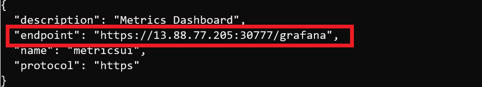
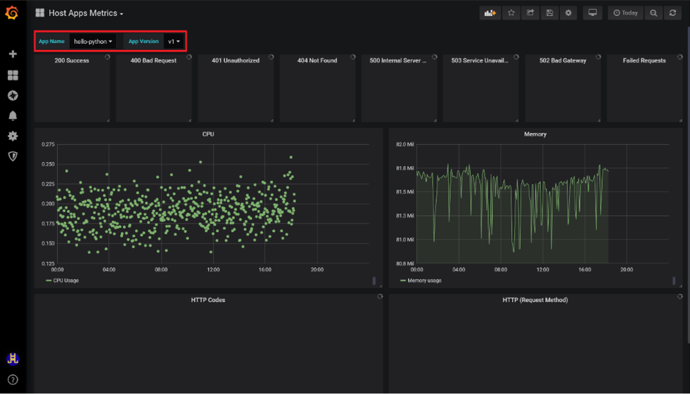
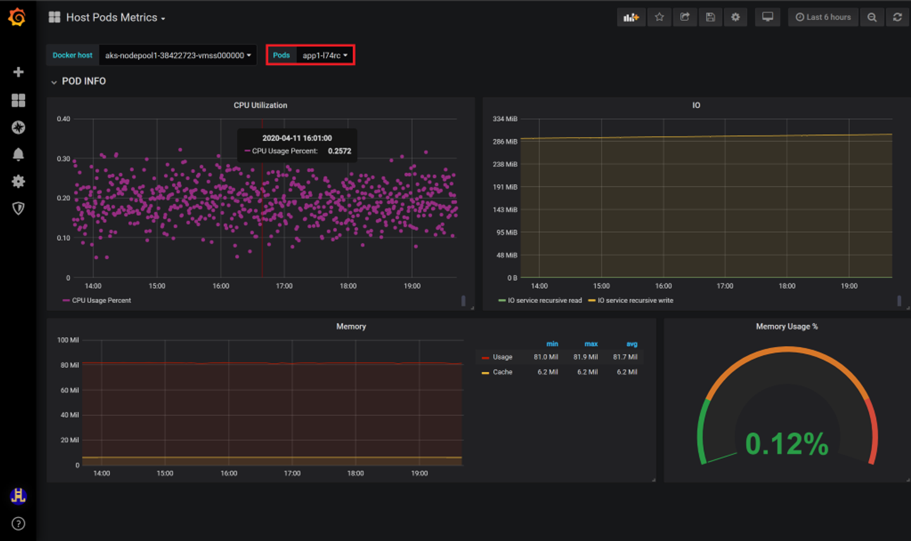

# Monitor applications with azdata and Grafana Dashboard

[!INCLUDE[big-data-clusters-banner-retirement](../includes/bdc-banner-retirement.md)]

Grafana is one of the best cloud-native virtualization tools, which can be used to provide various monitoring metrics of your application running in Kubernetes.  

This article describes how to monitor an application inside a SQL Server Big Data Cluster.

> [!IMPORTANT]
> The Internet Explorer browser and older Microsoft Edge browsers are not compatible with Grafana. In Grafana, you will see a black page with errors when using an unsupported browser. Consider the [Chromium-based Microsoft Edge](https://microsoftedgewelcome.microsoft.com/), or review the [supported browsers for Grafana](https://grafana.com/docs/grafana/latest/installation/requirements/#supported-web-browsers).

## Prerequisites

- [SQL Server 2019 big data cluster](deployment-guidance.md)
- [[!INCLUDE [azure-data-cli-azdata](../includes/azure-data-cli-azdata.md)]](../azdata/install/deploy-install-azdata.md)

## Capabilities

In SQL Server 2019 you can create, delete, describe, initialize, list run and update your application. The following table describes the application deployment commands that you can use with **azdata**.

|Command |Description |
|:---|:---|
|`azdata bdc endpoint list` | Lists the endpoints for the Big Data Cluster. |


You can use the following example to list the endpoint of **Grafana dashboard**:

```bash
azdata bdc endpoint list --endpoint-name metricsui 
```

The output will give you the endpoint, which you can use your cluster username and password to log in. 




When you open the dashboard, go to the **Host Apps Metrics**, where you'll get more insights about your application and keep in track.  




To get more insight about a single pod of the application ( in some cases you have multiple copies of your application), please go to the **Host Pods Metrics** and choose the pod respect, you'll get a view of metrics as follows:  

 


## Next steps

You can check out additional samples at [App Deploy Samples](https://aka.ms/sql-app-deploy).

For more information about [!INCLUDE[big-data-clusters-2019](../includes/ssbigdataclusters-ss-nover.md)], see [Introducing [!INCLUDE[big-data-clusters-2019](../includes/ssbigdataclusters-ver15.md)]](big-data-cluster-overview.md).