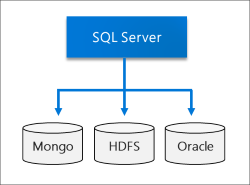
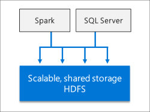
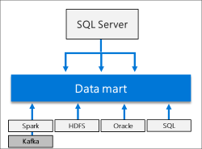
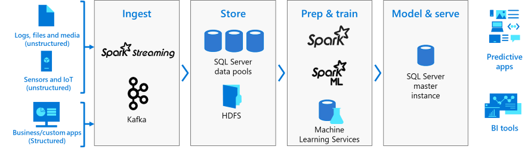
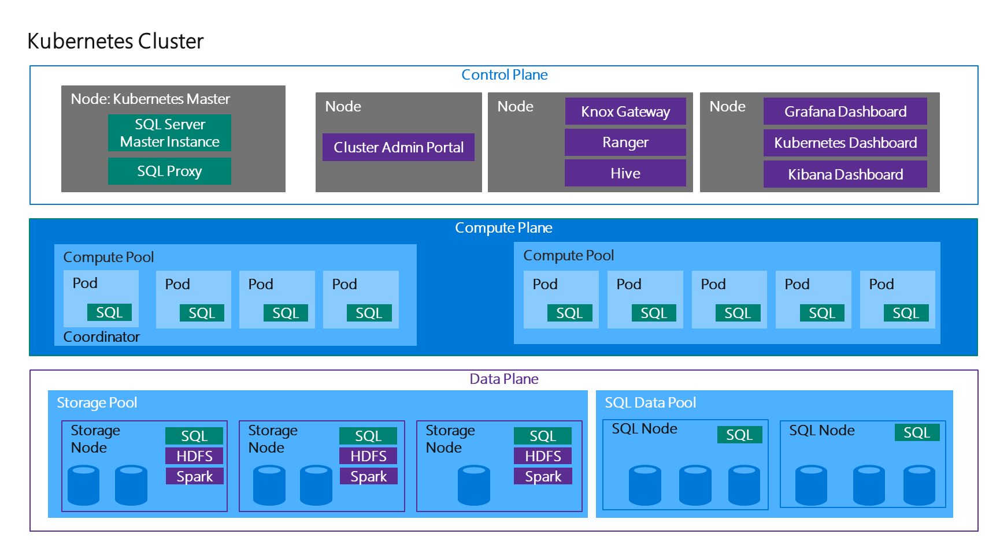

# What are SQL Server 2019 big data clusters?

Starting with [!INCLUDE[SQL Server 2019](../includes/sssqlv15-md.md)], SQL Server big data clusters allow you to deploy scalable clusters of SQL Server, Spark, and HDFS containers running on Kubernetes. These components are running side by side to enable you to read, write, and process big data from Transact-SQL or Spark, allowing you to easily combine and analyze your high-value relational data with high-volume big data.

For more information about new features and known issues for latest release, see the [release notes](big-data-cluster-release-notes.md).

[!INCLUDE [Limited public preview note](../includes/big-data-cluster-preview-note.md)]

## Scenarios

SQL Server big data clusters provide flexibility in how you interact with your big data. You can query external data sources, store big data in HDFS managed by SQL Server, or query data from multiple external data sources through the cluster. You can then use the data for AI, machine learning, and other analysis tasks. The following sections provide more information about these scenarios.

### Data virtualization

By leveraging [SQL Server PolyBase](../relational-databases/polybase/polybase-guide.md), SQL Server big data clusters can query external data sources without moving or copying the data. [!INCLUDE[SQL Server 2019](../includes/sssqlv15-md.md)] introduces new connectors to data sources.

### Data lake

A SQL Server big data cluster includes a scalable HDFS *storage pool*. This can be used to store big data, potentially ingested from multiple external sources. Once the big data is stored in HDFS in the big data cluster, you can analyze and query the data and combine it with your relational data.

### Scale-out data mart

SQL Server big data clusters provide scale-out compute and storage to improve the performance of analyzing any data. Data from a variety of sources can be ingested and distributed across *data pool* nodes as a cache for further analysis.

### Integrated AI and Machine Learning

SQL Server big data clusters enable AI and machine learning tasks on the data stored in HDFS storage pools and the data pools. You can use Spark as well as built-in AI tools in SQL Server, using R, Python, Scala, or Java.

### Management and Monitoring

Management and monitoring are provided through a combination of command line tools, APIs, an administrator portal, and dynamic management views.

The [cluster administrator portal](cluster-admin-portal.md) is a web interface that displays the status and health of the pods in the cluster. It also provides links to other dashboards for log analytics and monitoring dashboards.

You can use Azure Data Studio to perform a variety of tasks on the big data cluster. This is enabled by the new **SQL Server 2019 Extension (Preview)**. This extension provides:

- Built-in snippets for common management tasks.
- Ability to browse HDFS, upload files, preview files, and create directories.
- Ability to create, open, and run Jupyter-compatible notebooks.
- Data virtualization wizard to simplify the creation of external data sources.

##  Architecture

A SQL Server big data cluster is a cluster of Linux containers orchestrated by [Kubernetes](https://kubernetes.io/docs/concepts/).

### Kubernetes concepts

Kubernetes is an open source container orchestrator, which can scale container deployments according to need. The following table defines some important Kubernetes terminology:

|||
|--|--|
| **Cluster** | A Kubernetes cluster is a set of machines, known as nodes. One node controls the cluster and is designated the master node; the remaining nodes are worker nodes. The Kubernetes master is responsible for distributing work between the workers, and for monitoring the health of the cluster. |
| **Node** | A node runs containerized applications. It can be either a physical machine or a virtual machine. A Kubernetes cluster can contain a mixture of physical machine and virtual machine nodes. |
| **Pod** | A pod is the atomic deployment unit of Kubernetes. A pod is a logical group of one or more containers-and associated resources-needed to run an application. Each pod runs on a node; a node can run one or more pods. The Kubernetes master automatically assigns pods to nodes in the cluster. |

In SQL Server big data clusters, Kubernetes is responsible for the state of the SQL Server big data clusters; Kubernetes builds and configures the cluster nodes, assigns pods to nodes, and monitors the health of the cluster.

### Big data clusters architecture

Nodes in the cluster are arranged into three logical planes: the control plane, the compute plane, and the data plane. Each plane has different responsibilities in the cluster. Every Kubernetes node in a SQL Server big data cluster is hosting pods for components of at least one plane.

###  Control plane

The control plane provides management and security for the cluster. It contains the Kubernetes master, the *SQL Server master instance*, and other cluster-level services such as the Hive Metastore and Spark Driver.

###  Compute plane

The compute plane provides computational resources to the cluster. It contains nodes running SQL Server on Linux pods. The pods in the compute plane are divided into *compute pools* for specific processing tasks. A compute pool can act as a [PolyBase](../relational-databases/polybase/polybase-guide.md) scale-out group for distributed queries over different data sources-such as HDFS, Oracle, MongoDB, or Teradata.

###  Data plane

The data plane is used for data persistence and caching. It contains the SQL data pool, and storage pool.  The SQL data pool consists of one or more pods running SQL Server on Linux. It is used to ingest data from SQL queries or Spark jobs. SQL Server big data cluster data marts are persisted in the data pool. The storage pool consists of storage pool pods comprised of SQL Server on Linux, Spark, and HDFS. All the storage nodes in a SQL Server big data cluster are members of an HDFS cluster.

## Next steps

SQL Server big data clusters is first available as a limited public preview through the SQL Server 2019
Early Adoption Program. To request access, register [here](https://aka.ms/eapsignup), and specify your interest to try big data clusters. Microsoft will triage all requests and respond as soon as possible.
