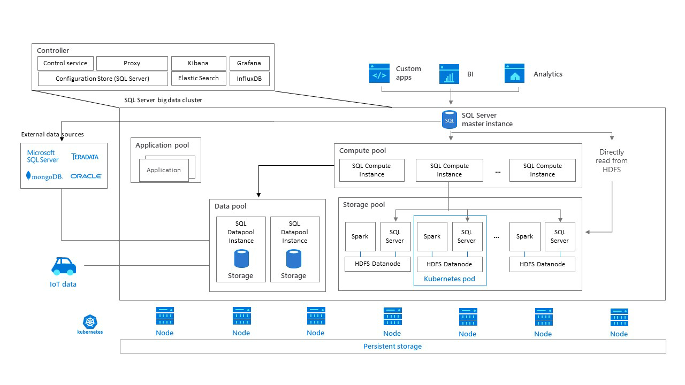

# What are [!INCLUDE[big-data-clusters-2019](../includes/ssbigdataclusters-ss-nover.md)]?

[!INCLUDE[SQL Server 2019](../includes/applies-to-version/sqlserver2019.md)]

Starting with [!INCLUDE[SQL Server 2019](../includes/sssqlv15-md.md)], [!INCLUDE[big-data-clusters-2019](../includes/ssbigdataclusters-ss-nover.md)] allow you to deploy scalable clusters of SQL Server, Spark, and HDFS containers running on Kubernetes. These components are running side by side to enable you to read, write, and process big data from Transact-SQL or Spark, allowing you to easily combine and analyze your high-value relational data with high-volume big data.

[!INCLUDE[SQL Server 2019](../includes/sssqlv15-md.md)] introduces SQL Server Big Data Clusters.

Use SQL Server Big Data Clusters to:

- [Deploy scalable clusters](../big-data-cluster/deploy-get-started.md) of SQL Server, Spark, and HDFS containers running on Kubernetes. 
- Read, write, and process big data from Transact-SQL or Spark.
- Easily combine and analyze high-value relational data with high-volume big data.
- Query external data sources.
- Store big data in HDFS managed by SQL Server.
- Query data from multiple external data sources through the cluster.
- Use the data for AI, machine learning, and other analysis tasks.
- [Deploy and run applications](../big-data-cluster/concept-application-deployment.md) in [!INCLUDE[big-data-clusters](../includes/ssbigdataclusters-nover.md)].
- Virtualize data with [PolyBase](../relational-databases/polybase/polybase-guide.md). Query data from external SQL Server, Oracle, Teradata, MongoDB, and ODBC data sources with external tables.
- Provide high availability for the SQL Server master instance and all databases by using Always On availability group technology.

For more information about new features and known issues for latest release, see the [release notes](release-notes-big-data-cluster.md).

## Scenarios

[!INCLUDE[big-data-clusters-2019](../includes/ssbigdataclusters-ss-nover.md)] provide flexibility in how you interact with your big data. You can query external data sources, store big data in HDFS managed by SQL Server, or query data from multiple external data sources through the cluster. You can then use the data for AI, machine learning, and other analysis tasks. The following sections provide more information about these scenarios.

### Data virtualization

By leveraging [SQL Server PolyBase](../relational-databases/polybase/polybase-guide.md), [!INCLUDE[big-data-clusters-2019](../includes/ssbigdataclusters-ss-nover.md)] can query external data sources without moving or copying the data. [!INCLUDE[SQL Server 2019](../includes/sssqlv15-md.md)] introduces new connectors to data sources.

### Data lake

A SQL Server big data cluster includes a scalable HDFS *storage pool*. This can be used to store big data, potentially ingested from multiple external sources. Once the big data is stored in HDFS in the big data cluster, you can analyze and query the data and combine it with your relational data.

### Scale-out data mart

[!INCLUDE[big-data-clusters-2019](../includes/ssbigdataclusters-ss-nover.md)] provide scale-out compute and storage to improve the performance of analyzing any data. Data from a variety of sources can be ingested and distributed across *data pool* nodes as a cache for further analysis.

### Integrated AI and Machine Learning

[!INCLUDE[big-data-clusters-2019](../includes/ssbigdataclusters-ss-nover.md)] enable AI and machine learning tasks on the data stored in HDFS storage pools and the data pools. You can use Spark as well as built-in AI tools in SQL Server, using R, Python, Scala, or Java.

### Management and Monitoring

Management and monitoring are provided through a combination of command line tools, APIs, portals, and dynamic management views.

You can use [Azure Data Studio](../azure-data-studio/what-is.md) to perform a variety of tasks on the big data cluster:
- Built-in snippets for common management tasks.
- Ability to browse HDFS, upload files, preview files, and create directories.
- Ability to create, open, and run Jupyter-compatible notebooks.
- Data virtualization wizard to simplify the creation of external data sources (enabled by the **Data Virtualization Extension**).

##  Architecture

A SQL Server big data cluster is a cluster of Linux containers orchestrated by [Kubernetes](https://kubernetes.io/docs/concepts/).

### Kubernetes concepts

Kubernetes is an open source container orchestrator, which can scale container deployments according to need. The following table defines some important Kubernetes terminology:

|Term|Description|
|:--|:--|
| **Cluster** | A Kubernetes cluster is a set of machines, known as nodes. One node controls the cluster and is designated the master node; the remaining nodes are worker nodes. The Kubernetes master is responsible for distributing work between the workers, and for monitoring the health of the cluster. |
| **Node** | A node runs containerized applications. It can be either a physical machine or a virtual machine. A Kubernetes cluster can contain a mixture of physical machine and virtual machine nodes. |
| **Pod** | A pod is the atomic deployment unit of Kubernetes. A pod is a logical group of one or more containers-and associated resources-needed to run an application. Each pod runs on a node; a node can run one or more pods. The Kubernetes master automatically assigns pods to nodes in the cluster. |
| &nbsp; ||

In [!INCLUDE[big-data-clusters-2019](../includes/ssbigdataclusters-ss-nover.md)], Kubernetes is responsible for the state of the [!INCLUDE[big-data-clusters-2019](../includes/ssbigdataclusters-ss-nover.md)]; Kubernetes builds and configures the cluster nodes, assigns pods to nodes, and monitors the health of the cluster.

### Big data clusters architecture

The following diagram shows the components of a big data cluster for SQL Server.

###  Controller

The controller provides management and security for the cluster. It contains the control service, the configuration store, and other cluster-level services such as Kibana, Grafana, and Elastic Search.

###  Compute pool

The compute pool provides computational resources to the cluster. It contains nodes running SQL Server on Linux pods. The pods in the compute pool are divided into *SQL Compute instances* for specific processing tasks. 

###  Data pool

The data pool is used for data persistence and caching. The data pool consists of one or more pods running SQL Server on Linux. It is used to ingest data from SQL queries or Spark jobs. SQL Server big data cluster data marts are persisted in the data pool. 

### Storage pool

The storage pool consists of storage pool pods comprised of SQL Server on Linux, Spark, and HDFS. All the storage nodes in a SQL Server big data cluster are members of an HDFS cluster.

> [!TIP]
> For an in-depth look into big data cluster architecture and installation, see [Workshop: Microsoft [!INCLUDE[big-data-clusters-2019](../includes/ssbigdataclusters-ss-nover.md)] Architecture](https://github.com/microsoft/sqlworkshops-bdc).

## Next steps

For more information about deploying SQL Server Big Data Clusters, see [Get started with SQL Server Big Data Clusters](deploy-get-started.md).
