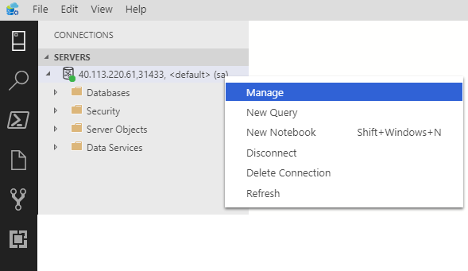
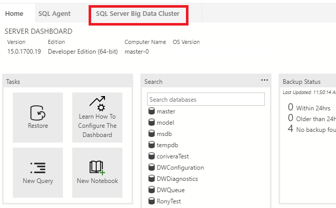
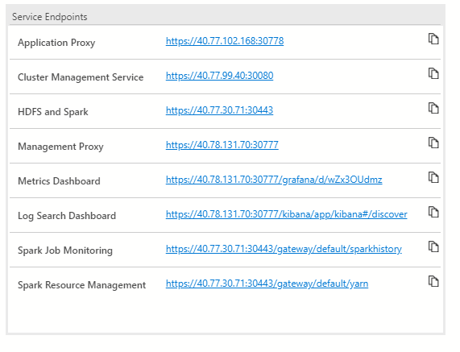
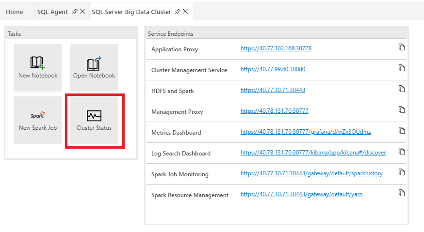

# Monitor Big Data Clusters status by using Azure Data Studio

This article explains how to view the status of a big data cluster using Azure Data Studio.

[!INCLUDE[big-data-clusters-banner-retirement](../includes/bdc-banner-retirement.md)]

##  Use Azure Data Studio

After downloading the latest **insiders build** of [Azure Data Studio](../azure-data-studio/download-azure-data-studio.md), you can view service endpoints and the status of a big data cluster with the SQL Server big data cluster dashboard. Some of the features below are only first available in the insiders build of Azure Data Studio.

1. First, create a connection to your big data cluster in Azure Data Studio. For more information, see [Connect to a SQL Server big data cluster with Azure Data Studio](connect-to-big-data-cluster.md).

1. Right-click on the big data cluster endpoint, and click **Manage**.

   

1. Select the **SQL Server Big Data Cluster** tab to access the big data cluster dashboard.

   

### Service endpoints

It is important to be able to easily access the various services within a big data cluster. The big data cluster dashboard provides a service endpoints table that allows you to see and copy the service endpoints.

These services list the endpoints that can be copied and pasted when you need the endpoint for connecting to those services. For example, you can click the copy icon to the right of the endpoint and then paste it in a text window requesting that endpoint. The Cluster Management Service endpoint is necessary to run the [cluster status notebook](#notebook).

### Dashboards

The service endpoints table also exposes several dashboards for monitoring:

- Metrics (Grafana)
- Logs (Kibana)
- Spark Job Monitoring
- Spark Resource Management

You can directly click on these links. You will be required to authenticate when accessing these dashboards. For the metrics and logs dashboards, provide controller admin credentials that you set at deployment time using environment variables **AZDATA_USERNAME** and **AZDATA_PASSWORD**. Spark dashboards will use gateway (Knox) credentials: either AD identity in a cluster integrated with AD or **AZDATA_USERNAME** and **AZDATA_PASSWORD** if using basic authentication in your cluster.

[!INCLUDE [big-data-cluster-root-user](../includes/big-data-cluster-root-user.md)]

###  Cluster Status notebook

1. You can also view cluster status of the big data cluster by launching the Cluster Status notebook. To launch the notebook, click the **Cluster Status** task.

    

2. Before you begin, you will need the following items:

    - Big data cluster name
    - Controller username
    - Controller password
    - Controller endpoints

    The default big data cluster name is **mssql-cluster** unless you customized it during your deployment. You can find the controller endpoint from the big data cluster dashboard in the Service Endpoints table. The endpoint is listed as **Cluster Management Service**. If you do not know the credentials, ask the admin who deployed your cluster.

3. Click **Run Cells** on the top toolbar.

4. Follow the prompt for your credentials. Press press ENTER after you type each credential for the big data cluster name, controller username, and controller password.

    > [!Note]
    > If you do not have a config file setup with your big data, you will be asked for the controller endpoint. Type or paste it, and then press ENTER to proceed.

5. If you connected successfully, the rest of the notebook will show the output of each component of the big data cluster. When you want to rerun a certain code cell, hover over the code cell and click the **Run** icon.

## Next steps

For more information about [!INCLUDE[big-data-clusters-2019](../includes/ssbigdataclusters-ss-nover.md)], see [Introducing [!INCLUDE[big-data-clusters-2019](../includes/ssbigdataclusters-ver15.md)]](big-data-cluster-overview.md).
