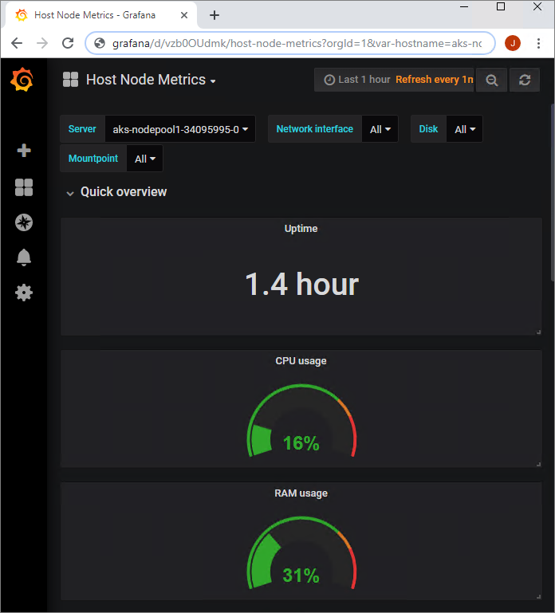
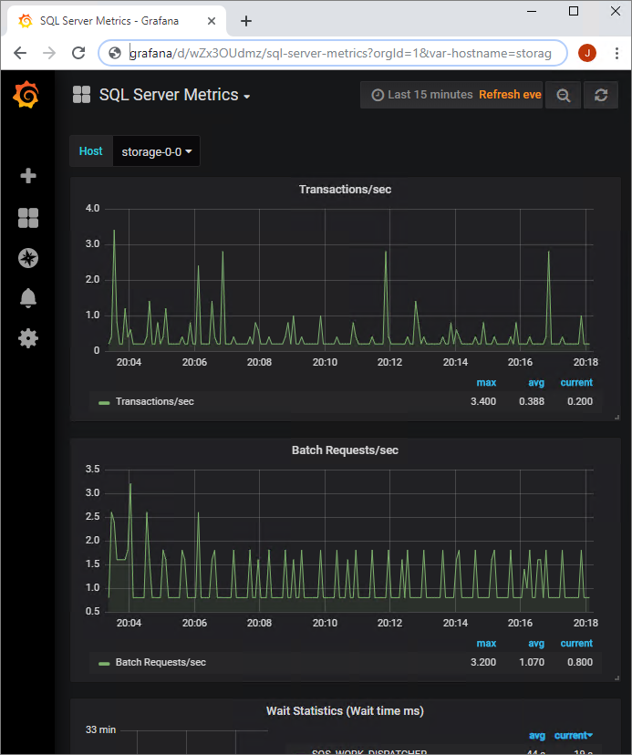

# Monitor applications with azdata and Grafana Dashboard

The `nodeMetricsUrl` and `sqlMetricsUrl` values link to a Grafana dashboard for monitoring Kubernetes node metrics and big data cluster service metrics:

## Next steps

You can check out additional samples at [App Deploy Samples](https://aka.ms/sql-app-deploy).

For more information about [!INCLUDE[big-data-clusters-2019](../includes/ssbigdataclusters-ss-nover.md)], see [What are [!INCLUDE[big-data-clusters-2019](../includes/ssbigdataclusters-ver15.md)]?](big-data-cluster-overview.md).
