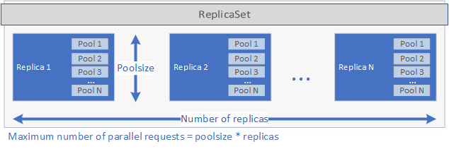

# What is Application Deployment on a SQL Server 2019 big data cluster?

Application Deployment enables the deployment of applications on the big data cluster by providing easy to use interfaces to create, manage and run applications. Applications deployed on the big data cluster benefit from the computational power of the cluster and can access the data that is available on the cluster. This increases scalability and performance of the applications, while managing the applications where the data lives.
The following sections describe the architecture and functionality of Application Deployment.

## Application Deployment architecture

Application deployment consists of a controller and app runtime handlers. When creating an application, a specification file (`spec.yaml`) is provided. This `spec.yaml` file contains everything the controller needs to know to succesfully deploy the application. The following is a sample of the contents for `spec.yaml`:

```yaml
#spec.yaml
name: add-app #name of your python script
version: v1  #version of the app
runtime: Python #the language this app uses (R or Python)
src: ./add.py #full path to the location of the app
entrypoint: add #the function that will be called upon execution
replicas: 1  #number of replicas needed
poolsize: 1  #the pool size that you need your app to scale
inputs:  #input parameters that the app expects and the type
  x: int
  y: int
output: #output parameter the app expects and the type
  result: int
```

The controller inspects the `runtime` specified in the `spec.yaml` file and calls the corresponding runtime handler. The runtime handler creates the application. First, a Kubernetes ReplicaSet is created containing one or more pods, each of which contains the application to be deployed. The number of pods is defined by the `replicas` parameter set in the `spec.yaml` file for the application. Each pod can have one of more pools. The number of pools is defined by the `poolsize` parameter set in the `spec.yaml` file.

These settings have an impact on the amount of requests the deployment can handle in parallel. The maximum number of requests at one given time is equals to `replicas` times `poolsize`. If you have 5 replicas and 2 pools per replica the deployment can handle 10 requests in parallel. See the image below for a graphical representation of `replicas` and `poolsize`:



After the ReplicaSet has been created and the pods have started a Cronjob is created if a `schedule` was set in the `spec.yaml` file. Finally, a Kubernetes Service is created that can be used to manage and run the application (see below).

When an application is executed, the Kubernetes service for the application proxies the requests to a replica and returns the results.

## How to work with Application Deployment

The two main interfaces for Application Deployment are: 
- [Command line interface `mssqlctl`](big-data-cluster-create-apps.md)
- [Visual Studio Code and Azure Data Studio extension](app-deployment-extension.md)

Next to that an application can be executed using a RESTful web service. See [Consume applications on big data clusters](big-data-cluster-consume-apps.md) for more information.

## Next steps

To learn more about how to create and run applications on SQL Server big data clusters, see the following:

- [Deploy applications using mssqlctl](big-data-cluster-create-apps.md)
- [Deploy applications using the App Deploy extension](app-deployment-extension.md)
- [Consume applications on big data clusters](big-data-cluster-consume-apps.md)

To learn more about the SQL Server big data clusters, see the following overview:

- [What are SQL Server 2019 big data clusters?](big-data-cluster-overview.md)
