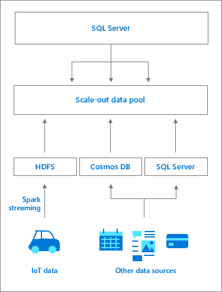

# What are data pools in a SQL Server 2019 big data cluster?

This article describes the role of *SQL Server data pools* in a SQL Server 2019 big data cluster (preview). The following sections describe the architecture and functionality of a SQL data pool.

## Data pool architecture

A data pool consists of one or more SQL Server data pool instances. SQL data pool instances provide persistent SQL Server storage for the cluster. A data pool is used to ingest data from SQL queries or Spark jobs. To provide better performance across large data sets, data in a data pool is distributed into shards across the member SQL data pool instances.

## Scale-out data marts

Data pools enable the creation of scale-out data marts, where external data from multiple sources is ingested into the data pool. Because data is distributed across data pool instances, parallel queries against the curated data are more efficient.

## Next steps

To learn more about the SQL Server big data clusters, see the following resources:

- [What are SQL Server 2019 big data clusters?](big-data-cluster-overview.md)
- [Workshop: Microsoft SQL Server big data clusters Architecture](https://github.com/Microsoft/sqlworkshops/tree/master/sqlserver2019bigdataclusters)
