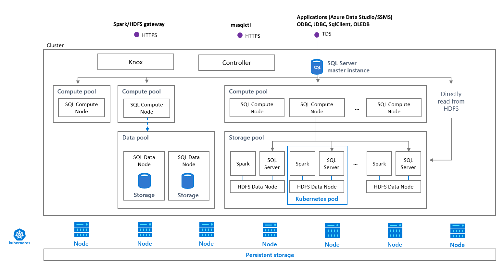

# Security concepts for SQL Server big data clusters

[!INCLUDE[tsql-appliesto-ssver15-xxxx-xxxx-xxx](../includes/tsql-appliesto-ssver15-xxxx-xxxx-xxx.md)]

A secure big data cluster implies consistent and coherent support for authentication and authorization scenarios, across both SQL Server and HDFS/Spark. Authentication is the process of verifying the identity of a user or service and ensuring they are who they are claiming to be. Authorization refers to granting or denying of access to specific resources based on the requesting user's identity. This step is performed after a user is identified through authentication.

Authorization in Big Data context is usually performed through access control lists (ACLs), which associate user identities with specific permissions. HDFS supports authorization by limiting access to service APIs, HDFS files and job execution.

This article will cover the key security-related concepts in the big data cluster.

## Cluster endpoints

There are three entry points to the big data cluster

* HDFS/Spark (Knox) gateway - This is an HTTPS-based endpoint. Other endpoints are proxied through this. HDFS/Spark gateway is used for accessing services like webHDFS and Livy. Wherever you see references to Knox, this is the endpoint.

* Controller endpoint - big data cluster  management service that exposes REST APIs for managing the cluster. Some tools, such as the Admin portal, are also accessed through this endpoint.

* Master Instance  - TDS endpoint for database tools and applications to connect to SQL Server Master Instance in the cluster.

Currently, there is no option of opening up additional ports for accessing the cluster from the outside.

### How endpoints are secured

Securing endpoints in the big data cluster is done using passwords that can be set/updated either using environment variables or CLI commands. All cluster internal passwords are stored as Kubernetes secrets.  

## Authentication

Upon provisioning the cluster, a number of logins are created.

Some of these logins are for services to communicate with each other, and others are for end users to access the cluster.

### End-user authentication
Upon provisioning the cluster, a number of end-user passwords needs to be set using environment variables. These are passwords that SQL administrators and cluster administrators use to access services:

Controller username:
 + CONTROLLER_USERNAME=<controller_username>

Controller password:  
 + CONTROLLER_PASSWORD=<controller_password>

SQL Master SA password: 
 + MSSQL_SA_PASSWORD=<controller_sa_password>

Password for accessing the HDFS/Spark endpoint:
 + KNOX_PASSWORD=<knox_password>

### Intra-cluster authentication

Upon deployment of the cluster, a number of SQL logins are created:

* A special SQL login is created in the Controller SQL instance that is system managed, with sysadmin role. The password for this login is captured as a K8s secret.

* A sysadmin login is created in all SQL instances in the cluster, that Controller owns and manages. It is required for Controller to perform administrative tasks, such as HA setup or upgrade, on these instances. These logins are also used for intra-cluster communication between SQL instances, such as the SQL master instance communicating with a data pool.

> [!NOTE]
> In current release, only basic authentication is supported. Fine-grained access control to HDFS objects, and SQL big data cluster compute and data pools, is not yet available.

## Intra cluster communication

Communication with non-SQL services within the big data cluster, such as Livy to Spark or Spark to the storage pool, is secured using certificates. All SQL Server to SQL Server communication is secured using SQL logins.

## Next steps

To learn more about the SQL Server big data clusters, see the following resources:

- [What are SQL Server 2019 big data clusters?](big-data-cluster-overview.md)
- [Workshop: Microsoft SQL Server big data clusters Architecture](https://github.com/Microsoft/sqlworkshops/tree/master/sqlserver2019bigdataclusters)
