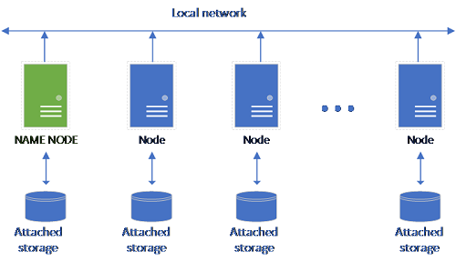

# What is the storage pool ([!INCLUDE[big-data-clusters-2019](../includes/ssbigdataclusters-ss-nover.md)])?

[!INCLUDE[SQL Server 2019](../includes/applies-to-version/sqlserver2019.md)]

This article describes the role of the *SQL Server storage pool* in a [!INCLUDE[big-data-clusters-2019](../includes/ssbigdataclusters-ver15.md)] (BDC). The following sections describe the architecture and functionality of a SQL storage pool.

## Storage Pool architecture

The storage pool is the local HDFS (Hadoop) cluster in the SQL Server BDC ecosystem. It provides persistent storage for unstructured and semi-structured data. Data files, such as Parquet or delimited text, can be stored in the storage pool. To persist storage each pod in the pool has a Persistent Volume attached to it. The storage pool files are accessible via [PolyBase](../relational-databases/polybase/polybase-guide.md) through SQL Server or directly using an Apache Knox Gateway.

A classical HDFS setup consists of a set of commodity-hardware computers with storage attached. The data is spread in blocks across the nodes for fault tolerance and leverage of parallel processing. One of the nodes in the cluster functions as the Name Node and contains the metadata information about the files located in the data nodes.

The storage pool consists of storage nodes that are members of a HDFS cluster. It runs one or more Kubernetes pods with each pod hosting the following containers:

- A Hadoop container linked to a Persistent Volume (storage). All containers of this type together form the Hadoop cluster. Within the Hadoop container is a YARN node manager process that can create on-demand Apache Spark worker processes. The Spark head node hosts the hivemetastore, sparkhistory and YARN job history containers.
- A SQL Server instance to read data from HDFS using OpenRowSet technology.
- collectd for collecting of metrics data.
- fluentbit for collecting of log data.

## Responsibilities

Storage nodes are responsible for:

- Data ingestion through Apache Spark.
- Data storage in HDFS (Parquet and delimited text format). HDFS also provides data persistency, as HDFS data is spread across all the storage nodes in the SQL BDC.
- Data access through HDFS and SQL Server endpoints.

## Accessing Data

The main methods for accessing the data in the storage pool are:

- Spark jobs.
- Utilization of SQL Server external tables to allow querying of the data using PolyBase compute nodes and the SQL Server instances running in the HDFS nodes.

You can also interact with HDFS using:

- Azure Data Studio.
- azdata client tool.
- kubectl to issue commands to the Hadoop container.
- HDFS http gateway.

## Next steps

To learn more about the [!INCLUDE[big-data-clusters-2019](../includes/ssbigdataclusters-ss-nover.md)], see the following resources:

- [What are [!INCLUDE[big-data-clusters-2019](../includes/ssbigdataclusters-ver15.md)]?](big-data-cluster-overview.md)
- [Workshop: Microsoft [!INCLUDE[big-data-clusters-2019](../includes/ssbigdataclusters-ss-nover.md)] Architecture](https://github.com/Microsoft/sqlworkshops/tree/master/sqlserver2019bigdataclusters)
