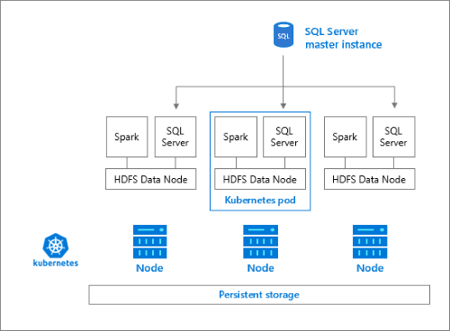

# What is the storage pool (SQL Server 2019 big data clusters)?

This article describes the role of the *SQL Server storage pool* in a SQL Server 2019 big data cluster (preview). The following sections describe the architecture and functionality of a SQL storage pool.

## Storage pool architecture

The storage pool consists of storage nodes comprised of SQL Server on Linux, Spark, and HDFS. All the storage nodes in a SQL big data cluster are members of an HDFS cluster.

## Responsibilities

Storage nodes are responsible for:

- Data ingestion through Spark.
- Data storage in HDFS (Parquet format). HDFS also provides data persistency, as HDFS data is spread across all the storage nodes in the SQL big data cluster.
- Data access through HDFS and SQL Server endpoints.

## Next steps

To learn more about the SQL Server big data clusters, see the following resources:

- [What are SQL Server 2019 big data clusters?](big-data-cluster-overview.md)
- [Workshop: Microsoft SQL Server big data clusters Architecture](https://github.com/Microsoft/sqlworkshops/tree/master/sqlserver2019bigdataclusters)
