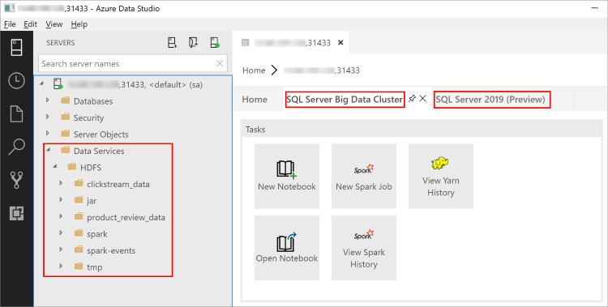

# Connect to a SQL Server big data cluster with Azure Data Studio

[!INCLUDE[tsql-appliesto-ssver15-xxxx-xxxx-xxx](../includes/tsql-appliesto-ssver15-xxxx-xxxx-xxx.md)]

This article describes how to connect to a SQL Server 2019 big data cluster (preview) from Azure Data Studio. There are two main endpoints that are used to interact with a big data cluster:

| Endpoint | Description |
|---|---|
| SQL Server Master instance | The SQL Server master instance in the cluster containing relational SQL Server databases. |
| HDFS/Spark gateway | Access to HDFS storage in the cluster and the ability to run Spark jobs. |

> [!TIP]
> With the February 2019 release of Azure Data Studio, connecting to the SQL Server master instance automatically provides UI access to the HDFS/Spark gateway.

## Prerequisites

- A deployed [SQL Server 2019 big data cluster](deployment-guidance.md).
- [SQL Server 2019 big data tools](deploy-big-data-tools.md):
   - **Azure Data Studio**
   - **SQL Server 2019 extension**
   - **kubectl**

## <a id="master"></a> Connect to the cluster

To connect to a big data cluster with Azure Data Studio, make a new connection to the SQL Server master instance in the cluster. The following steps describe how to connect to the master instance using Azure Data Studio.

1. From the command line, find the IP of your master instance with the following command:

   ```
   kubectl get svc endpoint-master-pool -n <your-cluster-name>
   ```

1. In Azure Data Studio, press **F1** > **New Connection**.

1. In **Connection type**, select **Microsoft SQL Server**.

1. Type the IP address of the SQL Server master instance in **Server name** (for example: **\<IP Address\>,31433**).

1. Enter a SQL login **User name** and **Password**.

   > [!TIP]
   > By default, the user name is **SA** and, unless changed, the password corresponds to the **MSSQL_SA_PASSWORD** environment variable used during deployment.

1. Change the target **Database name** to one of your relational databases.

   

1. Press **Connect**, and the **Server Dashboard** should appear.

With the February 2019 release of Azure Data Studio, connecting to the SQL Server master instance also enables you to interact with the HDFS/Spark gateway. This means that you do not need to use a separate connection for HDFS and Spark that the next section describes.

- The Object Explorer now contains a new **Data Services** node with right-click support for big data cluster tasks, such as creating new notebooks or submitting spark jobs. 
- The **Data Services** node also contains an **HDFS** folder for HDFS exploration and performing actions such as Create External Table or Analyze in Notebook.
- The **Server Dashboard** for the connection also contains tabs for **SQL Server big data cluster** and **SQL Server 2019 (Preview)** when the extension is installed.

   

> [!IMPORTANT]
> If you see **Unknown error** in the UI, you might have to [directly connect to the HDFS/Spark gateway](#hdfs). One cause for this error are different passwords for the SQL Server master instance and the HDFS/Spark gateway. Azure Data Studio assumes that the same password is used for both.
  
## <a id="hdfs"></a> Connect to the HDFS/Spark gateway

In most cases, connecting to the SQL Server master instance gives you access to the HDFS and Spark as well through the **Data Services** node. However, you can still create a dedicated connection to the **HDFS/Spark gateway** if needed. The following steps describe how to connect with Azure Data Studio.

1. From the command line, find the IP address of your HDFS/Spark gateway with one of the following commands.

   ```
   kubectl get svc endpoint-security -n <your-cluster-name>
   ```
 
1. In Azure Data Studio, press **F1** > **New Connection**.

1. In **Connection type**, select **SQL Server big data cluster**.

   > [!TIP]
   > If you do not see the **SQL Server big data cluster** connection type, make sure you have installed the [SQL Server 2019 extension](../azure-data-studio/sql-server-2019-extension.md) and that you restarted Azure Data Studio after the extension completed installing.

1. Type the IP address of the big data cluster in **Server name** (do not specify a port).

1. Enter `root` for the **User** and specify the **Password** to your big data cluster.

   

   > [!TIP]
   > By default, the user name is **root** and the password corresponds to the **KNOX_PASSWORD** environment variable used during deployment.

1. Press **Connect**, and the **Server Dashboard** should appear.

## Next steps

For more information about SQL Server 2019 big data clusters, see [What are SQL Server 2019 big data clusters](big-data-cluster-overview.md).