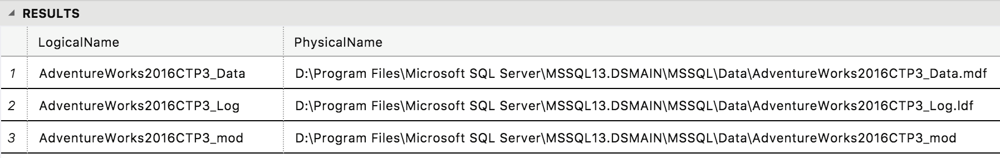

# Restore a database into the SQL Server big data cluster master instance

[!INCLUDE[SQL Server 2019](../includes/applies-to-version/sqlserver2019.md)]

This article describes how to restore an existing database into the master instance of a [!INCLUDE[big-data-clusters-2019](../includes/ssbigdataclusters-ver15.md)]. The recommended method is to use a backup, copy, and restore approach.

[!INCLUDE[big-data-clusters-banner-retirement](../includes/bdc-banner-retirement.md)]

## Backup your existing database

First, backup your existing SQL Server database from either SQL Server on Windows or Linux. Use standard backup techniques with Transact-SQL or with a tool like SQL Server Management Studio (SSMS).

This article shows how to restore the AdventureWorks database, but you can use any database backup. 

> [!TIP]
> Download the [AdventureWorks backup](../samples/adventureworks-install-configure.md).

## Copy the backup file

Copy the backup file to the SQL Server container in the master instance pod of the Kubernetes cluster.

```bash
kubectl cp <path to .bak file> master-0:/var/tmp/<.bak filename> -c mssql-server -n <name of your big data cluster>
```

Example:

```bash
kubectl cp ~/Downloads/AdventureWorks2016CTP3.bak master-0:/var/tmp/AdventureWorks2016CTP3.bak -c mssql-server -n clustertest
```

Then, verify that the backup file was copied to the pod container.

```bash
kubectl exec -it master-0 -n <name of your big data cluster> -c mssql-server -- bin/bash
cd /var/
ls /tmp
exit
```

Example:

```bash
kubectl exec -it master-0 -n clustertest -c mssql-server -- bin/bash
cd /var/
ls /tmp
exit
```

## Restore the backup file

Next, restore the database backup to master instance SQL Server.  If you are restoring a database backup that was created on Windows, you will need to get the names of the files.  In Azure Data Studio, connect to the master instance and run this SQL script:

```sql
RESTORE FILELISTONLY FROM DISK='/tmp/<db file name>.bak'
```

Example:

```sql
RESTORE FILELISTONLY FROM DISK='/tmp/AdventureWorks2016CTP3.bak'
```



Now, restore the database. The following script is an example. Replace the names/paths as needed depending on your database backup.

```sql
RESTORE DATABASE AdventureWorks2016CTP3
FROM DISK='/tmp/AdventureWorks2016CTP3.bak'
WITH MOVE 'AdventureWorks2016CTP3_Data' TO '/var/opt/mssql/data/AdventureWorks2016CTP3_Data.mdf',
        MOVE 'AdventureWorks2016CTP3_Log' TO '/var/opt/mssql/data/AdventureWorks2016CTP3_Log.ldf',
        MOVE 'AdventureWorks2016CTP3_mod' TO '/var/opt/mssql/data/AdventureWorks2016CTP3_mod'
```

## Configure data pool and HDFS access

Now, for the SQL Server master instance to access data pools and HDFS, run the data pool and storage pool stored procedures. Run the following Transact-SQL scripts against your newly restored database:

```sql
USE AdventureWorks2016CTP3
GO
-- Create the SqlDataPool data source:
IF NOT EXISTS(SELECT * FROM sys.external_data_sources WHERE name = 'SqlDataPool')
  CREATE EXTERNAL DATA SOURCE SqlDataPool
  WITH (LOCATION = 'sqldatapool://controller-svc/default');

-- Create the SqlStoragePool data source:
IF NOT EXISTS(SELECT * FROM sys.external_data_sources WHERE name = 'SqlStoragePool')
   CREATE EXTERNAL DATA SOURCE SqlStoragePool
   WITH (LOCATION = 'sqlhdfs://controller-svc/default');
GO
```

> [!NOTE]
> You will have to run through these setup scripts only for databases restored from older versions of SQL Server. If you create a new database in SQL Server master instance, data pool and storage pool store procedures are already configured for you.

## Next steps

To learn more about the [!INCLUDE[big-data-clusters-2019](../includes/ssbigdataclusters-ss-nover.md)], see the following overview:

- [Introducing [!INCLUDE[big-data-clusters-2019](../includes/ssbigdataclusters-ver15.md)]](big-data-cluster-overview.md)
