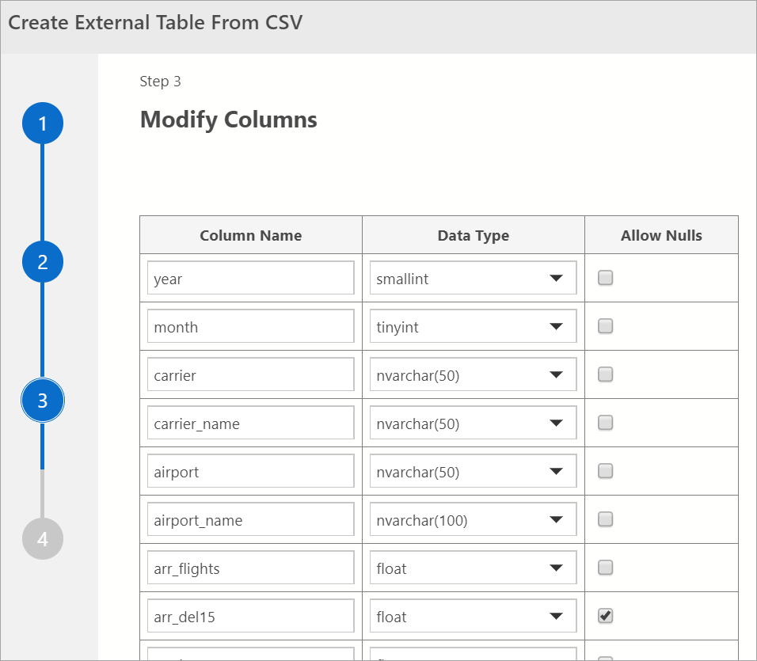
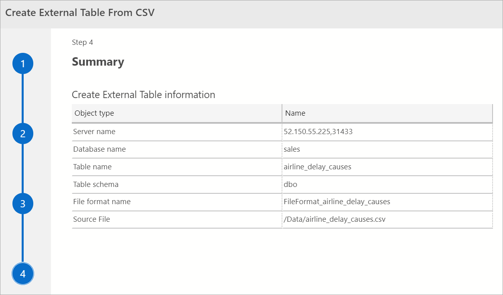

# Virtualize CSV data from storage pool (Big Data Clusters)

[!INCLUDE[big-data-clusters-banner-retirement](../includes/bdc-banner-retirement.md)]

SQL Server Big Data Clusters can virtualize data from CSV files in HDFS. This process allows the data to stay in its original location, but can be queried from a SQL Server instance like any other table. This feature uses PolyBase connectors, and minimizes the need for ETL processes. For more information on data virtualization, see [Introducing data virtualization with PolyBase](../relational-databases/polybase/polybase-guide.md)

## Prerequisites

- [A deployed big data cluster](deployment-guidance.md)
- [Azure Data Studio](../azure-data-studio/download-azure-data-studio.md)

## Select or upload a CSV file for data virtualization

In Azure Data Studio (ADS) [connect to the SQL Server master instance](connect-to-big-data-cluster.md#master) of your Big Data Cluster. Once connected, expand the HDFS elements in the object explorer to locate the CSV file(s) you would like to data virtualize.

For the purposes of this tutorial, create a new directory named **Data**.

1. Right-click on the HDFS root directory context menu.
2. Select **New directory**.
3. Name the new directory *Data*.

Upload sample data. For a simple walk-through, you can use a sample csv data file. This article uses airline delay cause data from the [US Department of Transportation](https://www.transtats.bts.gov/OT_Delay/OT_DelayCause1.asp?pn=1). Download the raw data, and extract the data to your computer. Name the file *airline_delay_causes.csv*.

To upload the sample file after you extract it:

1. In Azure Data Studio, *right-click* the new directory you created. 
2. Select **Upload files**.


Azure Data Studio uploads the files to HDFS on the Big Data Cluster.

## Create the storage pool external data source in your target database

The storage pool external data source is not created in a database by default in your Big Data Cluster. Before you can create the external table, create the default **SqlStoragePool** External Data Source in your target database with the following Transact-SQL query. Make sure you first change the context of the query to your target database.

```sql
-- Create the default storage pool source for SQL Big Data Cluster
IF NOT EXISTS(SELECT * FROM sys.external_data_sources WHERE name = 'SqlStoragePool')
    CREATE EXTERNAL DATA SOURCE SqlStoragePool
    WITH (LOCATION = 'sqlhdfs://controller-svc/default');
```

## Create the external table

From ADS, right-click on the CSV file and select **Create External Table From CSV File** from the context menu. You can also create external tables from CSV files from a directory in HDFS if the files under the directory follow the same schema. This would allow the virtualization of the data at a directory level without the need to process individual files and get a joined result set over the combined data. Azure Data Studio guides you through the steps to create the external table.

Specify the database, the data source, a table name, the schema, and the name for the table's external file format.

Select **Next**.

## Preview Data

Azure Data Studio provides a preview of the imported data.


Once done viewing the preview, select **Next** to continue

## Modify Columns

In the next window, you may modify the columns of the external table you intend to create. You are able to alter the column name, change the data type and allow for nullable rows. 



After you verify the destination columns, select **Next**.

## Summary

This step provides a summary of your selections. It provides the SQL Server name, database name, table name, table schema, and external table information. In this step, you have the option to generate a script or create a table. **Generate Script**  creates a script in T-SQL to create the external data source. **Create Table** creates the external data source.



If you select **Create Table**, SQL Server creates the external table in the destination database.

If you select, **Generate Script**, your Azure Data Studio creates the T-SQL query for creating the external table.

Once created the table can now be queried directly using T-SQL from the SQL Server instance.

## Next steps

For more information on SQL Server Big Data Cluster and related scenarios, see [Introducing [!INCLUDE[big-data-clusters-2019](../includes/ssbigdataclusters-ss-nover.md)]](big-data-cluster-overview.md).
