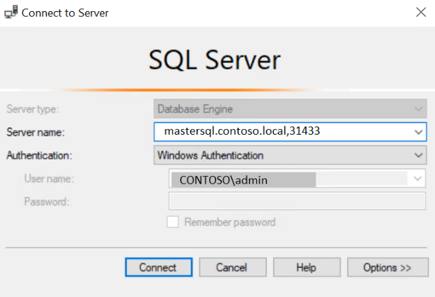
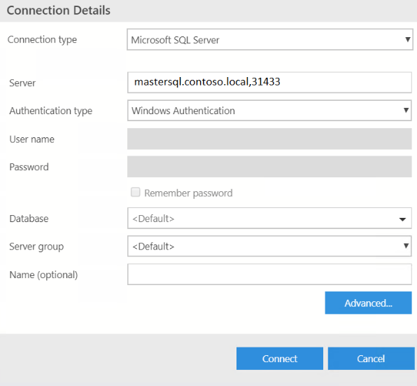

# Deploy [!INCLUDE[big-data-clusters-2019](../includes/ssbigdataclusters-ss-nover.md)] in Active Directory mode

[!INCLUDE[SQL Server 2019](../includes/applies-to-version/sqlserver2019.md)]

This document explains how to deploy a SQL Server big data cluster (BDC) in the Active Directory
authentication mode. The cluster uses an existing AD domain for authentication.

>[!Note]
>Before SQL Server 2019 CU5 release, there is a restriction in big data clusters so that only one cluster could be deployed against an Active Directory domain. This restriction is removed with the CU5 release, see [Concept: deploy [!INCLUDE[big-data-clusters-2019](../includes/ssbigdataclusters-ss-nover.md)] in Active Directory mode](active-directory-deployment-background.md) for details on the new capabilities. Examples in this article are adjusted to accommodate both deployment use cases.
>

## Background

To enable Active Directory (AD) authentication, the BDC automatically creates the users, groups, machine accounts, and service principal names (SPN) that the various services in the cluster need. To provide some containment of these accounts and allow scoping permissions, we suggest create an organizational unit (OU) before cluster deployment. All BDC-related AD objects will be created during deployment. 

## Object name collisions

### Organizational Unit (OU)
An organizational unit (OU) is a subdivision within an Active Directory into where place users, groups, and even other organizational units. Big picture Organizational units can be used to mirror an organization's functional or business structure. This article we'll create an OU called bdc as an example. 

>[!Note]
The organizational unit (OU) represents administrative boundaries and enable customers to control the scope of authority of data administrators. 
>

You can follow [OU Design Principes](/windows-server/identity/ad-ds/plan/reviewing-ou-design-concepts.md) to decide on the best structure on working with OUs within your organization. 

### AD account for BDC domain service account

To be able to create all the required objects in Active Directory automatically, the BDC needs an AD account which have specific permissions to create users, groups, and machine accounts inside the provided organizational unit (OU). This article will explain how to configure the permission of this AD account. We use an AD Account call bdcDSA as an example in this article.

### Auto generated Active Directory objects
BDC deployment automatically generates account and group names. Each of the accounts represents a service in BDC and will be managed by BDC throughout the lifetime where BDC cluster is in use. Those accounts own the Service Principal Names (SPNs) are required by each service.  For a full list of AD auto-generated accounts, groups, and service that they managed, see [Auto generated Active Directory objects](active-directory-objects.md).


>[!IMPORTANT]
>Depending on the password expiration policy set in the Domain Controller, passwords for these accounts can expire. The default expiration policy is 42 days. There is no mechanism to rotate credentials for all accounts in BDC, so the cluster will become inoperable once the expiration period is met. To workaround this issue, update the expiration policy for the BDC service accounts to “Password never expires” in the Domain Controller. This action can be done before or after the expiration time. In the latter case, Active Directory will reactivate the expired passwords.
>
>The following image shows where to set this property in in Active Directory Users and Computers.
>
>:::image type="content" source="media/deploy-active-directory/image25.png" alt-text="Set password expiration policy":::


The steps below assume you already have an Active Directory domain controller. If you don't have a domain controller, the following [guide](https://social.technet.microsoft.com/wiki/contents/articles/37528.create-and-configure-active-directory-domain-controller-in-azure-windows-server.aspx) includes steps that can be helpful.


## Create AD objects

Do the following things before you deploy a BDC with AD integration:

1. Create an organizational unit (OU) where all BDC-related AD objects will be stored. Alternatively you can choose an existing OU upon deployment.
1. Create an AD account for BDC, or use an existing account, and provide this BDC AD account the right permissions inside the provided organizational unit (OU).

### Create a user in AD for BDC domain service account

The big data cluster requires an account with specific permissions. Before you proceed, make sure that you have an existing AD account or create a new account, which the big data cluster can use to set up the necessary objects.

To create a new user in AD, you can right-click the domain or the OU and select **New** > **User**:


This user will be referred to as the *BDC domain service account* in this article.

### Create an OU

On the domain controller, open **Active Directory Users and Computers**. On the left panel, right-click the directory under which you want to create your OU and select **New** \> **Organizational Unit**, then follow the prompts from the wizard to create the OU. Alternatively, you can create an OU with PowerShell:

```powershell
New-ADOrganizationalUnit -Name "<name>" -Path "<Distinguished name of the directory you wish to create the OU in>"
```

The examples in this article use `bdc` for the OU name.


### Set permissions for an AD account 

Whether you have created a new AD user or using an existing AD user, there are certain permissions the user needs to have. This account is the user account that the BDC controller will use when joining the cluster to AD.

The BDC domain service account (DSA) needs to be able to create users, groups, and computer accounts in the OU. In the following steps, we have named the BDC domain service account `bdcDSA`. You can choose any name for this account.

1. On the domain controller, open **Active Directory Users and Computers**

1. In the left panel, navigate to your domain, then the OU which `bdc` will use

1. Right-click the OU, and select **Properties**.

1. Go to the Security tab (Make sure that you have selected **Advanced Features** by right-clicking on the OU, and selecting **View**)

    

1. Click **Add...** and add the **bdcDSA** user

    

    

1. Select the **bdcDSA** user and clear all permissions, then click **Advanced**

1. Click **Add**

    

    - Click **Select a Principal**, insert **bdcDSA**, and click Ok

    - Set **Type** to **Allow**

    - Set **Applies To** to **This Object and all descendant objects**

        

    - Scroll down to the bottom, and click **Clear all**

    - Scroll back to the top, and select:
       - **Read all properties**
       - **write all properties**
       - **Create Computer objects**
       - **Delete Computer objects**
       - **Create Group objects**
       - **Delete Group objects**
       - **Create User objects**
       - **Delete User objects**

    - Click **OK**

- Click **Add**

    - Click **Select a Principal**, insert **bdcDSA**, and click Ok

    - Set **Type** to **Allow**

    - Set **Applies To** to **Descendant Computer objects**

    - Scroll down to the bottom, and click **Clear all**

    - Scroll back to the top, and select **Reset password**

    - Click **OK**

- Click **Add**

    - Click **Select a Principal**, insert **bdcDSA**, and click Ok

    - Set **Type** to **Allow**

    - Set **Applies To** to **Descendant User objects**

    - Scroll down to the bottom, and click **Clear all**

    - Scroll back to the top, and select **Reset password**

    - Click **OK**

- Click **OK** twice more to close open dialog boxes

## Prepare deployment

For deployment of BDC with AD integration, there is some additional information that needs to be provided for creating the BDC-related objects in AD.

By using the `kubeadm-prod` profile (or `openshift-prod` starting with CU5 release), you will automatically have the placeholders for the security-related information and endpoint-related information that is required for AD integration.

Furthermore, you need to provide credentials that [!INCLUDE[big-data-clusters](../includes/ssbigdataclusters-nover.md)] will use to create the necessary objects in AD. These credentials are provided as environment variables.

## Set security environment variables

The following environment variables are providing the credentials for the BDC domain service account, which will be used to set up the AD integration. This account is also used by BDC to maintain the BDC-related AD objects going forward.

```bash
export DOMAIN_SERVICE_ACCOUNT_USERNAME=<AD principal account name>
export DOMAIN_SERVICE_ACCOUNT_PASSWORD=<AD principal password>
```

## Provide security and endpoint parameters

In addition to environment variables for credentials, you also need to provide security and endpoint information for AD integration to work. The parameters needed are automatically part of the `kubeadm-prod`/`openshift-prod` [deployment profile](deployment-guidance.md#configfile).

AD integration requires the following parameters. Add these parameters to the `control.json` and `bdc.json` files using `config replace` commands shown further down in this article. All the examples below are using the example domain `contoso.local`.

- `security.activeDirectory.ouDistinguishedName`: distinguished name of an organizational unit (OU) where all AD accounts created by cluster deployment will be added. If the domain is called `contoso.local`, the OU distinguished name is: `OU=BDC,DC=contoso,DC=local`.

- `security.activeDirectory.dnsIpAddresses`: contains the list of domain’s DNS servers IP addresses. 

- `security.activeDirectory.domainControllerFullyQualifiedDns`: List of FQDN of domain controller. The FQDN contains the machine/host name of the domain controller. If you have multiple domain controllers, you can provide a list here. Example: `HOSTNAME.CONTOSO.LOCAL`.

  > [!IMPORTANT]
  > When multiple domain controllers are serving a domain, use the primary domain controller (PDC) as the first entry in the `domainControllerFullyQualifiedDns` list in the security config. To get the PDC name, type `netdom query fsmo`, at the command prompt, and then press **ENTER**.

- `security.activeDirectory.realm` **Optional parameter**: In the majority of cases, the realm equals domain name. For cases where they are not the same, use this parameter to define name of realm (e.g. `CONTOSO.LOCAL`). The value of provided for this parameter should be fully-qualified.

- `security.activeDirectory.domainDnsName`: Name of your DNS domain that will be used for the cluster (e.g. `contoso.local`).

- `security.activeDirectory.clusterAdmins`: This parameter takes one AD group. The AD group scope must be universal or global. Members of this group will have the *bdcAdmin* cluster role which will give them administrator permissions in the cluster. This means that they have [`sysadmin` permissions in SQL Server](../relational-databases/security/authentication-access/server-level-roles.md#fixed-server-level-roles), [`superuser` permissions in HDFS](https://hadoop.apache.org/docs/current/hadoop-project-dist/hadoop-hdfs/HdfsPermissionsGuide.html#The_Super-User), and admin permissions when connected to the controller endpoint.

  >[!IMPORTANT]
  >Create this group in AD before deployment begins. If the scope for this AD group is domain local deployment fails.

- `security.activeDirectory.clusterUsers`: List of the AD groups that are regular users (no administrator permissions) in the big data cluster. The list can include AD groups that are scoped as either universal or global groups. They cannot be domain local groups.

AD groups in this list are mapped to the *bdcUser* big data cluster role and they need to be granted access to SQL Server (see [SQL Server permissions](../relational-databases/security/permissions-hierarchy-database-engine.md)) or HDFS (see [HDFS permissions Guide](https://hadoop.apache.org/docs/current/hadoop-project-dist/hadoop-hdfs/HdfsPermissionsGuide.html#:~:text=Permission%20Checks%20%20%20%20Operation%20%20,%20%20N%2FA%20%2029%20more%20rows%20)). When connected to the controller endpoint, these users can only list the endpoints available in the cluster using *azdata bdc endpoint list* command.

For details on how to update the AD groups for this settings see [Manage Big Data Cluster access in Active Directory
mode](manage-user-access.md).

  >[!TIP]
  >To enable the HDFS browsing experience when connected to SQL Server master in Azure Data Studio, an user with bdcUser role must be granted VIEW SERVER STATE permissions since Azure Data studio is using the *sys.dm_cluster_endpoints* DMV to get the required Knox gateway endpoint to connect to HDFS.

  >[!IMPORTANT]
  >Create these groups in AD before deployment begins. If the scope for any of these AD groups is domain local deployment fails.

  >[!IMPORTANT]
  >If your domain users have a large number of group memberships, you should adjust the values for the gateway setting *httpserver.requestHeaderBuffer* (default value is *8192*) and HDFS setting *hadoop.security.group.mapping.ldap.search.group.hierarchy.levels* (default value is *10*), using the custom *bdc.json* deployment configuration file. This is a best practice to avoid connection timeouts to gateway and/or HTTP responses with a 431 (*Request Header Fields Too Large*) status code. Here is a section of the configuration file showing how to define the values of these settings and what are the recommended values for higher number of group memerships: 

```json
{
    ...
    "spec": {
        "resources": {
            ...
            "gateway": {
                "spec": {
                    "replicas": 1,
                    "endpoints": [{...}],
                    "settings": {
                        "gateway-site.gateway.httpserver.requestHeaderBuffer": "65536"
                    }
                }
            },
            ...
        },
        "services": {
            ...
            "hdfs": {
                "resources": [...],
                "settings": {
                  "core-site.hadoop.security.group.mapping.ldap.search.group.hierarchy.levels": "4"
                }
            },
            ...
        }
    }
}
```

  >[!IMPORTANT]
  >Create the groups provided for the settings bellow in AD before deployment begins. If the scope for any of these AD groups is domain local deployment fails.

- `security.activeDirectory.appOwners` **Optional parameter**: List of AD groups who have permissions to create, delete, and run any application. The list can include AD groups that are scoped as either universal or global groups. They cannot be domain local groups.

- `security.activeDirectory.appReaders` **Optional parameter**: List of the AD groups who have permissions to run any application. The list can include AD groups that are scoped as either universal or global groups. They cannot be domain local groups.

Below table show the authorization model for application management:

|   Authorized roles   |   azdata command   |
|----------------------|--------------------|
|   appOwner           | azdata app create  |
|   appOwner           | azdata app update  |
|   appOwner, appReader| azdata app list    |
|   appOwner, appReader| azdata app describe|
|   appOwner           | azdata app delete  |
|   appOwner, appReader| azdata app run     |

- `security.activeDirectory.subdomain`: **Optional parameter** This parameter is introduced in SQL Server 2019 CU5 release to support deploying multiple big data clusters against the same domain. Using this setting, you can specify different DNS names for each of the big data cluster deployed. If the value of this parameter is not specified in the active directory section of the `control.json` file, by default, the big data cluster name (same as Kubernetes namespace name) will be used to compute the value of subdomain setting. 

  >[!NOTE]
  >The value passed through the subdomain setting is not a new AD domain but only a DNS domain used by the BDC cluster internally.

  >[!IMPORTANT]
  >You need to install or upgrade latest version of **azdata CLI** as of SQL Server 2019 CU5 release to leverage these new capabilities and deploy multiple big data clusters in the same domain.

  See [Concept: deploy [!INCLUDE[big-data-clusters-2019](../includes/ssbigdataclusters-ss-nover.md)] in Active Directory mode](active-directory-deployment-background.md) for more details regarding deploying multiple big data clusters in the same Active Directory domain.

- `security.activeDirectory.accountPrefix`: **Optional parameter** This parameter is introduced in SQL Server 2019 CU5 release to support deploying multiple big data clusters against the same domain. This setting guarantees uniqueness of the account names for various big data clusters services, that must differ between any two clusters. Customizing the account prefix name is optional, by default, the subdomain name is used as the account prefix. If the subdomain name is longer than the 12 characters, the first 12-characters of the subdomain name are used as the account prefix.  

  >[!NOTE]
  >Active Directory requires the account names to be limited to 20 characters. BDC cluster needs to use 8 of the characters for distinguishing pods and StatefulSets. This leaves us 12 characters as a limit for the account prefix

[Check AD group scope](/powershell/module/activedirectory/get-adgroup?view=winserver2012-ps&viewFallbackFrom=winserver2012r2-ps), to determine if it is DomainLocal.

If you have not already initialized the deployment configuration file, you can run this command to get a copy of the configuration. Examples below use the `kubeadm-prod` profile, same applies to `openshift-prod`.

```bash
azdata bdc config init --source kubeadm-prod  --target custom-prod-kubeadm
```

To set the above parameters in the `control.json` file, use the following `azdata` commands. The commands replace the config and provide your own values before deployment.

> [!IMPORTANT]
> In the SQL Server 2019 CU2 release, the structure of the security configuration section in the deployment profile changed sightly and all the Active Directory related settings are in the new *activeDirectory* in the json tree under *security* in the *control.json* file.

>[!NOTE]
> In addition to providing different values for the subdomain as described in this section, you must also use different port numbers for BDC endpoints when deploying multiple BDCs in the same Kubernetes cluster. These port numbers are configurable at deployment time through the [deployment configuration](deployment-custom-configuration.md) profiles.

The example below is based on using SQL Server 2019 CU2. It shows how to replace the AD-related parameter values in deployment config. The domain details below are example values.

```bash
azdata bdc config replace -c custom-prod-kubeadm/control.json -j "$.security.activeDirectory.ouDistinguishedName=OU\=bdc\,DC\=contoso\,DC\=local"
azdata bdc config replace -c custom-prod-kubeadm/control.json -j "$.security.activeDirectory.dnsIpAddresses=[\"10.100.10.100\"]"
azdata bdc config replace -c custom-prod-kubeadm/control.json -j "$.security.activeDirectory.domainControllerFullyQualifiedDns=[\"HOSTNAME.CONTOSO.LOCAL\"]"
azdata bdc config replace -c custom-prod-kubeadm/control.json -j "$.security.activeDirectory.domainDnsName=contoso.local"
azdata bdc config replace -c custom-prod-kubeadm/control.json -j "$.security.activeDirectory.clusterAdmins=[\"bdcadminsgroup\"]"
azdata bdc config replace -c custom-prod-kubeadm/control.json -j "$.security.activeDirectory.clusterUsers=[\"bdcusersgroup\"]"
#Example for providing multiple clusterUser groups: [\"bdcusergroup1\",\"bdcusergroup2\"]
```

Optionally, only starting SQL Server 2019 CU5 release, you can override the default values for the `subdomain` and `accountPrefix` settings.

```bash
azdata bdc config replace -c custom-prod-kubeadm/control.json -j "$.security.activeDirectory.subdomain=[\"bdctest\"]"
azdata bdc config replace -c custom-prod-kubeadm/control.json -j "$.security.activeDirectory.accountPrefix=[\"bdctest\"]"
```

Similarly, in releases before SQL Server 2019 CU2, you can run:

```bash
azdata bdc config replace -c custom-prod-kubeadm/control.json -j "$.security.ouDistinguishedName=OU\=bdc\,DC\=contoso\,DC\=local"
azdata bdc config replace -c custom-prod-kubeadm/control.json -j "$.security.dnsIpAddresses=[\"10.100.10.100\"]"
azdata bdc config replace -c custom-prod-kubeadm/control.json -j "$.security.domainControllerFullyQualifiedDns=[\"HOSTNAME.CONTOSO.LOCAL\"]"
azdata bdc config replace -c custom-prod-kubeadm/control.json -j "$.security.domainDnsName=contoso.local"
azdata bdc config replace -c custom-prod-kubeadm/control.json -j "$.security.clusterAdmins=[\"bdcadminsgroup\"]"
azdata bdc config replace -c custom-prod-kubeadm/control.json -j "$.security.clusterUsers=[\"bdcusersgroup\"]"
#Example for providing multiple clusterUser groups: [\"bdcusergroup1\",\"bdcusergroup2\"]
```

In addition to the above information, you also need to provide DNS names for the different cluster endpoints. The DNS entries using your provided DNS names will automatically be created in your DNS Server upon deployment. You will use these names when connecting to the different cluster endpoints. For example, if the DNS name for SQL master instance is `mastersql` and considering the subdomain will use the default value of the cluster name in *control.json*, you will either use `mastersql.contoso.local,31433` or `mastersql.mssql-cluster.contoso.local,31433`  (depending on the values you provided in the deployment configuration files for the endpoint DNS names) to connect to the master instance from the tools. 

```bash
# DNS names for BDC services
azdata bdc config replace -c custom-prod-kubeadm/control.json -j "$.spec.endpoints[0].dnsName=<controller DNS name>.contoso.local"
azdata bdc config replace -c custom-prod-kubeadm/control.json -j "$.spec.endpoints[1].dnsName=<monitoring services DNS name>.<Domain name. e.g. contoso.local>"
azdata bdc config replace -c custom-prod-kubeadm/bdc.json -j "$.spec.resources.master.spec.endpoints[0].dnsName=<SQL Master Primary DNS name>.<Domain name. e.g. contoso.local>"
azdata bdc config replace -c custom-prod-kubeadm/bdc.json -j "$.spec.resources.master.spec.endpoints[1].dnsName=<SQL Master Secondary DNS name>.<Domain name. e.g. contoso.local>"
azdata bdc config replace -c custom-prod-kubeadm/bdc.json -j "$.spec.resources.gateway.spec.endpoints[0].dnsName=<Gateway (Knox) DNS name>.<Domain name. e.g. contoso.local>"
azdata bdc config replace -c custom-prod-kubeadm/bdc.json -j "$.spec.resources.appproxy.spec.endpoints[0].dnsName=<app proxy DNS name>.<Domain name. e.g. contoso.local>"
```

> [!IMPORTANT]
> You can use endpoint DNS names of your choice as long as they are fully qualified and do not conflict between any two big data clusters deployed in the same domain. Optionally, you can use the `subdomain` parameter value to ensure DNS names are different across clusters. For example:

```bash
# DNS names for BDC services
azdata bdc config replace -c custom-prod-kubeadm/control.json -j "$.spec.endpoints[0].dnsName=<controller DNS name>.<subdomain e.g. mssql-cluster>.contoso.local"
```

You can find an example script here for [deploying a SQL Server big data cluster on single node Kubernetes cluster (kubeadm) with AD integration](https://github.com/microsoft/sql-server-samples/tree/master/samples/features/sql-big-data-cluster/deployment/kubeadm/ubuntu-single-node-vm-ad).

> [!Note]
> There might be scenarios where you can't accommodate the newly introduced `subdomain` parameter. For example, you must deploy an a pre-CU5 release and you already upgraded **azdata CLI**. This is highly unlikely, but if you need to revert to the pre-CU5 behavior, you can set `useSubdomain` parameter to `false` in the active directory section of `control.json`.  Here is the command to do so:

```bash
azdata bdc config replace -c custom-prod-kubeadm/control.json -j "$.security.activeDirectory.useSubdomain=false"
```

You should now have set all the required parameters for a deployment of BDC with Active Directory integration.

You can now deploy the BDC cluster integrated with Active Directory using the `azdata` command and the kubeadm-prod deployment profile. For full documentation of how to deploy [!INCLUDE[big-data-clusters](../includes/ssbigdataclusters-nover.md)], please visit the [How to deploy SQL Server Big Data Clusters on Kubernetes](deployment-guidance.md).

## Verify reverse DNS entry for domain controller

Make sure that there is a reverse DNS entry (PTR record) for the domain controller itself, registered in the DNS server. You can verify this by running `nslookup` of the domain name on the domain controller, to see that it can be resolved to the domain controller IP address.

## Connect to cluster endpoints in AD mode

Log in to SQL Server master instance with AD Auth.

To verify AD connections to the SQL Server instance, connect to the SQL master instance with `sqlcmd`. Logins are automatically be created for the provided groups upon deployment (`clusterUsers` and `clusterAdmins`).

If you are using Linux, first run `kinit` as the AD user, then run `sqlcmd`. If you are using Windows, simply log in as your desired user from a **domain joined client machine**.

### Connect to master instance from Linux/Mac

```bash
kinit <username>@<domain name>
sqlcmd -S <DNS name for master instance>,31433 -E
```

### Connect to master instance from Windows

```cmd
sqlcmd -S <DNS name for master instance>,31433 -E
```

### Log in to SQL Server master instance using Azure Data Studio or SSMS

From a domain joined client, you can open SSMS or Azure Data Studio and connect to the master instance. This is the same experience as connecting to any SQL Server instance using AD authentication.

From SSMS:



From Azure Data Studio:

}

### Log in to controller with AD authentication

#### Connect to controller with AD authentication from Linux/Mac

There are two options for connecting to the controller endpoint using `azdata` and AD authentication. You can use the *--endpoint/-e* parameter:

```bash
kinit <username>@<domain name>
azdata login -e https://<controller DNS name>:30080 --auth ad
```

Alternatively, you can connect using the *--namespace/-n* parameter, which is the big data cluster name:

```bash
kinit <username>@<domain name>
azdata login -n <clusterName> --auth ad
```

#### Connect to controller with AD authentication from Windows

```cmd
azdata login -e https://<controller DNS name>:30080 --auth ad
```

### Use AD authentication to Knox gateway (webHDFS)

You can also issue HDFS commands using curl through the Knox gateway endpoint. That requires AD authentication to Knox. The below curl command issues a webHDFS REST call through the Knox gateway to create a directory called `products`

```bash
curl -k -v --negotiate -u : https://<Gateway DNS name>:30443/gateway/default/webhdfs/v1/products?op=MKDIRS -X PUT
```

## Known issues and limitations

**Limitations to be aware of in SQL Server 2019 CU5**

- Currently, the Log Search Dashboard and Metrics Dashboard do not support AD authentication. Basic username and password set upon deployment can be used for authentication to these dashboards. All other cluster endpoint support AD authentication.

- The secure AD mode will only work on `kubeadm` and `openshift` deployment environments and not on AKS or ARO right now. The `kubeadm-prod` and `openshift-prod` deployment profiles includes the security sections by default.

- Before SQL Server 2019 CU5 release, only one BDC per domain (Active Directory) is allowed. Enabling multiple BDCs per domain is available starting with CU5 release.

- None of the AD groups specified in security configurations can be DomainLocal scoped. You can check the scope of an AD group by following [these instructions](/powershell/module/activedirectory/get-adgroup?view=winserver2012-ps&viewFallbackFrom=winserver2012r2-ps).

- AD account that can be used to login into BDC are allowed from the same domain that was configured for BDC. Enabling logins from other trusted domain is not supported.

## Next steps

[Troubleshoot SQL Server Big Data Cluster Active Directory integration](troubleshoot-active-directory.md)

[Concept: deploy [!INCLUDE[big-data-clusters-2019](../includes/ssbigdataclusters-ss-nover.md)] in Active Directory mode](active-directory-deployment-background.md)