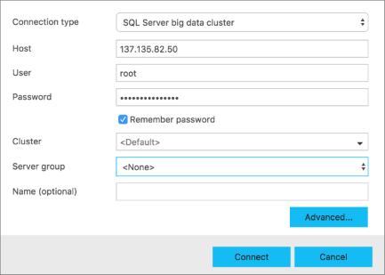

# Connect to a SQL Server big data cluster with Azure Data Studio

This article describes how to install Azure Data Studio, the SQL Server 2019 extension (preview), and then connect to a big data cluster. The new SQL Server 2019 extension includes preview support for [SQL Server 2019 big data clusters](big-data-cluster-overview.md), an integrated [notebook experience](notebooks-guidance.md), and a PolyBase [Create External Table wizard](../relational-databases/polybase/data-virtualization.md?toc=%2fsql%2fbig-data-cluster%2ftoc.json).

[!INCLUDE [Limited public preview note](../includes/big-data-cluster-preview-note.md)]

## Install Azure Data Studio

To install Azure Data Studio, see [Download and install the latest version of Azure Data Studio](../azure-data-studio/download.md).

## Install the SQL Server 2019 extension (preview)

To install the extension, see [Install the SQL Server 2019 extension (preview)](../azure-data-studio/sql-server-2019-extension.md).

## Connect to the cluster

When you connect to a big data cluster, you have the option to connect to the SQL Server [master instance](concept-master-instance.md) or to the HDFS/Spark gateway. The following sections show how to connect to each.

## <a id="master"></a> Master instance

1. From the command-line, find the IP of your master instance with the following command:

   **AKS deployments:**

   ```
   kubectl get svc service-master-pool-lb -n <your-cluster-name>
   ```

   **Non-AKS deployments**:

   ```
   kubectl get svc service-master-pool-nodeport -n <your-cluster-name>
   ```

1. In Azure Data Studio, press **F1** > **New Connection**.

1. In **Connection type**, select **Microsoft SQL Server**.

1. Type the IP address of the SQL Server master instance in **Server name** (for example: **\<IP Address\>,31433**).

1. Enter a SQL login **User name** and **Password**.

1. Change the **Database name** to the **high_value_data** database.

   

1. Press **Connect**, and the **Server Dashboard** should appear.

## <a id="hdfs"></a> HDFS/Spark gateway

1. From the command-line, find the IP address of your HDFS/Spark gateway with one of the following commands.
   
   **AKS deployments:**

   ```
   kubectl get svc service-security-lb -n <your-cluster-name>
   ```

   **Non-AKS deployments**:

   ```
   kubectl get svc service-security-nodeport -n <your-cluster-name>
   ```
 
1. In Azure Data Studio, press **F1** > **New Connection**.

1. In **Connection type**, select **SQL Server big data cluster**.

1. Type the IP address of the big data cluster in **Server name** (do not specify a port).

1. Enter `root` for the **User** and specify the **Password** to your big data cluster.

   

1. Press **Connect**, and the **Server Dashboard** should appear.

## Next steps

To run notebooks in Azure Data Studio, see [How to use notebooks in SQL Server 2019 preview](notebooks-guidance.md).
