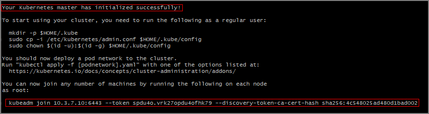
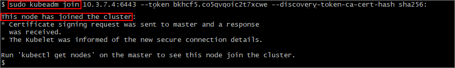

# Configure Kubernetes on multiple machines for SQL Server 2019 big data cluster (preview) deployments

This article provides an example of how to use **kubeadm** to configure Kubernetes on multiple machines for SQL Server 2019 big data cluster (preview) deployments. In this example, multiple Ubuntu 16.04 or 18.04 LTS machines (physical or virtual) are the target. If you are deploying to a different Linux platform, you must alter some of the commands to match your system.  

> [!TIP] 
> For sample scripts that configure Kubernetes, see [Create a Kubernetes cluster using Kubeadm on Ubuntu 16.04 LTS or 18.04 LTS](https://github.com/Microsoft/sql-server-samples/tree/master/samples/features/sql-big-data-cluster/deployment/kubeadm).

## Prerequisites

- Multiple Linux physical machines or virtual machines to use for the cluster
- Recommended configuration: 8 CPUs, 32 GB of memory, and at least 100 GB of storage for each machine
- Minimum of three machines in the cluster

## Prepare the machines

On each machine, there are several required prerequisites. In a bash terminal, run the following commands on each machine:

1. Add the current machine to the `/etc/hosts` file:

   ```bash
   echo $(hostname -i) $(hostname) | sudo tee -a /etc/hosts
   ```

1. Disable swapping on all devices.

   ```bash
   sudo sed -i "/ swap / s/^/#/" /etc/fstab
   sudo swapoff -a
   ```

1. Import the keys and register the repository for Kubernetes.

   ```bash
   sudo curl -s https://packages.cloud.google.com/apt/doc/apt-key.gpg | sudo apt-key add -
   echo 'deb http://apt.kubernetes.io/ kubernetes-xenial main' | sudo tee -a /etc/apt/sources.list.d/kubernetes.list
   ```

1. Configure docker and Kubernetes prerequisites on the machine.

   ```bash
   KUBE_DPKG_VERSION=1.11.3-00
   sudo apt-get update && /
   sudo apt-get install -y ebtables ethtool && /
   sudo apt-get install -y docker.io && /
   sudo apt-get install -y apt-transport-https && /
   sudo apt-get install -y kubelet=$KUBE_DPKG_VERSION kubeadm=$KUBE_DPKG_VERSION kubectl=$KUBE_DPKG_VERSION && /
   curl https://raw.githubusercontent.com/kubernetes/helm/master/scripts/get | bash
   ```
 
1. Set `net.bridge.bridge-nf-call-iptables=1`. On Ubuntu 18.04, the following commands first enable `br_netfilter`.

   ```bash
   . /etc/os-release
   if [ "$VERSION_CODENAME" == "bionic" ]; then sudo modprobe br_netfilter; fi
   sudo sysctl net.bridge.bridge-nf-call-iptables=1
   ```

## Configure the Kubernetes master

After running the previous commands on each machine, choose one of the machines to be your Kubernetes master. Then fun the following commands on that machine.

1. First, create an rbac.yaml file in your current directory with the following command. 

   ```bash
   cat <<EOF > rbac.yaml
   apiVersion: rbac.authorization.k8s.io/v1beta1
   kind: ClusterRoleBinding
   metadata:
     name: default-rbac
   subjects:
   - kind: ServiceAccount
     name: default
     namespace: default
   roleRef:
     kind: ClusterRole
     name: cluster-admin
     apiGroup: rbac.authorization.k8s.io
   EOF
   ```

1. Initialize the Kubernetes master on this machine. You should see output that the Kubernetes master was successfully initialized.

   ```bash
   KUBE_VERSION=1.11.3
   sudo kubeadm init --pod-network-cidr=10.244.0.0/16 --kubernetes-version=$KUBE_VERSION
   ```

1. Note the `kubeadm join` command that you need to use on the other servers to join the Kubernetes cluster. Copy this for later use.

   

1. Set up a Kubernetes configuration file your home directory.

   ```bash
   mkdir -p $HOME/.kube
   sudo cp -i /etc/kubernetes/admin.conf $HOME/.kube/config
   sudo chown $(id -u):$(id -g) $HOME/.kube/config
   ```

1. Configure the cluster and the Kubernetes dashboard.

   ```bash
   kubectl apply -f https://raw.githubusercontent.com/coreos/flannel/master/Documentation/kube-flannel.yml
   helm init
   kubectl apply -f rbac.yaml
   kubectl apply -f https://raw.githubusercontent.com/kubernetes/dashboard/master/src/deploy/recommended/kubernetes-dashboard.yaml
   kubectl create clusterrolebinding kubernetes-dashboard --clusterrole=cluster-admin --serviceaccount=kube-system:kubernetes-dashboard
   ```

## Configure the Kubernetes agents

The other machines will act as Kubernetes agents in the cluster. 

On each of the other machines, run the `kubeadm join` command that you copied in the previous section.



## View the cluster status

To verify the connection to your cluster, use the [kubectl get](https://kubernetes.io/docs/reference/generated/kubectl/kubectl-commands) command to return a list of the cluster nodes.

```bash
kubectl get nodes
```

## Next steps

The steps in this article configured a Kubernetes cluster on multiple Ubuntu machines. The next step is to deploy SQL Server 2019 big data cluster. For instructions, see the following article:

[Deploy SQL Server on Kubernetes](deployment-guidance.md#deploy)
