# How to deploy [!INCLUDE[big-data-clusters-2019](../includes/ssbigdataclusters-ss-nover.md)] in Active Directory mode

[!INCLUDE[tsql-appliesto-ssver15-xxxx-xxxx-xxx](../includes/tsql-appliesto-ssver15-xxxx-xxxx-xxx.md)]

# How to deploy a [!INCLUDE[big-data-clusters](../includes/ssbigdataclusters-nover.md)] in Active Directory (AD) authentication mode

This document describes how to deploy a SQL Server 2019 big data cluster in the Active Directory authentication mode which will use an existing AD domain for authentication.

For now, there are some limitations to be aware of:

- This security mode will only work on`kubeadm`deployment environments and not on AKS right now.

- This mode will only enable authentication to the SQL master instance and the Knox Gateway (for access to HDFS and Spark). AD authentication to other service end points such as the Controller, Management services and Apps is not supported at this time. This means that basic username and password defined upon deployment can be used for authentication to the non-AD joined endpoints. Full support for AD authentication to all service end points are planned for a future release.

- This mode will only allow one big data cluster per domain. Enabling multiple [!INCLUDE[big-data-clusters](../includes/ssbigdataclusters-nover.md)] per domain is planned for a future release.

- To manage HDFS permissions, there is a documented workaround:

    - Another workaround is that, the admin can log into the cluster (by using `kubectl`), and do `kinit` as `hdfs` (by using `hdfs` `keytab`) and then set the permission of the HFDS files.

- HDFS Tiering is not supported in the AD mode for RC1.

## Background

To enable AD authentication, the cluster needs to be joined to an already-existing Active Directory domain. This is different from the standard domain joining of a Linux machine though as there are many pods over multiple machines. Pods can fail over, and pod names are not always static. This means that domain joining every pod is impractical. Instead, we just need to ensure that all pods can query the domain and each service has the credentials they require. This reduces the number of objects created in the domain. In addition, when a pod fails over, it still has the credentials it needs, so we do not need to waste time domain joining the pod again.

To enable AD authentication, the BDC automatically creates the users, groups, machine accounts, and SPNs that the various services need. In addition, the BDC will enable constrained delegation between some objects that it created (e.g. accounts for SQL instances). To provide some containment of these accounts and allow scoping permissions, an organizational unit (OU) must be specified where all AD objects will be created. This OU must be created before cluster deployment.

To automatically create all the accounts the BDC needs, an AD account must be given during deployment. This account needs to be able to create users, groups, and machine accounts inside the provided OU. It must also be able to enable constrained delegation between accounts it created in the OU. For example, it must be able to enable constrained delegation between the SQL instance on the master pool and a SQL instance in the storage pool.

The steps below will help you set up an AD domain controller if you don't already have one, create the required AD objects and then deploy a big data cluster in AD authentication mode.

## Step 1. Setting up an Active Directory domain controller

The below steps come from the following [guide](https://social.technet.microsoft.com/wiki/contents/articles/37528.create-and-configure-active-directory-domain-controller-in-azure-windows-server.aspx). If you already have an Active Directory domain, you can skip step 1 and proceed to step 2.

To set up an Active Directory domain controller, we will need a machine or VM with Windows Server 2016 or above. In the following example, a VM is being used.

When logging in to the machine that will act as the Active Directory Domain Controller, we can see 3 Roles are assigned to the server. As we proceed, we will add 2 more roles to the server.

- Active Directory Domain Service

- Active Directory Domain Controller
    
    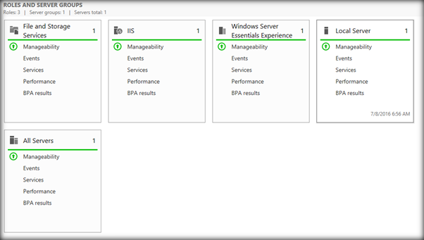

### Configure role Active Directory Domain Service

As the server starts up, Server Manager will opens. Click **Add roles and features** option in Server Manager.

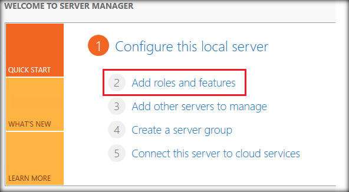

Server Manager opens the **Add Roles and Features Wizard**. Click **Next**.

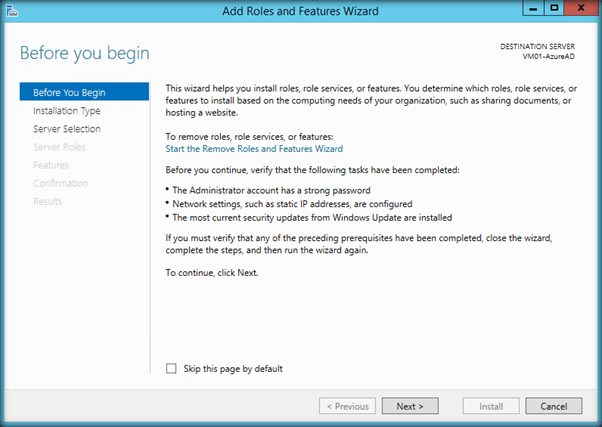

Select Role-based or feature-based installation, and click **Next**.
\
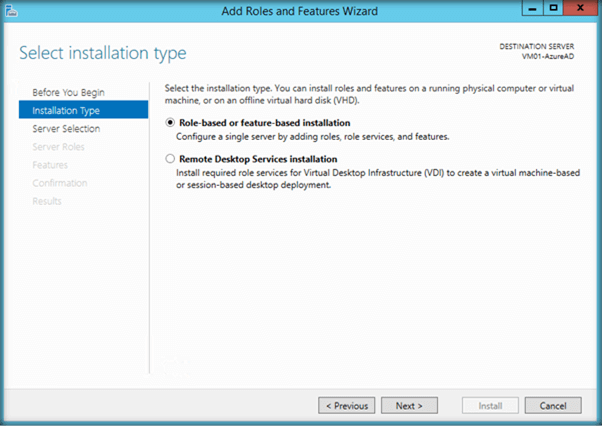

By default **Select a server from the server pool** is selected and the current VM will be highlighted. Click **Next**.

### Configure role Active Directory Domain Service

Now we have to add the server role. Select the **Active Directory Domain Services** check-box. The window includes the features that are required for Active Directory Domain Services. Click **Add Features**.

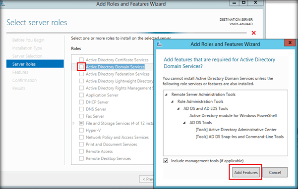

The Active Directory Domain Services role will be checked. Click **Next**.

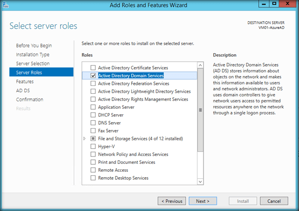
In this page, you can add extra features that can be added to the server. Currently, we are adding only a role and not adding any extra features. Click **Next**.

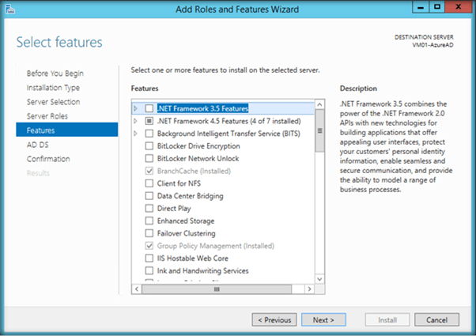

This is just an information screen about AD DS. Click **Next**.

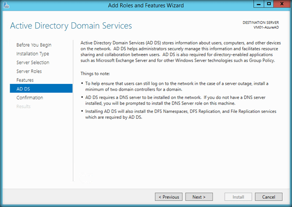

The following page lists out the roles that will be added to the server. After confirmation, click **Install**.

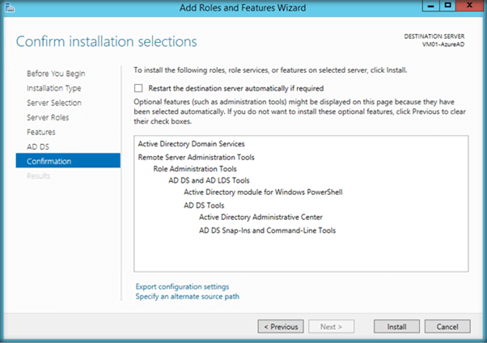

Installation of Active Directory Domain Services has started in the VM.

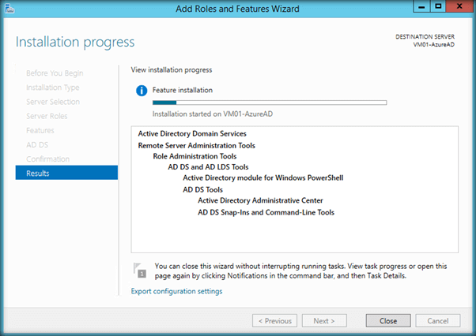

After some time the installation will finish. Click **Close**.

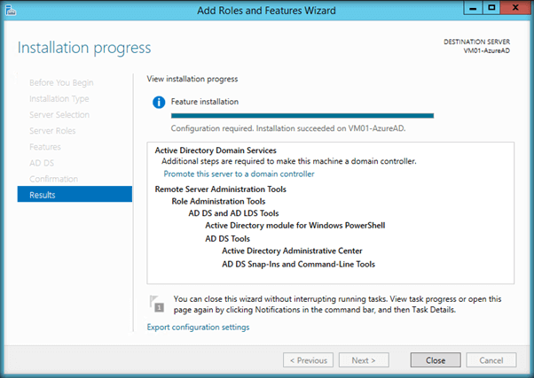

## Step2. Create AD objects

There are two things in AD that need to be done before a BDC in AD mode can be deployed.

1. Create an organizational unit (OU) where all AD objects will be stored and create a user for the BDC controller to run as. You can also choose to nominate an existing OU upon deployment.

2. Assigning the BDC AD account the right permissions.

### Creating a user -- BDC domain service account

The big data cluster requires an account with specific permissions. Before you proceed, please make sure that you have an existing AD account or create a new account which the big data cluster can use to set up the necessary objects.

To create a new user in AD, you can right-click the domain or the OU and select **New** > **User**:


This user will be referred to as the bdc domain service account.

### Creating an OU

On the domain controller, open **Active Directory Users and Computers**. On the left panel, right click the directory under which you want to create your OU and select New -\> **Organizational Unit**, then follow the prompts from the wizard to create the OU. Alternatively, you can create an OU with PowerShell:

```powershell
New-ADOrganizationalUnit -Name "<name>" -Path "<Distinguished name of the directory you wish to create the OU in>"
```

In this document, we are naming the OU: `bdc`

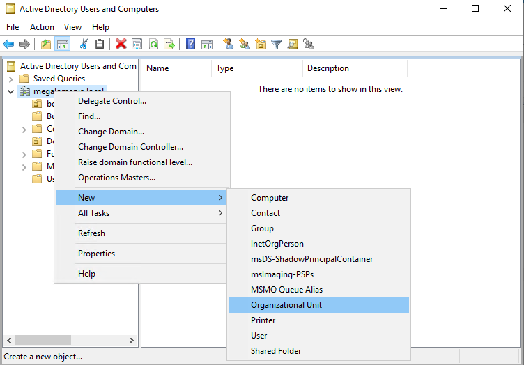

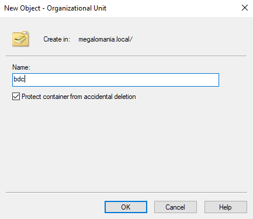

### Setting permissions for the `bdc` AD user

Whether you have created a new user or using an existing user, there are certain permissions the user needs to have. Note that this is the user account that the `bdc` controller will use when joining the cluster to AD.

The `bdc` domain service account (DSA) user needs to be able to create users, groups, and computer accounts in the OU above. In the following steps, we have named the `bdc` domain service account `bdcDSA`. You can choose any name for this account. If you don't already have an account created for the `bdc`, you can create one before going through the below steps.

- On the domain controller, open **Active Directory Users and Computers**

- In the left panel, navigate to your domain, then the OU which `bdc` will use

- Right click the OU, and select **Properties**.

- Go to the Security tab (Make sure that you have selected **Advanced Features** by right-clicking on the OU, and selecting **View**)

    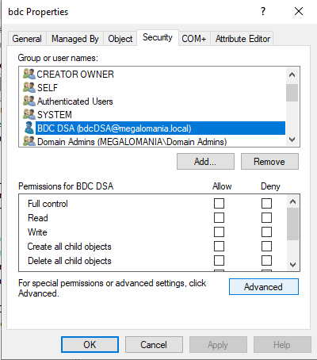

- Click **Add...** and add the **[!INCLUDE[big-data-clusters](../includes/ssbigdataclusters-nover.md)]DSA** user

    

    

- Select the **[!INCLUDE[big-data-clusters](../includes/ssbigdataclusters-nover.md)]DSA** user and un-check all permissions, then click **Advanced**

- Click **Add**

    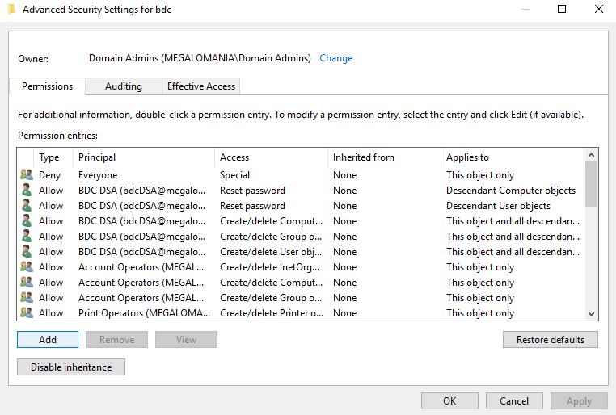

    - Click **Select a Principal**, insert **[!INCLUDE[big-data-clusters](../includes/ssbigdataclusters-nover.md)]DSA**, and click Ok

    - Set **Type** to **Allow**

    - Set **Applies To** to **This Object and all descendant objects**

        

    - Scroll down to the bottom, and click **Clear all**

    - Scroll back to the top, and select:
       - **Read all properties**
       - **write all properties**
       - **Create Computer objects**
       - **Delete Computer objects**
       - **Create Group objects**
       - **Delete Group objects**
       - **Create User objects**
       - **Create User objects**

    - Click **OK**

- Click **Add**

    - Click **Select a Principal**, insert **[!INCLUDE[big-data-clusters](../includes/ssbigdataclusters-nover.md)]DSA**, and click Ok

    - Set **Type** to **Allow**

    - Set **Applies To** to **Descendant Computer objects**

    - Scroll down to the bottom, and click **Clear all**

    - Scroll back to the top, and select **Reset password**

    - Click **OK**

- Click **Add**

    - Click **Select a Principal**, insert **[!INCLUDE[big-data-clusters](../includes/ssbigdataclusters-nover.md)]DSA**, and click Ok

    - Set **Type** to **Allow**

    - Set **Applies To** to **Descendant User objects**

    - Scroll down to the bottom, and click **Clear all**

    - Scroll back to the top, and select **Reset password**

    - Click **OK**

- Click **OK** twice more to close open dialog boxes

## Step 3. Prepare deployment

For deployment of BDC in AD mode, there is some additional information that needs to be provided so that the cluster can find the domain controller and connect to it for setting up BDC-related objects in AD.

The way the additional parameters will be provided is through "patching" the `control.json` and `cluster.json` files. By patching, we mean adding additional information to. You will need to prepare two separate patches stored in two `.json` files. The first patch is a security section and we can, for example, save it in a file called `security.json`. The next patch we need is called `endpoint.json`. Each patch is added to the main .son files by using an `azdata` command:

```bash
azdata bdc config patch
```

Finally, we need to provide the credentials that [!INCLUDE[big-data-clusters](../includes/ssbigdataclusters-nover.md)] will use to create the necessary objects in AD.

In summary, before deploying a cluster in AD mode, three things must be done:

1. First, turn on AD mode by patching `control.json` with the content of `security-patch.json`.
2. Specify an AD endpoint name for master pool by patching `cluster.json` with the content in `endpoint-patch.json`.
3. Supply [!INCLUDE[big-data-clusters](../includes/ssbigdataclusters-nover.md)] service account AD credentials as environment variables (two new environment variables)

Below are some instructions for each of the listed steps.

### Step 3.1 Provide security parameters

#### Option1: Prepare security patch

Create a patch (`security-patch.json`) as shown below and add your own domain's information to the file.

```json
{ 
    "patch": [ 
        { 
            "op": "add", 
            "path": "security", 
            "value": { 
                "ouDistinguishedName": "<OU's distinguished name for new accounts>", 
                "dnsIpAddresses": ["<your domain controller's IP>"], 
                "domainControllerFullyQualifiedDns": ["<your domain controller's FQDN>"], 
                "realm": "<your realm name>", 
                "domainDnsName": "<your domain name>", 
                "bdcAdminPrincipals": [ 
                    "Domain Admins", "Enterprise Admins" 
                ], 
                "bdcUserPrincipals": [ 
                    "Domain Users" 
                ] 
            } 
        }, 
        { 
            "op": "add", 
            "path": "spec.endpoints/0", 
            "value": { 
                "name": "Kerberos", 
                "serviceType": "NodePort", 
                "port": 30088 
            } 
        } 
    ] 
}
```

The fields above do the following:

- `ouDistinguishedName`: distinguished name of an organizational unit (OU) where all AD accounts created by cluster deployment will be added. (e.g. `OU=BDC,DC=contoso,DC=local`). This OU must be created before deployment, and the credentials supplied must be able to create users, groups, and machines inside this OU as well as enable constrained delegation between objects in this OU.

- `upstreamIpAddresses`: list of IP addresses of domain controllers

- `domainControllerFullyQualifiedDns`: list of FQDNs of domain controllers. The entries in this list must be upper-case.

- `realm`: name of your realm (e.g. `CONTOSO.LOCAL`). The entries in this list must be upper-case.

- `domainDnsName`: name of your domain (e.g. `contoso.local`). The values in this entry must be lower-case.

    Other parameters currently not used:

- `BDCAdminPrincipals`: list of the AD users or Groups you want to make admins of the big data cluster. You don't need to edit this list in this release.

- `BDCUserPrincipals`: list of the AD users or Groups who are regular users in the big data cluster. You don't need to edit this list in this release.

To apply the patch to the `control.json` file, run the following:

```bash
azdata bdc config patch --config-file custom/control.json --patch <path>/security-patch.json

azdata bdc config replace -c custom-aks/bdc.json -j $.spec.resources
```

#### Example `security.json`

In the example below, we have a domain called `contoso.local` and an OU in that domain called `bdc`. The domain controller is installed on a host named "dc".

```json
"patch": [
    {
      "op": "add",
      "path": "security",
      "value": {
        "useInternalDomain": false,
        "ouDistinguishedName":"OU=bdc,DC=contoso,DC=local",
        "dnsIpAddresses": ["11.11.111.11"],
        "domainControllerFullyQualifiedDns": ["DC.CONTOSO.LOCAL"],
        "realm":"CONTOSO.LOCAL",
        "domainDnsName":"contoso.local",
        "bdcAdminPrincipals": [
          "Domain Admins", "Enterprise Admins"
        ],
        "bdcUserPrincipals": [
          "Domain Users"
        ]
      }
    },
    {
      "op": "add",
      "path": "spec.endpoints/0",
      "value": {
        "name": "Kerberos",
        "serviceType": "NodePort",
        "port": 30088
      }
    }
  ]
}
```

You can find the above `.json` file on GitHub and edit that file and add your own domain information. See [Deploy a SQL Server big data cluster on single node Kubernetes cluster (kubeadm)](https://github.com/microsoft/sql-server-samples/tree/master/samples/features/sql-big-data-cluster/deployment/kubeadm/ubuntu-single-node-vm-ad).

### Step 3.2 Provide endpoint parameters

#### Prepare endpoint patch for master pool

The DNS name of the master instance must be supplied. This is the DNS name you will register to point to the master pod and wish users to connect to. Create the patch (`endpoint-patch.json`) below.

The DNS name provided should be an FQDN (e.g. `mastersql.contoso.local`). The hostname (`mastersql`) can be whatever you like but the remainder of the FQDN should match your existing domain name (`contoso.local`). This applies to all the external endpoints.

```json
{
  "patch": [
    {
      "op": "add",
      "path": "spec.resources.master.spec.dnsName",
      "value": "<master instance DNS name>"
    },
    {
        "op": "add",
        "path": "spec.resources.gateway.spec.dnsName",
        "value": "<knox.megalomania.local>"
    }
  ]
}
```

To apply the endpoint patch to the `cluster.json` file, run the following:

```bash
azdata bdc config patch --config-file customer/bdc.json --patch <path>/endpoint-patch.json
```

Example `endpoint.json`:

```json
{
  "patch": [
    {
      "op": "replace",
      "path": "spec.pools[?(@.spec.type=='Master')].spec",
      "value": {
        "type": "Master",
        "dnsName": "mastersql.contoso.local",
        "replicas": 1,
        "endpoints": [
          {
            "name": "Master",
            "serviceType": "NodePort",
            "port": 31433
          }
        ]
      }
    }
  ]
}

```

You can find the above `.json` file on GitHub and edit that file and add your own domain information. See [Deploy a SQL Server big data cluster on single node Kubernetes cluster (kubeadm)](https://github.com/microsoft/sql-server-samples/tree/master/samples/features/sql-big-data-cluster/deployment/kubeadm/ubuntu-single-node-vm-ad).

>[!IMPORTANT]
>Create an entry for the above `dnsName` in your DNS Server. You will use this name when connecting to SQL Server Master instance from Azure Data Studio and other tools. Authentication using Active Directory will only work when using the DNS name. Connecting via IP address will not work.

#### Create DNS host entry for SQL Server master instance

In the DNS manager on your domain controller, right click and add **New Host**.

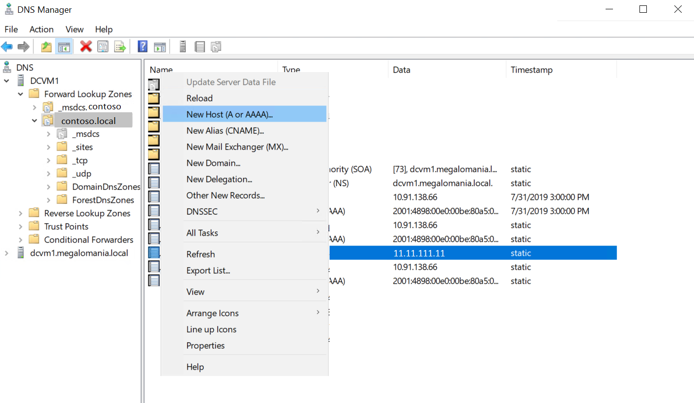

Enter the name of the host (you should use the same name here as you entered in the `endpoint-patch.json`. For example: `mastersql`). Next, enter the IP address of the machine/VM where you are running the`kubeadm`cluster and click **Add Host**.

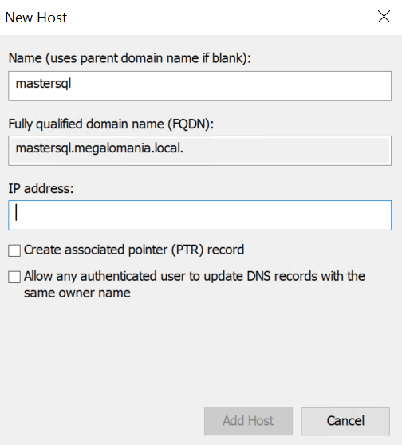

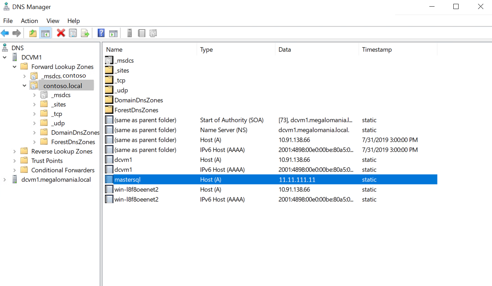

### 3.3 Supply additional environment variables for BDC AD credentials

Before deploying the BDC, the username and password of the service account created above must be supplied so AD operations (such as registering SQL SPNs) can be performed. For security reasons, these credentials are passed in as environment variables when running cluster deployment.

These will be the credentials you set for the bdcDSA account in Step 2.

```
export DOMAIN_SERVICE_ACCOUNT_USERNAME=<Username for DBC AD account>

export DOMAIN_SERVICE_ACCOUNT_PASSWORD=<Password for DBC AD account>
```

## Step 4. Deploy the BDC joined to AD

For full documentation of how to deploy [!INCLUDE[big-data-clusters](../includes/ssbigdataclusters-nover.md)], please visit the [official documentation](deployment-guidance.md).

This section describes how you can use this [script](https://github.com/microsoft/sql-server-samples/blob/master/samples/features/sql-big-data-cluster/deployment/kubeadm/ubuntu-single-node-vm-ad/setup-bdc-ad.sh) on GitHub to deploy a single node`kubeadm`cluster joined to an existing domain. The script has been adjusted to deploy a big data cluster joined to AD. If you have used the script before, you will notice some additional inputs required.

#### Steps to deploy a secure cluster using the script

In addition to the existing inputs you have been prompted for, this release will require some additional security related inputs.

1. Since this is a private release, you need the docker credentials you have been using in the past for deploying [!INCLUDE[big-data-clusters](../includes/ssbigdataclusters-nover.md)]:

    **Docker username**

    **Docker password**

>[!IMPORTANT]
>This private release is using a private docker registry and repository. 

Make sure to use the following details to get the images:

```
DOCKER_REGISTRY="private-repo.microsoft.com"

DOCKER_REPOSITORY="mssql-private-preview"
```

2. The script also prompts for the [!INCLUDE[big-data-clusters](../includes/ssbigdataclusters-nover.md)] domain account credentials.

    `bdc domain account username`

    `bdc domain account password`

3. The script runs the `azdata` patch commands to add the security patch and endpoint patch to the deployment profile. You need to edit these files and add your own domain and DNS information. 

    >![NOTE]
    >You can find the patch `.json` files as well as deployment instructions for the script from [GitHub](https://github.com/microsoft/sql-server-samples/tree/master/samples/features/sql-big-data-cluster/deployment/kubeadm/ubuntu-single-node-vm-ad).

## Step 5. Test AD connectivity

Before testing connectivity, take the external IP address of one of the `kubeadm` nodes and register it your DNS server. The name will be the same name you chose as `dnsName` in the `endpoint.json` file:

### Verify master pool keytab

To verify that the master pool's SQL Server has its `keytab`, list the contents of the keyt`ab with the command below:

`kubectl exec -it master-0 -c mssql-server -n <name-space> -- klist -kte /var/run/secrets/keytabs/mssql.keytab`

This prints out the entries in the `keytab`. There will be SPNs for SQL Server for both the internal pod name and the endpoint name you provided in the `endpoint.json` patch. It also has machine account credentials for more privileged actions it needs to perform.

### Login to SQL Server master instance using AD Auth - `SQLCMD`

To verify that AD connections to the SQL Server instance in the master pool work, connect to master pool with `sqlcmd` and create a login for an AD user.

```cmd
sqlcmd -S <DNS name supplied in endpoint.json>,31433 -U sa
CREATE LOGIN [CONTOSO\user1] FROM WINDOWS
GO
```

Next, attempt an AD login as the above user. If you are on Linux, first `kinit` as the user, then run `sqlcmd`. If you are on Windows, simply login as your desired user.

Windows:

```cmd
sqlcmd -S \<DNS name supplied in endpoint.json\>,31433 -E
```

Linux:

```bash
kinit user1@CONTOSO.LOCAL
sqlcmd --S <DNS name supplied in endpoint.json> -E
```

### Login to SQL Server master instance using Azure Data Studio and SSMS

Before you can login to SQL Server master instance, you need to create a login in SQL Server for the users/groups you want to be able to login.

For example: `create login [contoso.local\<AD username>] from windows`

From a domain joined Windows client, you can open SSMS or Azure Data Studio and connect to the master instance. This is the same experience as connecting to any SQL Server instance using AD authentication.

From SSMS:


From Azure Data Studio:

}

## Known issues and limitations

- A `-` hyphen in the domain controller host name is not supported. Fix is coming in a future release.

- This mode will only allow one BDC per domain at this time. Enabling multiple BDCs per domain is planned for a future release.
